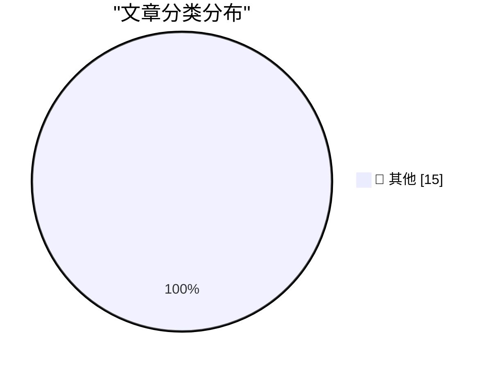

# 📰 AI 资讯每日精选 — 2026-09-21

> 汇聚 140+ 技术博客、X/Twitter、Hacker News、Reddit、Product Hunt、
> Lobste.rs、ClawFeed 日报及 GitHub Trending，经 AI 评分筛选。
>
> **本期内容**：🏆 今日必读 · 🌐 ClawFeed 日报 · 🔥 GitHub Trending · 📂 分类精选 · 🎨 设计与生成式 AI · 📊 数据概览

## 🏆 今日必读

🥇 **Quoting voxium**

[Quoting voxium](https://simonwillison.net/2026/Sep/20/voxium/) — simonwillison.net · 4 小时前 · 📝 其他

> Quoting voxium

🥈 **llm-keys-ui 0.1**

[llm-keys-ui 0.1](https://simonwillison.net/2026/Sep/20/llm-keys-ui/) — simonwillison.net · 6 小时前 · 📝 其他

> llm-keys-ui 0.1

🥉 **Apple TV to Finally Air ‘The Savant’ in Early 2027, Supposedly**

[Apple TV to Finally Air ‘The Savant’ in Early 2027, Supposedly](https://deadline.com/2026/09/jessica-chastain-the-savant-new-release-date-apple-tv-1237108228/) — daringfireball.net · 45 分钟前 · 📝 其他

> Apple TV to Finally Air ‘The Savant’ in Early 2027, Supposedly

4️⃣ **Yours Truly on CNBC’s ‘Squawk on the Street’ Friday**

[Yours Truly on CNBC’s ‘Squawk on the Street’ Friday](https://youtu.be/WrwY_jVaN-w) — daringfireball.net · 58 分钟前 · 📝 其他

> Yours Truly on CNBC’s ‘Squawk on the Street’ Friday

5️⃣ **WorkOS: How SSO Works and the Fastest Way to Add It**

[WorkOS: How SSO Works and the Fastest Way to Add It](https://workos.com/guide/the-developers-guide-to-sso?utm_source=daringfireball&amp;utm_medium=newsletter&amp;utm_campaign=q32026) — daringfireball.net · 8 小时前 · 📝 其他

> WorkOS: How SSO Works and the Fastest Way to Add It

---

## 🌐 ClawFeed 日报精选

> 来源：[ClawFeed](https://clawfeed.kevinhe.io) — AI 驱动的多源新闻聚合

📊 ClawFeed 日报 | 2026-09-20 SGT

聚合 5 期 4h digest (#1246-#1250)，覆盖 00:00-19:59 SGT
feed 总计 ~25 / bookmarks ~25 / errors 0

---

## 🔥 当日全场最重要 5 条

1. **Laya 开源模型正式挑战 Jev——421M 参数、准确率 0.766 vs Jev 0.727**——非自回归决策模型，单题 ~33ms（比 Jev 快 6-10x），校准 ECE 0.081 vs 0.246。消费级 GPU 可跑，不用排队不用付费。开源意味着社区可自由微调和部署。Jev 的闭源护城河首次受到实质性挑战。

2. **Jev + 具身智能突破——MuJoCo 物理仿真实现决策-执行全闭环**——Franka Panda 机械臂夹爪接触、抓取、堆叠、越障均有物理反馈，浏览器即可体验无需硬件。Astra + Jev 8分43秒击败末影龙，总成本不到 $1。Jev 从网页自动化扩展到机器人决策，应用边界显著拓宽。

3. **Jev 能力边界共识形成——开放任务差、中文弱、依赖约束设计**——多位高频用户独立验证：Jev 极其依赖使用者定义的约束，开放任务效果差，中文适配能力弱（官方文档已标注）。但结构化分类任务仍有碾压优势（300封邮件28秒，SEO 584链/$0.21）。"Jev 是依赖使用者的工具"成为共识。

4. **SEO 内链重构实测 Jev vs Opus 5——碾压级差距**——Jev 45.1秒完成全站 584 个内链放置 + 拒绝 139 个无效页面，总花费 $0.21；Opus 5 同时段仅处理 21 个页面。客服/内容审核/招聘等 agent 场景因 Jev 迎来重构机会。

5. **macbrow：Jev 驱动语音控制 Mac——开源 1.6s 响应**——System One 的低延迟让语音操控从不实用变为可能。具身交互方向早期探索，从屏幕自动化走向人机自然交互。

---

## 📰 当日核心主题

### 🏷️ Jev 进入"理性验证"阶段（从刷屏→落地→边界认知）
- **能力边界共识**：开放任务不行、中文弱、极依赖约束设计。"Jev 是依赖使用者的工具"成为多人独立验证的结论
- **结构化任务仍碾压**：300封邮件28秒分类、SEO 584链45秒/$0.21、15品牌428条新闻$0.01
- **落地案例丰富**：@leaf_sanren 8 个带源码案例成中文社区最引用参考；9 大实际使用场景汇编（操作电脑、浏览器、代码路由、交易等）
- **免费通道开放**：Vercel AI Gateway 直接注册可用，不用排 waitlist，入门门槛大幅降低（截止 9/25）
- **RLCD 学习笔记**：用公开资料梳理技术原理，中文社区知识沉淀开始

### 🏷️ 开源竞品 Laya 登场
- 421M 非自回归决策模型，准确率 0.766 > Jev 0.727，单题 ~33ms
- 消费级 GPU 部署，一次前向传播出结果，不写字、不幻觉、不解析 JSON
- 开源 = 社区可自由微调。话题从"怎么用 Jev"进入"谁更好"的竞争阶段

### 🏷️ Jev 应用边界拓宽
- **具身智能**：MuJoCo + Franka Panda 机械臂物理仿真全闭环，浏览器可体验
- **语音控制**：macbrow 开源项目，Jev 驱动语音操控 Mac + Chrome，1.6s 响应
- **jev-use 双层架构延续**：决策（Jev）+ 执行层分离，社区工具链持续丰富

### 🏷️ 个人助理赛道（非 Jev 信号，持续跟踪）
- **Instinct 体验**：持续被引为"OpenClaw for normal people"，普适性验证
- **Rene**：iMessage 原生 multiplayer AI agent，正式发布
- **Assistant Benchmark**：71 助理 × 15 维度公开评分卡，首个标准化横评

### 🏷️ Agentic workload 共识
- Aaron Levie 四股力量论持续被引用（agent swarm / computer use / API+MCP / 新模型）

---

## 🔖 Bookmarks 精选

- **Browser Use + Jev**（@SUOHA_AI）：DOM 级操作替代 LLM，jev-trader 开源 14h 实盘（亏 300% 但架构惊艳）
- **Rene**（@tlxue）：iMessage 原生 multiplayer AI agent，内测四个月后正式发布
- **Instinct 体验**（@pitdesi）："OpenClaw for normal people"，帮父亲设置——普适性验证
- **Assistant Benchmark**（@AGTPinsights）：71 AI 助理 × 15 维度公开横评 assistantbenchmark.com
- **Aaron Levie**（@levie）：agentic workload 拐点论——agent swarms + computer use + API/MCP + 新形态

⚠️ Bookmarks 页面内容全天未刷新（5 期完全相同），可能需要检查 bookmarks scrape 逻辑。

---

## 👀 推荐关注汇总

- **@leaf_sanren** — 8 个带源码仓库的 Jev 落地案例，中文社区最高质量实操参考
- **@SUOHA_AI** — Jev 生产级测试者（300封邮件分流、15品牌428条新闻），持续输出真实业务验证
- **@akshay_pachaar** — Jev 英文系统解读，340K 浏览，builder 视角全球传播
- **macbrow 作者** — Jev 语音控制 Mac 的开源实验项目，具身交互方向早期探索
- **Laya 项目作者**（待确认具体账号）— 首个对 Jev 形成实质性挑战的开源替代

---

## 💤 当日重复噪音模式

- **Jev 仍占 feed 绝对主导**（5 期 × 5 条 feed，Jev 相关占比约 90%），但质量结构有明显变化：从前几天的科普刷屏，进入"落地验证 + 能力边界 + 竞品出现"的成熟期
- **Bookmarks 全天零更新**：5 期的 bookmarks 内容完全相同（Browser Use/Rene/Instinct/AB/Levie），很可能是 bookmarks 页面未刷新或 scrape 逻辑问题，而非真的无新 bookmark
- **Jev vs DeepSeek 对比多次出现**（#1246 客服工单、#1248 品牌新闻、#1249 邮件分流），虽场景不同但信息结构类似，去重后核心结论一致：结构化分类 Jev 快且便宜，复杂任务各有千秋
- **"Jev 科普长文"饱和**：入门级教程/解释类内容已过饱和，信息增量递减

---

## 📈 趋势判断

**今日转折信号**：Jev 话题从"单方面刷屏"正式进入"竞争 + 边界认知"阶段。两个标志性事件——Laya 开源替代（准确率反超）+ 高频用户能力边界共识——意味着市场情绪从 FOMO 转向理性评估。同时具身智能（MuJoCo）和语音控制（macbrow）拓宽了 Jev 的想象空间，但尚属早期探索。
---

## 🔥 GitHub Trending

> 今日热门开源项目（全语言 + Python）

| # | 项目 | 描述 | ⭐ 总星 | 📈 今日 | 语言 |
|---|------|------|---------|---------|------|
| 1 | [cloudflare/security-audit-skill](https://github.com/cloudflare/security-audit-skill) 🤖 | A coding-agent skill for multi-phase security audits with... | 18.1k | +2428 | JavaScript |
| 2 | [trycua/cua](https://github.com/trycua/cua) | Scale computer-use 2.0 with open-source drivers, cross-OS... | 25.2k | +1018 | HTML |
| 3 | [affaan-m/ECC](https://github.com/affaan-m/ECC) 🤖 | The agent harness performance optimization system. Skills... | 263.8k | +826 | JavaScript |
| 4 | [Open-Dev-Society/OpenStock](https://github.com/Open-Dev-Society/OpenStock) | OpenStock is an open-source alternative to expensive mark... | 16.9k | +755 | TypeScript |
| 5 | [addyosmani/agent-skills](https://github.com/addyosmani/agent-skills) 🤖 | Production-grade engineering skills for AI coding agents. | 97.7k | +736 | JavaScript |
| 6 | [docling-project/docling](https://github.com/docling-project/docling) 🤖 | Get your documents ready for gen AI | 67.4k | +585 | Python |
| 7 | [higgsfield-ai/higgsfield](https://github.com/higgsfield-ai/higgsfield) 🤖 | Fault-tolerant, highly scalable GPU orchestration, and a ... | 5.4k | +465 | Jupyter Notebook |
| 8 | [anthropics/claude-code](https://github.com/anthropics/claude-code) 🤖 | Claude Code is an agentic coding tool that lives in your ... | 147.1k | +419 | TypeScript |
| 9 | [zhouxiaoka/autoclip](https://github.com/zhouxiaoka/autoclip) 🤖 | AutoClip : AI-powered video clipping and highlight genera... | 7.9k | +395 | Python |
| 10 | [cactus-compute/needle](https://github.com/cactus-compute/needle) | Automation foundation model for tiny devices: 2-bit, 8-29... | 11.9k | +381 | Python |
| 11 | [coder/coder](https://github.com/coder/coder) | Secure environments for developers and their agents | 16.1k | +379 | Go |
| 12 | [vercel-labs/json-render](https://github.com/vercel-labs/json-render) 🤖 | The Generative UI framework | 17.3k | +291 | TypeScript |
| 13 | [FareedKhan-dev/train-llm-from-scratch](https://github.com/FareedKhan-dev/train-llm-from-scratch) 🤖 | A straightforward method for training your LLM, from down... | 10.4k | +265 | Python |
| 14 | [anthropics/financial-services](https://github.com/anthropics/financial-services) |  | 35.4k | +260 | Python |
| 15 | [mihail911/modern-software-dev-assignments](https://github.com/mihail911/modern-software-dev-assignments) | Assignments for CS146S: The Modern Software Dev (Stanford... | 4.6k | +172 | Python |

---

## 📝 其他

### 1. Quoting voxium

[Quoting voxium](https://simonwillison.net/2026/Sep/20/voxium/) — **simonwillison.net** · 4 小时前 · ⭐ 15/30

> Quoting voxium

---

### 2. llm-keys-ui 0.1

[llm-keys-ui 0.1](https://simonwillison.net/2026/Sep/20/llm-keys-ui/) — **simonwillison.net** · 6 小时前 · ⭐ 15/30

> llm-keys-ui 0.1

---

### 3. Apple TV to Finally Air ‘The Savant’ in Early 2027, Supposedly

[Apple TV to Finally Air ‘The Savant’ in Early 2027, Supposedly](https://deadline.com/2026/09/jessica-chastain-the-savant-new-release-date-apple-tv-1237108228/) — **daringfireball.net** · 45 分钟前 · ⭐ 15/30

> Apple TV to Finally Air ‘The Savant’ in Early 2027, Supposedly

---

### 4. Yours Truly on CNBC’s ‘Squawk on the Street’ Friday

[Yours Truly on CNBC’s ‘Squawk on the Street’ Friday](https://youtu.be/WrwY_jVaN-w) — **daringfireball.net** · 58 分钟前 · ⭐ 15/30

> Yours Truly on CNBC’s ‘Squawk on the Street’ Friday

---

### 5. WorkOS: How SSO Works and the Fastest Way to Add It

[WorkOS: How SSO Works and the Fastest Way to Add It](https://workos.com/guide/the-developers-guide-to-sso?utm_source=daringfireball&amp;utm_medium=newsletter&amp;utm_campaign=q32026) — **daringfireball.net** · 8 小时前 · ⭐ 15/30

> WorkOS: How SSO Works and the Fastest Way to Add It

---

### 6. GM Revives CarPlay for 2027 Trucks

[GM Revives CarPlay for 2027 Trucks](https://www.autoweek.com/news/a73761352/gm-revives-apple-carplay-for-2027-chevy-silverado-gmc-sierra/) — **daringfireball.net** · 8 小时前 · ⭐ 15/30

> GM Revives CarPlay for 2027 Trucks

---

### 7. Marques Brownlee’s iPhone 18 Pro Review

[Marques Brownlee’s iPhone 18 Pro Review](https://www.youtube.com/watch?v=ohqxP8EEumo) — **daringfireball.net** · 9 小时前 · ⭐ 15/30

> Marques Brownlee’s iPhone 18 Pro Review

---

### 8. Book Review: How to Build a Space Station by Jonathan Morrison ★★★⯪☆

[Book Review: How to Build a Space Station by Jonathan Morrison ★★★⯪☆](https://shkspr.mobi/blog/2026/09/book-review-how-to-build-a-space-station-by-jonathan-morrison/) — **shkspr.mobi** · 14 小时前 · ⭐ 15/30

> Book Review: How to Build a Space Station by Jonathan Morrison ★★★⯪☆

---

### 9. This is why we play

[This is why we play](https://xeiaso.net/blog/2026/this-is-why-we-play/) — **xeiaso.net** · 1 小时前 · ⭐ 15/30

> This is why we play

---

### 10. Alibaba's open-weight Qwen-Image-2.1 claims to beat closed models in image generation with just 7 billion parameters

[Alibaba's open-weight Qwen-Image-2.1 claims to beat closed models in image generation with just 7 billion parameters](https://the-decoder.com/alibabas-open-weight-qwen-image-2-1-claims-to-beat-closed-models-in-image-generation-with-just-7-billion-parameters/) — **The Decoder** · 9 小时前 · ⭐ 15/30

> Alibaba's open-weight Qwen-Image-2.1 claims to beat closed models in image generation with just 7 billion parameters

---

### 11. Tencent's Gander aims to keep talking while it works in the background

[Tencent's Gander aims to keep talking while it works in the background](https://the-decoder.com/tencents-gander-aims-to-keep-talking-while-it-works-in-the-background/) — **The Decoder** · 9 小时前 · ⭐ 15/30

> Tencent's Gander aims to keep talking while it works in the background

---

### 12. Runway wants to turn AI video generation into a live stream you control in real time

[Runway wants to turn AI video generation into a live stream you control in real time](https://the-decoder.com/runway-wants-to-turn-ai-video-generation-into-a-live-stream-you-control-in-real-time/) — **The Decoder** · 13 小时前 · ⭐ 15/30

> Runway wants to turn AI video generation into a live stream you control in real time

---

### 13. Daily AI usage in the U.S. has more than doubled in just six months

[Daily AI usage in the U.S. has more than doubled in just six months](https://the-decoder.com/daily-ai-usage-in-the-u-s-has-more-than-doubled-in-just-six-months/) — **The Decoder** · 15 小时前 · ⭐ 15/30

> Daily AI usage in the U.S. has more than doubled in just six months

---

### 14. Simulated students that make realistic mistakes help AI tutors learn faster

[Simulated students that make realistic mistakes help AI tutors learn faster](https://the-decoder.com/simulated-students-that-make-realistic-mistakes-help-ai-tutors-learn-faster/) — **The Decoder** · 15 小时前 · ⭐ 15/30

> Simulated students that make realistic mistakes help AI tutors learn faster

---

### 15. Trump announces "AI Force" and plans for an "AI czar" as he pushes unchecked AI growth

[Trump announces "AI Force" and plans for an "AI czar" as he pushes unchecked AI growth](https://the-decoder.com/trump-announces-ai-force-and-plans-for-an-ai-czar-as-he-pushes-unchecked-ai-growth/) — **The Decoder** · 16 小时前 · ⭐ 15/30

> Trump announces "AI Force" and plans for an "AI czar" as he pushes unchecked AI growth

---

## 🎨 Design & Generative AI

### 🖼️ 生成式图片

- **[Runway wants to turn AI video generation into a live stream you control in real time](https://the-decoder.com/runway-wants-to-turn-ai-video-generation-into-a-live-stream-you-control-in-real-time/)** — The Decoder · 13 小时前
  > Runway wants to turn AI video generation into a live stream you control in real time

---

## 📊 数据概览

| 扫描源 | 抓取文章 | 时间范围 | 精选 |
|:---:|:---:|:---:|:---:|
| 94/140 | 3931 篇 → 68 篇 | 24h | **15 篇** |

### 分类分布

---

*生成于 2026-09-21 01:35 | 汇聚 140 个技术博客、X/Twitter、Hacker News、Reddit、Product Hunt、Lobste.rs、ClawFeed 日报及 GitHub Trending，经 AI 评分筛选出 Top 15 精华内容*
