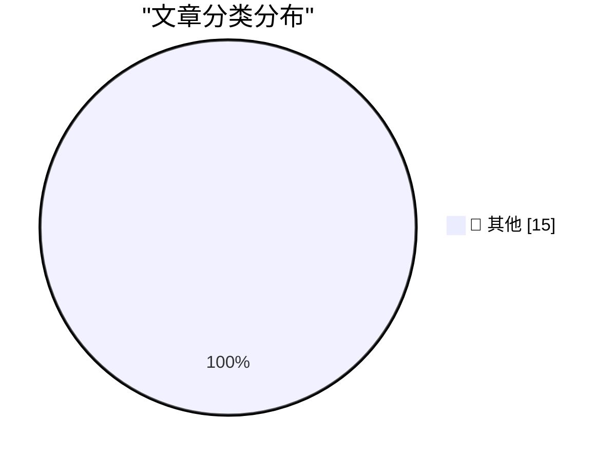

# 📰 AI 资讯每日精选 — 2026-09-22

> 汇聚 140+ 技术博客、X/Twitter、Hacker News、Reddit、Product Hunt、
> Lobste.rs、ClawFeed 日报及 GitHub Trending，经 AI 评分筛选。
>
> **本期内容**：🏆 今日必读 · 🌐 ClawFeed 日报 · 🔥 GitHub Trending · 📂 分类精选 · 🎨 设计与生成式 AI · 📊 数据概览

## 🏆 今日必读

🥇 **Jev introduces a new shape of LLM - System One, aka Decision Models**

[Jev introduces a new shape of LLM - System One, aka Decision Models](https://simonwillison.net/2026/Sep/21/jev/) — simonwillison.net · 2 小时前 · 📝 其他

> Jev introduces a new shape of LLM - System One, aka Decision Models

🥈 **Cloudflare Python Workers are now generally available**

[Cloudflare Python Workers are now generally available](https://simonwillison.net/2026/Sep/21/cloudflare-python-worker/) — simonwillison.net · 3 小时前 · 📝 其他

> Cloudflare Python Workers are now generally available

🥉 **Raspberry Pi locks down Pi 5 RAM upgrades in firmware**

[Raspberry Pi locks down Pi 5 RAM upgrades in firmware](https://www.jeffgeerling.com/blog/2026/raspberry-pi-ram-lockdown/) — jeffgeerling.com · 8 小时前 · 📝 其他

> Raspberry Pi locks down Pi 5 RAM upgrades in firmware

4️⃣ **[Sponsor] Mux: Turn Your Video Into Context**

[[Sponsor] Mux: Turn Your Video Into Context](https://www.mux.com/?utm_campaign=fireball&amp;utm_source=DF) — daringfireball.net · 2 小时前 · 📝 其他

> [Sponsor] Mux: Turn Your Video Into Context

5️⃣ **Lex Friedman Brings Back Strategery**

[Lex Friedman Brings Back Strategery](https://lexontech.org/strategery-is-back-and-im-the-developer) — daringfireball.net · 2 小时前 · 📝 其他

> Lex Friedman Brings Back Strategery

---

## 🌐 ClawFeed 日报精选

> 来源：[ClawFeed](https://clawfeed.kevinhe.io) — AI 驱动的多源新闻聚合

# ClawFeed 日报 | 2026-09-21 (SGT)

> 聚合 5 份 4h digest（ID 1254-1258，覆盖 00:00-19:59 SGT）
> 20:00-23:59 期 4h digest 尚未生成，不含在本日报中

---

## 🔥 当日全场最重要 5 条

1. **Jev 创始人 Diogo Almeida 演讲解读引爆中文圈**——核心论点"RLHF 是史诗级大弯路"，Jev 从第一天瞄准自动化非对话，揭示产品底层逻辑。这是理解 Jev 为什么在判断/分类/路由上碾压通用大模型的关键材料。（1258期）

2. **Jev 首现"能力边界"共识**——@SUOHA_AI 高频实测后总结：极度依赖使用者定义的约束、开放任务差、中文适配弱。核心定位固化为分类/筛选/路由/快速判断，不是通用 AI。这是竞品观测的**转折信号**——从"Jev 无所不能"热潮转向理性边界认知。（1255期）

3. **Dhravya Shah 发布 Instinct 记忆系统逆向工程**——supermemory 创始人花 3 天黑盒探测，推断出 grep 式关键词检索（非向量）、~24h 摄取周期、git-tracked markdown 文件结构。第一篇声称基于逆向工程（而非理论推测）的 Instinct 记忆分析。注：作者为竞品创始人，证据等级 = 作者报告的行为/重建假说。（1255/1256/1257/1258期，持续发酵）

4. **"决策与生成分离"方法论提出**——Jev 的意义被提炼为架构原则：输出范式引导把决策和生成拆开，即便同一 LLM 做此抽象也有更好效果。从"用 Jev 干活"升级为"Jev 揭示的架构原则"。（1257期）

5. **Laya 开源模型挑战 Jev 地位**——421M 参数开源模型 MMLU 达 0.766 vs Jev 的 0.727，在分类/判断赛道上形成技术指标挑战。Jev 的护城河可能不在模型本身而在生态和工程化。（跨期信号，竞品观测转折点）

---

## 📰 当日核心主题

### 主题 1：Jev 生态全面爆发与边界清晰化（5/5 期均主导）
- **生态宽度扩展**：从 Browser Use 单点 → Agent 路由层、代码审查、手机操作、游戏、文档分类的全栈自动化
- **工程化升级**：碎片用例 → 完整"拿到 API 怎么玩"操作手册（jev-ultrafast、fast-jev-compaction、批量分类/打分）
- **方法论提炼**：从"速度快"→"决策与生成分离"架构原则，@akshay_pachaar 被评"全网最透彻"技术图解
- **能力边界固化**：开放任务差、中文适配弱、极度依赖约束定义——不是通用 AI
- **创始人演讲**：Diogo Almeida "RLHF 是史诗级大弯路"解读在中文圈引爆

### 主题 2：Instinct 记忆系统被逆向工程
- Dhravya Shah（supermemory 创始人）3 天逆向，推断 grep 式检索、~24h 摄取、git markdown 存储
- 帖子 123K+ views 持续发酵，跨 4 个时段反复出现在 feed 顶部
- 证据等级：作者报告的行为/重建假说（非独立验证）

### 主题 3：个人助理赛道新动态
- **Rene 正式发布**：multiplayer-first iMessage agent，与 Instinct 形成 iMessage agent 双雄（1.1M views）
- **Assistant Benchmark 上线**：71 个 AI PA 的公开排行榜，15 维度评分
- **Instinct UX 评论**："OpenClaw for normal people"，magic 般体验，吸引力不限硅谷

### 主题 4：Agentic workloads 趋势
- Aaron Levie 前瞻：agent swarms + computer use + 新 API/MCP + Muse/Instinct 新形态 + 垂直企业 agent

---

## 🔖 累计 Bookmark 精选（跨期去重）

1. **Browser Use + JEV 速度对比**——DOM 直接决策 vs 大模型操控浏览器，Monad 开源链上交易系统（架构惊艳但实盘亏 300%）。349K views。
2. **Rene 正式发布**——multiplayer-first iMessage agent，与 Instinct 同赛道。1.1M views（本日最大流量信号）。
3. **Instinct 用户体验**——"OpenClaw for normal people"，magic 般体验。325K views。
4. **Assistant Benchmark**——71 个 AI PA 公开排行榜，15 维度。对 ow-pa 竞品定位有参考价值。
5. **Agentic workloads 趋势**——Aaron Levie 前瞻，宏观趋势信号。118K views。

---

## 👀 推荐关注汇总（去重）

- **@DhravyaShah**（Dhravya Shah）——supermemory 创始人，Instinct 逆向工程原作者。待确认是否已关注。
- **@akshay_pachaar**——Jev 技术图解作者，"全网最透彻"。待确认是否已关注。
- **@wey_gu**（古思为）——"决策与生成分离"洞察原作者。待确认是否已关注。

---

## 💤 当日重复噪音模式

- **Jev 中文布道帖高密度贯穿全天**：5/5 期均以 Jev 为主导话题，Browser Use 场景被多人多角度反复报道，部分内容跨期高度重叠
- **但本日出现质变信号**：从纯 demo/布道 → 能力边界认知（@SUOHA_AI）+ 方法论提炼（"决策与生成分离"）+ 创始人演讲解读，信息增量比前几日高
- **Instinct 逆向工程帖跨 4 期反复出现**：同一帖被多次 scrape 到 feed，是再传播非新增内容
- **Feed 作者信息缺失问题**：多期 scrape 未返回 author 字段，导致推荐关注功能受限
---

## 🔥 GitHub Trending

> 今日热门开源项目（全语言 + Python）

| # | 项目 | 描述 | ⭐ 总星 | 📈 今日 | 语言 |
|---|------|------|---------|---------|------|
| 1 | [Open-Dev-Society/OpenStock](https://github.com/Open-Dev-Society/OpenStock) | OpenStock is an open-source alternative to expensive mark... | 17.8k | +844 | TypeScript |
| 2 | [trycua/cua](https://github.com/trycua/cua) | Scale computer-use 2.0 with open-source drivers, cross-OS... | 25.7k | +609 | HTML |
| 3 | [BuilderIO/agent-native](https://github.com/BuilderIO/agent-native) 🤖 | A framework for building agentic apps | 5.9k | +607 | TypeScript |
| 4 | [coder/coder](https://github.com/coder/coder) | Secure environments for developers and their agents | 16.4k | +460 | Go |
| 5 | [anthropics/financial-services](https://github.com/anthropics/financial-services) |  | 35.9k | +424 | Python |
| 6 | [Crosstalk-Solutions/project-nomad](https://github.com/Crosstalk-Solutions/project-nomad) 🤖 | Project NOMAD is an offline-first knowledge and education... | 37.9k | +394 | TypeScript |
| 7 | [paperless-ngx/paperless-ngx](https://github.com/paperless-ngx/paperless-ngx) | A community-supported supercharged document management sy... | 45.8k | +377 | Python |
| 8 | [zhouxiaoka/autoclip](https://github.com/zhouxiaoka/autoclip) 🤖 | AutoClip : AI-powered video clipping and highlight genera... | 8.3k | +250 | Python |
| 9 | [browser-use/browser-use](https://github.com/browser-use/browser-use) | Agents that use the browser. | 115.8k | +248 | Python |
| 10 | [virgiliojr94/book-to-skill](https://github.com/virgiliojr94/book-to-skill) 🤖 | Turn any technical book PDF into a Claude Code skill — re... | 31.8k | +210 | Python |
| 11 | [ruanyf/weekly](https://github.com/ruanyf/weekly) | 科技爱好者周刊，每周五发布 | 104.0k | +182 | - |
| 12 | [mvt-project/mvt](https://github.com/mvt-project/mvt) | MVT (Mobile Verification Toolkit) helps with conducting f... | 13.6k | +169 | Python |
| 13 | [akitaonrails/ai-memory](https://github.com/akitaonrails/ai-memory) 🤖 | Solution for long term memory for agent coding CLIs and t... | 7.7k | +167 | Rust |
| 14 | [docling-project/docling](https://github.com/docling-project/docling) 🤖 | Get your documents ready for gen AI | 67.5k | +130 | Python |
| 15 | [ZhuLinsen/daily_stock_analysis](https://github.com/ZhuLinsen/daily_stock_analysis) 🤖 | LLM 驱动的多市场股票智能分析系统：多源行情、实时新闻、决策看板与自动推送，支持零成本定时运行。 LLM-pow... | 65.4k | +59 | Python |

---

## 📝 其他

### 1. Jev introduces a new shape of LLM - System One, aka Decision Models

[Jev introduces a new shape of LLM - System One, aka Decision Models](https://simonwillison.net/2026/Sep/21/jev/) — **simonwillison.net** · 2 小时前 · ⭐ 15/30

> Jev introduces a new shape of LLM - System One, aka Decision Models

---

### 2. Cloudflare Python Workers are now generally available

[Cloudflare Python Workers are now generally available](https://simonwillison.net/2026/Sep/21/cloudflare-python-worker/) — **simonwillison.net** · 3 小时前 · ⭐ 15/30

> Cloudflare Python Workers are now generally available

---

### 3. Raspberry Pi locks down Pi 5 RAM upgrades in firmware

[Raspberry Pi locks down Pi 5 RAM upgrades in firmware](https://www.jeffgeerling.com/blog/2026/raspberry-pi-ram-lockdown/) — **jeffgeerling.com** · 8 小时前 · ⭐ 15/30

> Raspberry Pi locks down Pi 5 RAM upgrades in firmware

---

### 4. [Sponsor] Mux: Turn Your Video Into Context

[[Sponsor] Mux: Turn Your Video Into Context](https://www.mux.com/?utm_campaign=fireball&amp;utm_source=DF) — **daringfireball.net** · 2 小时前 · ⭐ 15/30

> [Sponsor] Mux: Turn Your Video Into Context

---

### 5. Lex Friedman Brings Back Strategery

[Lex Friedman Brings Back Strategery](https://lexontech.org/strategery-is-back-and-im-the-developer) — **daringfireball.net** · 2 小时前 · ⭐ 15/30

> Lex Friedman Brings Back Strategery

---

### 6. GM Confirms They’re Still Smoking Crack

[GM Confirms They’re Still Smoking Crack](https://x.com/JoannaStern/status/2102105565195288859) — **daringfireball.net** · 3 小时前 · ⭐ 15/30

> GM Confirms They’re Still Smoking Crack

---

### 7. America’s Decline Can Be Measured by the Names of Ballparks and Arenas

[America’s Decline Can Be Measured by the Names of Ballparks and Arenas](https://www.mlb.com/news/tigers-ballpark-name-changed-to-fifth-third-park) — **daringfireball.net** · 4 小时前 · ⭐ 15/30

> America’s Decline Can Be Measured by the Names of Ballparks and Arenas

---

### 8. Ichiro, at 52, Throws 127-Pitch Shutout Against All-Star Girls Team in Japan

[Ichiro, at 52, Throws 127-Pitch Shutout Against All-Star Girls Team in Japan](https://www.seattletimes.com/sports/mariners/ichiro-at-52-throws-127-pitch-shutout-against-all-star-girls-team-in-japan/) — **daringfireball.net** · 8 小时前 · ⭐ 15/30

> Ichiro, at 52, Throws 127-Pitch Shutout Against All-Star Girls Team in Japan

---

### 9. Glenn Fleishman on the Increasing Impracticality of Shipping From the U.S. to the E.U.

[Glenn Fleishman on the Increasing Impracticality of Shipping From the U.S. to the E.U.](https://glog.glennf.com/blog/2026/09/17/u-s-small-biz-cant-ship-to-the-eu-anymore/) — **daringfireball.net** · 8 小时前 · ⭐ 15/30

> Glenn Fleishman on the Increasing Impracticality of Shipping From the U.S. to the E.U.

---

### 10. David Pogue: ‘125 Tests of the New AI Siri’

[David Pogue: ‘125 Tests of the New AI Siri’](https://pogueman.substack.com/p/125-tests-of-the-new-ai-siri) — **daringfireball.net** · 8 小时前 · ⭐ 15/30

> David Pogue: ‘125 Tests of the New AI Siri’

---

### 11. Matthew Butterick: ‘Big AI to Humanity: Drop Dead’

[Matthew Butterick: ‘Big AI to Humanity: Drop Dead’](https://matthewbutterick.com/chron/drop-dead.html) — **daringfireball.net** · 8 小时前 · ⭐ 15/30

> Matthew Butterick: ‘Big AI to Humanity: Drop Dead’

---

### 12. ‘Measuring Nothing (With Great Accuracy)’

[‘Measuring Nothing (With Great Accuracy)’](https://seths.blog/2014/01/measuring-nothing-with-great-accuracy/) — **daringfireball.net** · 10 小时前 · ⭐ 15/30

> ‘Measuring Nothing (With Great Accuracy)’

---

### 13. Pluralistic: The Claude Delusion (21 Sep 2026)

[Pluralistic: The Claude Delusion (21 Sep 2026)](https://pluralistic.net/2026/09/21/sunsetting/) — **pluralistic.net** · 14 小时前 · ⭐ 15/30

> Pluralistic: The Claude Delusion (21 Sep 2026)

---

### 14. What’s the highest legal FILETIME? Is it safe to use?

[What’s the highest legal FILETIME? Is it safe to use?](https://devblogs.microsoft.com/oldnewthing/20260921-00/?p=112711) — **devblogs.microsoft.com/oldnewthing** · 11 小时前 · ⭐ 15/30

> What’s the highest legal FILETIME? Is it safe to use?

---

### 15. Haversine law

[Haversine law](https://www.johndcook.com/blog/2026/09/21/haversine-law/) — **johndcook.com** · 2 小时前 · ⭐ 15/30

> Haversine law

---

## 🎨 Design & Generative AI

### 🖼️ 生成式图片

- **[AMD Consumer GPUs On ComfyUI with Minimax H3 1080p Videos](https://www.reddit.com/r/comfyui/comments/1wm5lhy/amd_consumer_gpus_on_comfyui_with_minimax_h3/)** — r/comfyui · 18 小时前
  > AMD Consumer GPUs On ComfyUI with Minimax H3 1080p Videos

- **[ComfyUI-QwenImage21-LatentUpscale](https://www.reddit.com/r/comfyui/comments/1wmc8sn/comfyuiqwenimage21latentupscale/)** — r/comfyui · 12 小时前
  > ComfyUI-QwenImage21-LatentUpscale

- **[Went looking for a GPU to rent for ComfyUI and fell into a rabbit hole. Where are you running yours? (runpod, modal, vast etc)](https://www.reddit.com/r/comfyui/comments/1wmgqdk/went_looking_for_a_gpu_to_rent_for_comfyui_and/)** — r/comfyui · 9 小时前
  > Went looking for a GPU to rent for ComfyUI and fell into a rabbit hole. Where are you running yours? (runpod, modal, vast etc)

- **[ComfyUI-Kompressor v1.0 — INT8 ConvRot / W4A8 ConvRot quantization tools](https://www.reddit.com/r/comfyui/comments/1wmb4ld/comfyuikompressor_v10_int8_convrot_w4a8_convrot/)** — r/comfyui · 13 小时前
  > ComfyUI-Kompressor v1.0 — INT8 ConvRot / W4A8 ConvRot quantization tools

- **[H3 Sharpness LMS LoRa Successes?](https://www.reddit.com/r/comfyui/comments/1wm73j7/h3_sharpness_lms_lora_successes/)** — r/comfyui · 17 小时前
  > H3 Sharpness LMS LoRa Successes?

---

## 📊 数据概览

| 扫描源 | 抓取文章 | 时间范围 | 精选 |
|:---:|:---:|:---:|:---:|
| 94/140 | 3937 篇 → 93 篇 | 24h | **15 篇** |

### 分类分布

---

*生成于 2026-09-22 01:49 | 汇聚 140 个技术博客、X/Twitter、Hacker News、Reddit、Product Hunt、Lobste.rs、ClawFeed 日报及 GitHub Trending，经 AI 评分筛选出 Top 15 精华内容*
