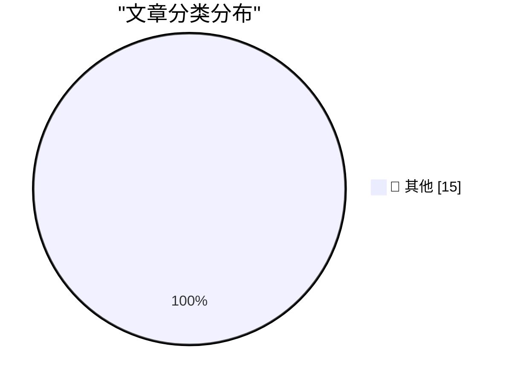

# 📰 AI 资讯每日精选 — 2026-09-23

> 汇聚 140+ 技术博客、X/Twitter、Hacker News、Reddit、Product Hunt、
> Lobste.rs、ClawFeed 日报及 GitHub Trending，经 AI 评分筛选。
>
> **本期内容**：🏆 今日必读 · 🌐 ClawFeed 日报 · 🔥 GitHub Trending · 📂 分类精选 · 🎨 设计与生成式 AI · 📊 数据概览

## 🏆 今日必读

🥇 **Claude Opus 5.5, GPT-6 Sol, GPT-6 Luna, and a new price war**

[Claude Opus 5.5, GPT-6 Sol, GPT-6 Luna, and a new price war](https://simonwillison.net/2026/Sep/22/opus-and-sol-and-luna/) — simonwillison.net · 1 小时前 · 📝 其他

> Claude Opus 5.5, GPT-6 Sol, GPT-6 Luna, and a new price war

🥈 **llm 0.36**

[llm 0.36](https://simonwillison.net/2026/Sep/22/llm/) — simonwillison.net · 6 小时前 · 📝 其他

> llm 0.36

🥉 **Quoting @therealcornpop**

[Quoting @therealcornpop](https://simonwillison.net/2026/Sep/22/therealcornpop/) — simonwillison.net · 7 小时前 · 📝 其他

> Quoting @therealcornpop

4️⃣ **llm-anthropic 0.29**

[llm-anthropic 0.29](https://simonwillison.net/2026/Sep/22/llm-anthropic/) — simonwillison.net · 8 小时前 · 📝 其他

> llm-anthropic 0.29

5️⃣ **llm-typesafe 0.1a0**

[llm-typesafe 0.1a0](https://simonwillison.net/2026/Sep/22/llm-typesafe/) — simonwillison.net · 9 小时前 · 📝 其他

> llm-typesafe 0.1a0

---

## 🌐 ClawFeed 日报精选

> 来源：[ClawFeed](https://clawfeed.kevinhe.io) — AI 驱动的多源新闻聚合

# ClawFeed Daily | 2026-09-22 (SGT)

aggregated: 5 x 4h digests (IDs 1261-1265, 00:00-19:59 SGT)
feed: 25 total (high overlap) | bookmarks: 5 (static all day) | errors: 0

---

## 🔥 当日全场最重要 5 条

1. **Laya 开源模型正面挑战 Jev——System One 赛道出现搅局者**（#1265, 16:00-19:59）
   421M 参数开源模型，本地跑 45ms 决策 vs Jev 云端 ~300ms，速度快 7-11x，成本 $0 vs 按 token 收费，权重开源。贪吃蛇/俄罗斯方块实测 Laya 碾压。这是 Jev 发布以来第一次来自开源社区的正面性能挑战。

2. **Lauren Tan (@poteto) 单月 2500 PRs agent 舰队实战**（#1264-1265, 12:00-19:59）
   前 Meta/Netflix、现 xAI/Grok Bot 核心工程师。核心方法论：不是 agent 数量，而是把工程经验/约束/验证能力沉淀为运行环境，建立"信任"后 agent 自主持续交付。目前公开的最大规模 agent 编程实战数据之一。

3. **TypeSafe CEO 公开 coding agent 设计笔记——KV cache 反事实思想实验**（#1261, 00:00-03:59，持续 5 期）
   Diogo Almeida 分享 TypeSafe 方向文档：如果 LLM 没有 KV cache，coding agent 该怎么设计？论点：今天 agent 的许多"标准特性"不是源于用户价值，而是绕过 KV cache 和按 token 计费的权宜之计。对当前 agent 范式的结构性质疑。

4. **OpenAI 正在开发对标 Grok Bot 的长期在线 Agent 产品**（#1265, 16:00-19:59）
   The Information 爆料，把 Codex + ChatGPT Agent 能力重组。Agent 竞争全面升级信号。

5. **Jev 60 案例合集 + 12 重点场景系统梳理**（#1261-1265, 全天）
   目前最完整的 Jev 应用场景梳理。核心框架：生成模型（复杂推理）+ Jev（分类/筛选/评分/路由）+ 代码执行 + 人工复核。配合 Codex 实测 token 节省 90%。

---

## 📰 当日核心主题

### System One 模型赛道爆发
Jev 话题贯穿全天 5 个 4h 周期，从技术图解→案例沉淀→生态盘点完成一轮传播周期。更重要的信号是 Laya 开源模型的出现——System One 不再是 Jev 独占赛道，开源替代方案首次在速度和成本上正面挑战。"System One Models" 作为新概念被提出：继文字/图片/音频/视频之后，又一个可能改变 Agent 格局的模型类型。

### Agent 规模化从概念到量化
Lauren Tan 的 2500 PRs/月是"agent 舰队"从概念验证跨越到生产力量化的标志性数据。方法论核心是信任工程（沉淀约束和验证能力为环境），而非简单堆叠 agent 数量。

### Coding Agent 架构反思
TypeSafe/Diogo 的 KV cache 反事实实验全天持续传播。核心质疑：当前 agent 设计有多少是"真需求"，有多少是绕过基础设施约束的 workaround？如果约束变了，架构该怎么变？

### 个人助理赛道持续分化（Bookmarks 层）
Rene（iMessage Agent）、Instinct（"OpenClaw for normal people"）、Assistant Benchmark（71 助理 x 15 维度）三者分别代表：新交互形态、普通人市场、可量化比较。赛道从技术圈扩散到普通用户。

---

## 🔖 累计 Bookmark 精选

全天 5 期 bookmarks 完全相同（未刷新），5 条关键书签：

1. **Browser Use + Jev**：DOM 级操作让浏览器 Agent 速度暴增，不再"杀鸡用牛刀"
2. **Rene**：multiplayer-first iMessage Agent，像朋友一样发短信交互，已内测 4 个月
3. **Instinct**：用户评价"OpenClaw for normal people"，个人 AI Agent 走向普通人市场
4. **Assistant Benchmark**：71 个 AI 个人助理公开评分卡，15 维度，赛道进入可量化比较阶段
5. **Aaron Levie agentic workload 预判**：agent swarms + computer use + 新 API/MCP + 垂直企业 Agent + 后台 Agent 同时涌来

---

## 👀 推荐关注汇总

| 账号 | 身份 | 推荐理由 |
|------|------|---------|
| @CompleteSkeptic (Diogo Almeida) | TypeSafe/Jev 创始人 | coding agent 设计笔记一手信息源 |
| @akshay_pachaar | 技术写作者 | Jev 技术图解长文"全网最透彻" |
| @poteto (Lauren Tan) | xAI 核心工程师，前 Meta/Netflix | agent 舰队工程实战 2500 PRs/月 |

（需确认是否已关注，操作前请先在 Following 里搜索。）

---

## 💤 当日重复噪音模式

- **Jev 内容饱和循环**：同一批 Jev 内容（60 案例合集、Codex 节省 90%、TypeSafe 设计笔记）在 5 个 4h 周期中反复出现，feed 信息增量从第 3 期开始趋近于零。第 1-2 期有原创深度分析，第 3-4 期退化为搬运/汇编
- **Bookmarks 全天未刷新**：5/5 bookmarks 连续 5 期完全相同，无新增书签信号
- **建议**：Jev 话题已进入收敛期，除非出现新竞品（如 Laya 后续动态）或新技术维度，可降频关注。关注点转向 Laya 开源挑战和 System One 赛道竞争格局

---

version: daily | date: 2026-09-22 | aggregated_ids: [1261, 1262, 1263, 1264, 1265]---

## 🔥 GitHub Trending

> 今日热门开源项目（全语言 + Python）

| # | 项目 | 描述 | ⭐ 总星 | 📈 今日 | 语言 |
|---|------|------|---------|---------|------|
| 1 | [google/ax](https://github.com/google/ax) | Google's open agentic orchestration runtime | 7.7k | +2305 | Go |
| 2 | [zhouxiaoka/autoclip](https://github.com/zhouxiaoka/autoclip) 🤖 | AutoClip : AI-powered video clipping and highlight genera... | 8.7k | +594 | Python |
| 3 | [mvt-project/mvt](https://github.com/mvt-project/mvt) | MVT (Mobile Verification Toolkit) helps with conducting f... | 14.1k | +441 | Python |
| 4 | [anthropics/financial-services](https://github.com/anthropics/financial-services) |  | 36.4k | +438 | Python |
| 5 | [dream-num/univer](https://github.com/dream-num/univer) 🤖 | The Office Harness for AI Agents — Spreadsheets, Docs, Sl... | 15.4k | +255 | TypeScript |
| 6 | [agent-substrate/substrate](https://github.com/agent-substrate/substrate) 🤖 | Agent Substrate: the core system | 3.0k | +245 | Go |
| 7 | [superdesigndev/treg](https://github.com/superdesigndev/treg) 🤖 | OpenRouter for agent tools. Join community here: https://... | 2.2k | +230 | Python |
| 8 | [browser-use/video-use](https://github.com/browser-use/video-use) | Edit videos with coding agents | 25.9k | +191 | Python |
| 9 | [TNT-Likely/PanWatch](https://github.com/TNT-Likely/PanWatch) 🤖 | 盯盘侠 PanWatch · 自托管 AI 盯盘助手，集成 TradingAgents 多 Agent 投资决策 ... | 1.3k | +175 | Python |
| 10 | [FareedKhan-dev/train-llm-from-scratch](https://github.com/FareedKhan-dev/train-llm-from-scratch) 🤖 | A straightforward method for training your LLM, from down... | 10.8k | +141 | Python |
| 11 | [paperless-ngx/paperless-ngx](https://github.com/paperless-ngx/paperless-ngx) | A community-supported supercharged document management sy... | 45.9k | +75 | Python |
| 12 | [davila7/claude-code-templates](https://github.com/davila7/claude-code-templates) 🤖 | CLI tool for configuring and monitoring Claude Code | 31.1k | +64 | Python |

---

## 📝 其他

### 1. Claude Opus 5.5, GPT-6 Sol, GPT-6 Luna, and a new price war

[Claude Opus 5.5, GPT-6 Sol, GPT-6 Luna, and a new price war](https://simonwillison.net/2026/Sep/22/opus-and-sol-and-luna/) — **simonwillison.net** · 1 小时前 · ⭐ 15/30

> Claude Opus 5.5, GPT-6 Sol, GPT-6 Luna, and a new price war

---

### 2. llm 0.36

[llm 0.36](https://simonwillison.net/2026/Sep/22/llm/) — **simonwillison.net** · 6 小时前 · ⭐ 15/30

> llm 0.36

---

### 3. Quoting @therealcornpop

[Quoting @therealcornpop](https://simonwillison.net/2026/Sep/22/therealcornpop/) — **simonwillison.net** · 7 小时前 · ⭐ 15/30

> Quoting @therealcornpop

---

### 4. llm-anthropic 0.29

[llm-anthropic 0.29](https://simonwillison.net/2026/Sep/22/llm-anthropic/) — **simonwillison.net** · 8 小时前 · ⭐ 15/30

> llm-anthropic 0.29

---

### 5. llm-typesafe 0.1a0

[llm-typesafe 0.1a0](https://simonwillison.net/2026/Sep/22/llm-typesafe/) — **simonwillison.net** · 9 小时前 · ⭐ 15/30

> llm-typesafe 0.1a0

---

### 6. Meta’s Muse Logomark, Designed by Jessica Hische

[Meta’s Muse Logomark, Designed by Jessica Hische](https://thedieline.com/jessica-hische-metas-muse-and-the-ethical-landmines-of-design/) — **daringfireball.net** · 2 小时前 · ⭐ 15/30

> Meta’s Muse Logomark, Designed by Jessica Hische

---

### 7. Meta’s New Muse AI Agent Read Jason Aten’s Messages Database

[Meta’s New Muse AI Agent Read Jason Aten’s Messages Database](https://www.inc.com/jason-aten/metas-new-muse-ai-agent-read-my-private-messages-i-never-asked-it-to/91408202) — **daringfireball.net** · 4 小时前 · ⭐ 15/30

> Meta’s New Muse AI Agent Read Jason Aten’s Messages Database

---

### 8. Why Didn’t Google Build Muse?

[Why Didn’t Google Build Muse?](https://spyglass.org/why-didnt-google-build-muse/) — **daringfireball.net** · 4 小时前 · ⭐ 15/30

> Why Didn’t Google Build Muse?

---

### 9. Amazon Blocks Meta’s Muse AI Assistant

[Amazon Blocks Meta’s Muse AI Assistant](https://www.geekwire.com/2026/amazon-blocks-metas-muse-ai-assistant-in-new-standoff-over-agentic-shopping/) — **daringfireball.net** · 5 小时前 · ⭐ 15/30

> Amazon Blocks Meta’s Muse AI Assistant

---

### 10. Meta’s New Muse AI Agent App Overtakes ChatGPT as Top iPhone App

[Meta’s New Muse AI Agent App Overtakes ChatGPT as Top iPhone App](https://9to5mac.com/2026/09/18/metas-new-muse-ai-agent-app-overtakes-chatgpt-as-top-iphone-app/) — **daringfireball.net** · 5 小时前 · ⭐ 15/30

> Meta’s New Muse AI Agent App Overtakes ChatGPT as Top iPhone App

---

### 11. Xcode 27.2 Now Supports a New JSON Project File Format

[Xcode 27.2 Now Supports a New JSON Project File Format](https://developer.apple.com/documentation/xcode-release-notes/xcode-27_2-release-notes) — **daringfireball.net** · 6 小时前 · ⭐ 15/30

> Xcode 27.2 Now Supports a New JSON Project File Format

---

### 12. Siri AI Class-Action Lawsuit Settlement Website Is Now Live

[Siri AI Class-Action Lawsuit Settlement Website Is Now Live](https://www.macrumors.com/2026/09/20/siri-ai-settlement-website-now-live/) — **daringfireball.net** · 10 小时前 · ⭐ 15/30

> Siri AI Class-Action Lawsuit Settlement Website Is Now Live

---

### 13. It's Not Just True, It's False

[It's Not Just True, It's False](https://idiallo.com/byte-size/its-not-just-true-its-false) — **idiallo.com** · 23 小时前 · ⭐ 15/30

> It's Not Just True, It's False

---

### 14. Pluralistic: Bonta sold us out to Trump's oligarchs (22 Sep 2026)

[Pluralistic: Bonta sold us out to Trump's oligarchs (22 Sep 2026)](https://pluralistic.net/2026/09/22/happy-chudmas/) — **pluralistic.net** · 17 小时前 · ⭐ 15/30

> Pluralistic: Bonta sold us out to Trump's oligarchs (22 Sep 2026)

---

### 15. Are LLMs still surprisingly bad at some simple tasks?

[Are LLMs still surprisingly bad at some simple tasks?](https://shkspr.mobi/blog/2026/09/are-llms-still-surprisingly-bad-at-some-simple-tasks/) — **shkspr.mobi** · 14 小时前 · ⭐ 15/30

> Are LLMs still surprisingly bad at some simple tasks?

---

## 📊 数据概览

| 扫描源 | 抓取文章 | 时间范围 | 精选 |
|:---:|:---:|:---:|:---:|
| 90/140 | 3851 篇 → 91 篇 | 24h | **15 篇** |

### 分类分布

---

*生成于 2026-09-23 01:45 | 汇聚 140 个技术博客、X/Twitter、Hacker News、Reddit、Product Hunt、Lobste.rs、ClawFeed 日报及 GitHub Trending，经 AI 评分筛选出 Top 15 精华内容*
