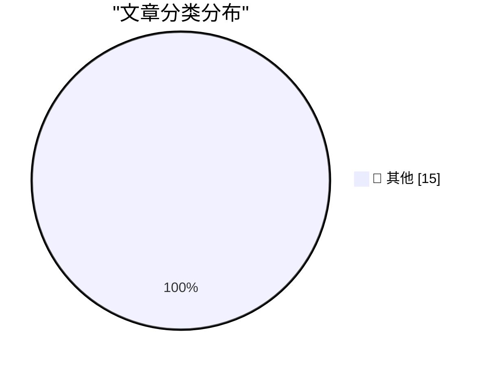

# 📰 AI 资讯每日精选 — 2026-09-24

> 汇聚 140+ 技术博客、X/Twitter、Hacker News、Reddit、Product Hunt、
> Lobste.rs、ClawFeed 日报及 GitHub Trending，经 AI 评分筛选。
>
> **本期内容**：🏆 今日必读 · 🌐 ClawFeed 日报 · 🔥 GitHub Trending · 📂 分类精选 · 🎨 设计与生成式 AI · 📊 数据概览

## 🏆 今日必读

🥇 **Gemini 3.8 TTS Playground**

[Gemini 3.8 TTS Playground](https://simonwillison.net/2026/Sep/23/gemini-tts-playground/) — simonwillison.net · 8 小时前 · 📝 其他

> Gemini 3.8 TTS Playground

🥈 **Shadow roots, explained with live examples**

[Shadow roots, explained with live examples](https://simonwillison.net/2026/Sep/23/shadow-roots/) — simonwillison.net · 9 小时前 · 📝 其他

> Shadow roots, explained with live examples

🥉 **SF October 14th: A Birds of a Feather Session on Agentic Engineering**

[SF October 14th: A Birds of a Feather Session on Agentic Engineering](https://simonwillison.net/2026/Sep/23/bof-agentic-engineering/) — simonwillison.net · 22 小时前 · 📝 其他

> SF October 14th: A Birds of a Feather Session on Agentic Engineering

4️⃣ **Changes to App Tracking Transparency in the E.U.**

[Changes to App Tracking Transparency in the E.U.](https://developer.apple.com/app-store/user-privacy-and-data-use/) — daringfireball.net · 1 小时前 · 📝 其他

> Changes to App Tracking Transparency in the E.U.

5️⃣ **★ The iPhone 4 ‘Antennagate’ Press Conference Q&A — Finally**

[★ The iPhone 4 ‘Antennagate’ Press Conference Q&A — Finally](https://daringfireball.net/2026/09/iphone_4_antennagate_q_and_a) — daringfireball.net · 3 小时前 · 📝 其他

> ★ The iPhone 4 ‘Antennagate’ Press Conference Q&A — Finally

---

## 🌐 ClawFeed 日报精选

> 来源：[ClawFeed](https://clawfeed.kevinhe.io) — AI 驱动的多源新闻聚合

# ClawFeed Daily | 2026-09-23 (SGT)

aggregated: 5 x 4h digests (IDs 1268-1272, 00:00-19:59 SGT)
feed: 25 total | bookmarks: 25 total (高度重叠，实际独立条目约 8) | errors: 0

---

## 🔥 当日全场最重要 5 条

1. **Harvey 法律 AI 毛利崩塌——Agent 时代推理成本风险实证**（#1271, 12:00-15:59）
   Agent token 使用量暴增 20 倍，毛利率从约 50% 直跌至 -50%（彭博报道）。结论指向开源模型或自己做后训练。这是迄今最清晰的"Agent 密集调用经济性"警示案例，对所有 Agent 平台（包括 OpenMax）的定价和成本模型有直接参考价值。

2. **Muse 登顶 App Store + Amazon 封杀——从产品事件升级为平台博弈**（#1270-1272, 全天持续）
   Muse 上线 13 天压过 ChatGPT 登顶美区 App Store 效率类，带飞 Meta 股价（小扎身家涨 1000+ 亿）、AMD 股价。Amazon 直接封杀 Muse 代购（Muse 可自动比价/购物）。同时 OpenMuse 开源版发布，个人 Agent 架构正在被商品化。

3. **Lauren Tan 单月 2500 PR Agent 舰队方法论公开**（#1268-1269, 00:00-07:59）
   前 Meta/Netflix、现 xAI/Grok Bot 核心工程师，Cursor 官方大会 38 分钟技术演讲免费放出。核心：不是堆 Agent 数量，而是把工程经验/约束/验证能力沉淀为运行环境，建立"信任"后 Agent 自主持续交付。目前公开的最大规模 Agent 编程实战数据之一。

4. **Opus 5.5 + GPT-6 Sol/Luna 同日发布，推理成本断崖下降**（#1270-1272, 08:00 起）
   Opus 5.5 价格比 Opus 5 低 40%、token 用量减 63%；GPT-6 Sol/Luna 降价 50%。实测 Opus 5.5 可直接生成产品宣传视频。Anthropic Playbook 三核心差异：独立工作更长、直白汇报、不需"think carefully"。Agent 密集调用场景经济性显著改善。

5. **Personal AI 四产品白热化竞争 + Today 9/24 中国上线**（#1268-1272, 全天）
   Muse（Meta，App Store #1）、Today（中国版 9/24 上线，全平台）、Instinct（$3.5 亿融资 / $25 亿估值）、Rene（iMessage 原生 multiplayer Agent）四家产品同周竞争。OpenMuse 开源版加入战局。Assistant Benchmark 上线对 71 款 AI 助手做 15 维横评。

---

## 📰 当日核心主题

### Agent 经济性：从理论风险到实证崩塌
Harvey 毛利从 +50% 到 -50% 是今天最重要的单一信号。同时 Opus 5.5/GPT-6 大幅降价提供了解药方向。两条消息合在一起的结论：Agent 密集调用的推理成本是生死线，但模型厂商降价速度也在加快——谁能最快适配新模型价格曲线，谁就能把 Harvey 的教训变成竞争优势。

### Personal AI 赛道：一周内从概念到混战
本周 Muse/Today/Instinct/Rene 四产品同时活跃，OpenMuse 开源版加入，Assistant Benchmark 提供量化比较框架。赛道特征正在收敛：主动式、后台持续运行、代执行真实任务、消息平台入口。Amazon 封杀 Muse 代购标志着 Personal AI 已触及电商平台利益边界。

### Agent 工程化从演示到量产
Lauren Tan 2500 PR/月是"Agent 舰队"从概念跨越到生产力量化的标志。方法论核心是信任工程（沉淀约束和验证为环境），而非堆叠 Agent 数量。Mirasim 多 Agent 统一 IDE（支持 Claude/Codex/Grok 同 session 切换）也指向 Agent 工具链走向成熟。

### Jev 生态：一周 194 个项目
Jev（Monad 团队小模型）生态持续爆发，一周内 194 个项目上线。热门方向：浏览器自动化（jev-ultrafast 15k⭐）、Claude Code 上下文压缩、链上交易。Browser Use + Jev 组合把 Computer Use 推理开销砍到极低。但信息密度已进入递减区间。

### 知识基础设施：Firecrawl $75M 转向
Firecrawl B 轮 $75M（Smash Capital 领投），从爬虫工具转向 Agent 知识基础设施（Alexandria 知识库）。"为超级智能构建最大知识库"——数据集和数据提供商整合为 Agent 即时可用的知识层。

---

## 🔖 累计 Bookmark 精选

全天 bookmarks 高度重叠（5 期基本相同），核心独立条目：
- **Browser Use + Jev**：小模型做 DOM 离散操作，速度碾压大模型。链上交易 demo 开源（架构参考）。
- **Rene**：iMessage 原生 multiplayer Agent，浏览器/代码/购物/建站全能。
- **Instinct**："OpenClaw for normal people"，非技术用户可用。
- **Assistant Benchmark**：71 款 AI 助手 x 15 维度公开横评（assistantbenchmark.com）。
- **Agent 工作负载预判**：agent swarms + computer use + MCP + 新形态组合，规模可能超预期。

---

## 👀 推荐关注汇总

- **@jarrodwatts** — Monad 开发者，Jev 链上交易系统开源（#1269）
- **@ataiiam (Atai Barkai)** — OpenMuse 创作者，开源个人 Agent 架构（#1270）
- **@poteto (Lauren Tan)** — xAI 工程师，2500 PR/月 Agent 舰队方法论（#1270）
- **@TodayAIofficial** — Today AI 中国版 Personal Agent，竞品监测对象（#1270）

---

## 💤 当日重复噪音模式

- **Jev 项目列表类内容信息密度递减**：5 期中 4 期包含 Jev 项目合集/案例站推荐，核心事实（194 项目/热门方向/速度优势）在第一期即已饱和。后续可降权。
- **Muse 霸屏**：5 期中 3-4 期包含 Muse 相关内容（登顶/OpenMuse/Amazon 封杀），事件已从产品层升级到平台博弈层，但信息增量在 #1271 后趋于饱和。
- **Personal AI 四方框架重复**：Muse/Today/Instinct/Rene 竞争格局在每期重复出现，核心事实已稳定。
- **Bookmarks 全天几乎不变**：5 期 bookmarks 高度重叠，实际独立条目约 8 条。---

## 🔥 GitHub Trending

> 今日热门开源项目（全语言 + Python）

| # | 项目 | 描述 | ⭐ 总星 | 📈 今日 | 语言 |
|---|------|------|---------|---------|------|
| 1 | [google/ax](https://github.com/google/ax) | Google's open agentic orchestration runtime | 9.1k | +1543 | Go |
| 2 | [dream-num/univer](https://github.com/dream-num/univer) 🤖 | The Office Harness for AI Agents — Spreadsheets, Docs, Sl... | 16.3k | +1142 | TypeScript |
| 3 | [browser-use/video-use](https://github.com/browser-use/video-use) | Edit videos with coding agents | 26.5k | +746 | Python |
| 4 | [anthropics/financial-services](https://github.com/anthropics/financial-services) |  | 37.0k | +664 | Python |
| 5 | [agent-substrate/substrate](https://github.com/agent-substrate/substrate) 🤖 | Agent Substrate: the core system | 3.5k | +558 | Go |
| 6 | [mvt-project/mvt](https://github.com/mvt-project/mvt) | MVT (Mobile Verification Toolkit) helps with conducting f... | 14.5k | +543 | Python |
| 7 | [superdesigndev/treg](https://github.com/superdesigndev/treg) 🤖 | OpenRouter for agent tools. Join community here: https://... | 2.7k | +506 | Python |
| 8 | [obra/superpowers](https://github.com/obra/superpowers) | An agentic skills framework & software development method... | 290.7k | +474 | Shell |
| 9 | [davila7/claude-code-templates](https://github.com/davila7/claude-code-templates) 🤖 | CLI tool for configuring and monitoring Claude Code | 31.5k | +389 | Python |
| 10 | [Open-Dev-Society/OpenStock](https://github.com/Open-Dev-Society/OpenStock) | OpenStock is an open-source alternative to expensive mark... | 18.8k | +344 | TypeScript |
| 11 | [pbakaus/impeccable](https://github.com/pbakaus/impeccable) 🤖 | The design language that makes your AI harness better at ... | 70.3k | +304 | JavaScript |
| 12 | [Comfy-Org/ComfyUI](https://github.com/Comfy-Org/ComfyUI) 🤖 | The most powerful and modular diffusion model GUI, api an... | 134.7k | +209 | Python |
| 13 | [DeusData/codebase-memory-mcp](https://github.com/DeusData/codebase-memory-mcp) | High-performance code intelligence MCP server. Indexes co... | 44.6k | +190 | C |
| 14 | [zhouxiaoka/autoclip](https://github.com/zhouxiaoka/autoclip) 🤖 | AutoClip : AI-powered video clipping and highlight genera... | 8.8k | +139 | Python |
| 15 | [strands-agents/harness-sdk](https://github.com/strands-agents/harness-sdk) 🤖 | Build an agent harness and control it end-to-end. Open-so... | 7.9k | +115 | Python |

---

## 📝 其他

### 1. Gemini 3.8 TTS Playground

[Gemini 3.8 TTS Playground](https://simonwillison.net/2026/Sep/23/gemini-tts-playground/) — **simonwillison.net** · 8 小时前 · ⭐ 15/30

> Gemini 3.8 TTS Playground

---

### 2. Shadow roots, explained with live examples

[Shadow roots, explained with live examples](https://simonwillison.net/2026/Sep/23/shadow-roots/) — **simonwillison.net** · 9 小时前 · ⭐ 15/30

> Shadow roots, explained with live examples

---

### 3. SF October 14th: A Birds of a Feather Session on Agentic Engineering

[SF October 14th: A Birds of a Feather Session on Agentic Engineering](https://simonwillison.net/2026/Sep/23/bof-agentic-engineering/) — **simonwillison.net** · 22 小时前 · ⭐ 15/30

> SF October 14th: A Birds of a Feather Session on Agentic Engineering

---

### 4. Changes to App Tracking Transparency in the E.U.

[Changes to App Tracking Transparency in the E.U.](https://developer.apple.com/app-store/user-privacy-and-data-use/) — **daringfireball.net** · 1 小时前 · ⭐ 15/30

> Changes to App Tracking Transparency in the E.U.

---

### 5. ★ The iPhone 4 ‘Antennagate’ Press Conference Q&A — Finally

[★ The iPhone 4 ‘Antennagate’ Press Conference Q&A — Finally](https://daringfireball.net/2026/09/iphone_4_antennagate_q_and_a) — **daringfireball.net** · 3 小时前 · ⭐ 15/30

> ★ The iPhone 4 ‘Antennagate’ Press Conference Q&A — Finally

---

### 6. ‘Prepare to Ship’ Is a Clever Software Solution That Allows iPhone 18 Pro Max to Ship With a Battery That Would Otherwise Exceed International Shipping Regulations

[‘Prepare to Ship’ Is a Clever Software Solution That Allows iPhone 18 Pro Max to Ship With a Battery That Would Otherwise Exceed International Shipping Regulations](https://support.apple.com/en-us/127848) — **daringfireball.net** · 5 小时前 · ⭐ 15/30

> ‘Prepare to Ship’ Is a Clever Software Solution That Allows iPhone 18 Pro Max to Ship With a Battery That Would Otherwise Exceed International Shipping Regulations

---

### 7. App Store Scam of the Week: ‘Update My Phone & Apps: Guide’ by Tair Olzhasev

[App Store Scam of the Week: ‘Update My Phone & Apps: Guide’ by Tair Olzhasev](https://apps.apple.com/us/app/update-my-phone-apps-guide/id6753936837) — **daringfireball.net** · 6 小时前 · ⭐ 15/30

> App Store Scam of the Week: ‘Update My Phone & Apps: Guide’ by Tair Olzhasev

---

### 8. ★ AppZapper 3000

[★ AppZapper 3000](https://daringfireball.net/2026/09/appzapper_3000) — **daringfireball.net** · 8 小时前 · ⭐ 15/30

> ★ AppZapper 3000

---

### 9. Super Intelligence, Indeed

[Super Intelligence, Indeed](https://bsky.app/profile/atrupar.com/post/3mw4it5l5fd23) — **daringfireball.net** · 11 小时前 · ⭐ 15/30

> Super Intelligence, Indeed

---

### 10. Navigation with only addition, subtraction, and tables

[Navigation with only addition, subtraction, and tables](https://www.johndcook.com/blog/2026/09/23/navigation-minimum/) — **johndcook.com** · 11 小时前 · ⭐ 15/30

> Navigation with only addition, subtraction, and tables

---

### 11. Make Money to Make More Websites

[Make Money to Make More Websites](https://blog.jim-nielsen.com/2026/make-money-to-make-more-websites/) — **blog.jim-nielsen.com** · 6 小时前 · ⭐ 15/30

> Make Money to Make More Websites

---

### 12. Ebay’s IPO: The rare dotcom survivor

[Ebay’s IPO: The rare dotcom survivor](https://dfarq.homeip.net/ebays-ipo-the-rare-dotcom-survivor/?utm_source=rss&#038;utm_medium=rss&#038;utm_campaign=ebays-ipo-the-rare-dotcom-survivor) — **dfarq.homeip.net** · 14 小时前 · ⭐ 15/30

> Ebay’s IPO: The rare dotcom survivor

---

### 13. The Year AI Came For Us: Teaching Entrepreneurship Will Never Be The Same

[The Year AI Came For Us: Teaching Entrepreneurship Will Never Be The Same](https://steveblank.com/2026/09/23/the-year-ai-came-for-us-teaching-entrepreneurship-will-never-be-the-same/) — **steveblank.com** · 12 小时前 · ⭐ 15/30

> The Year AI Came For Us: Teaching Entrepreneurship Will Never Be The Same

---

### 14. Weekly Update 522: Live From Oslo with Scott Helme

[Weekly Update 522: Live From Oslo with Scott Helme](https://www.troyhunt.com/weekly-update-522/) — **troyhunt.com** · 20 小时前 · ⭐ 15/30

> Weekly Update 522: Live From Oslo with Scott Helme

---

### 15. How to Use NVIDIA Warp and MjWarp to Accelerate Robotics Simulation and Learning Workflows

[How to Use NVIDIA Warp and MjWarp to Accelerate Robotics Simulation and Learning Workflows](https://huggingface.co/blog/nvidia/how-to-use-nvidia-warp-and-mjwarp) — **Hugging Face Blog** · 6 小时前 · ⭐ 15/30

> How to Use NVIDIA Warp and MjWarp to Accelerate Robotics Simulation and Learning Workflows

---

## 📊 数据概览

| 扫描源 | 抓取文章 | 时间范围 | 精选 |
|:---:|:---:|:---:|:---:|
| 93/140 | 3917 篇 → 85 篇 | 24h | **15 篇** |

### 分类分布

---

*生成于 2026-09-24 01:38 | 汇聚 140 个技术博客、X/Twitter、Hacker News、Reddit、Product Hunt、Lobste.rs、ClawFeed 日报及 GitHub Trending，经 AI 评分筛选出 Top 15 精华内容*
