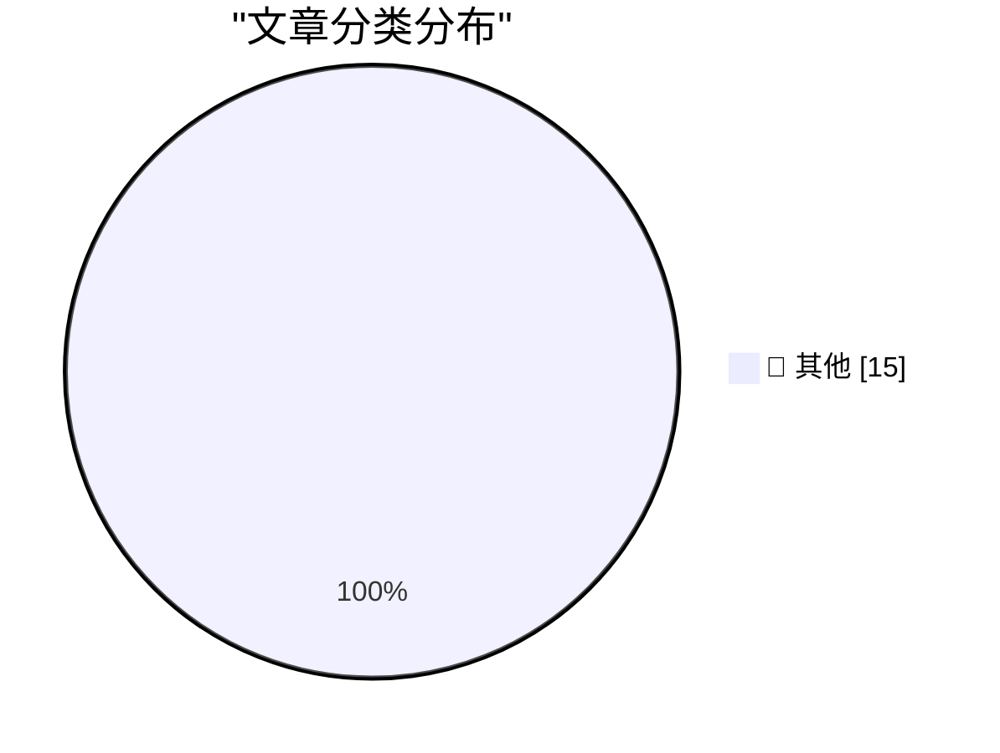

# 📰 AI 资讯每日精选 — 2026-09-27

> 汇聚 140+ 技术博客、X/Twitter、Hacker News、Reddit、Product Hunt、
> Lobste.rs、ClawFeed 日报及 GitHub Trending，经 AI 评分筛选。
>
> **本期内容**：🏆 今日必读 · 🌐 ClawFeed 日报 · 🔥 GitHub Trending · 📂 分类精选 · 🎨 设计与生成式 AI · 📊 数据概览

## 🏆 今日必读

🥇 **Kākāpō Party**

[Kākāpō Party](https://simonwillison.net/2026/Sep/26/kakapo-party/) — simonwillison.net · 2 小时前 · 📝 其他

> Kākāpō Party

🥈 **Reelizer Returns**

[Reelizer Returns](https://www.reelizer.com/) — daringfireball.net · 4 小时前 · 📝 其他

> Reelizer Returns

🥉 **Alexandr Wang: ‘Why I’m Building Muse’**

[Alexandr Wang: ‘Why I’m Building Muse’](https://x.com/alexandr_wang/status/2103551714536439951) — daringfireball.net · 5 小时前 · 📝 其他

> Alexandr Wang: ‘Why I’m Building Muse’

4️⃣ **Apple’s Other Recent ‘Duo’**

[Apple’s Other Recent ‘Duo’](https://support.apple.com/en-us/111812) — daringfireball.net · 6 小时前 · 📝 其他

> Apple’s Other Recent ‘Duo’

5️⃣ **International Standard Paper Sizes**

[International Standard Paper Sizes](https://www.cl.cam.ac.uk/~mgk25/iso-paper.html) — daringfireball.net · 6 小时前 · 📝 其他

> International Standard Paper Sizes

---

## 🌐 ClawFeed 日报精选

> 来源：[ClawFeed](https://clawfeed.kevinhe.io) — AI 驱动的多源新闻聚合

# ClawFeed 日报 | 2026-09-26 (SGT)

> 汇总 5 期 4h digest：#1289 (00:00) · #1290 (04:00) · #1291 (08:00) · #1292 (12:00) · #1293 (16:00)

---

## 🔥 当日全场最重要 5 条

1. **Jev + BrowserUse ultrafast 爆发（19K+ Star）**
   Browser Use 团队基于 Jev 模型做出 jev-ultrafast，把网页可交互元素编号成离散多选题，一次请求同时决定动作+目标元素，Google Flights 搜航班仅 7.1 秒。链上自动交易系统已开源（跑 14h 亏 300%，但架构验证了 Jev 实时决策能力）。核心洞察：网页操作本质是离散多选题，不需要 AI 会写诗。
   *出现频次：5/5 期，全天持续刷屏*

2. **Anthropic 工程师：Agent 时代的瓶颈已从代码转向组织**
   前线工程师分享——借助 Agent，以前需要几年的代码现代化项目现在几周完成，但新瓶颈转向组织：测试、Review、审批和上线流程跟不上代码变化速度。组织能力成为 agent 时代的真正限速器。
   *出现频次：1/5 期（#1292），但信号权重极高*

3. **Opus 5.5 effort 官方用法指南 + 前端能力碾压**
   Thariq（Anthropic Claude Code 团队）长文：日常 medium，盯改 low，修 bug/验证 high，全放手/安全审计 max。Eval 实测结果出乎意料：不是所有场景都该用 max。同时 Opus 5.5 一键生成产品宣传片（含代码生成背景音乐），GPT-6 Astra 被评为明显不如。OpenAI Dev Day 下周二成关键节点。
   *出现频次：4/5 期*

4. **Muse（Meta）全面铺开：购物闭环 + 云电脑玩法爆发**
   购物实测：500 元预算买降噪耳机，自动搜京东→识别需登录→转华为电商→返回商品选项，对中国电商生态熟悉度超预期。云电脑被玩出花：出口是干净美国家宽，注册 Claude/甲骨文/AWS/谷歌云全过，可跑定时任务 24h 不关机。扎克伯格："Muse 这类 agent 会不会让 Codex 变成上一代产品？"
   *出现频次：4/5 期，从注册通道到购物闭环逐步升级*

5. **Assistant Benchmark 上线：PA 赛道首个标准化横评**
   71 个 AI 个人助理 × 15 个维度（速度/记忆/邮件/研究/购物/权限等）公开打分排名，assistantbenchmark.com。对 OpenClaw 竞争格局定位直接相关。
   *出现频次：4/5 期*

---

## 📰 当日核心主题

### 主题 1：Personal Agent 赛道集体爆发
Rene（iMessage 原生多人 agent）、Instinct（"OpenClaw for normal people"，向非技术人群渗透）、Muse（购物+云电脑）、Assistant Benchmark（71 款横评）——PA 赛道从产品发布到评测体系建立，一天内集齐。Instinct 用户在给家人部署，说明受众不限硅谷圈。

### 主题 2：浏览器自动化范式转移
Jev 证明网页操作是离散多选题，Browser Use 基于此做到 7.1 秒搜航班。与此同时 Opus 5.5 把动效制作从框架编码变成纯 prompt 驱动——工具链断代正在发生，Remotion 等框架被替代。

### 主题 3：Agent 工程化进入深水区
Anthropic 工程师的"组织瓶颈论"指向一个结构性问题：代码生产速度已经不是瓶颈，组织流程（测试/review/审批/上线）才是。Company Brain（开源多人 Slack AI 员工）和 Zuse（统一封装多个 CLI Agent 的编排器）是工程侧的应对。

### 主题 4：Opus 5.5 vs GPT-6 对比升温
Opus 5.5 前端能力（宣传片、动效）获一致好评，GPT-6 Astra 被评为明显不如。effort 官方指南发布，说明 Anthropic 在引导用户精细化使用。OpenAI Dev Day 下周二是下一个变量。

### 主题 5：开源知识工具破圈
《高性价比人生指南》13K+ Star，601 条人生建议全引期刊论文+官方文件。开源内容从技术领域扩展到生活决策领域，Codex + Excalidraw 手绘视频 Skill 一句话出知识视频。

---

## 🔖 累计 Bookmark 精选

| 项目 | 关键信息 | 出现期数 |
|------|----------|----------|
| Jev + BrowserUse ultrafast | 19K+ Star，7.1s 搜航班，链上交易开源 | 5/5 |
| Rene | iMessage 多人 agent，正式上线 | 4/5 |
| Instinct | "OpenClaw for normal people"，非技术人群渗透 | 4/5 |
| Assistant Benchmark | 71 PA × 15 维度横评 | 4/5 |
| Together AI Jev 训练教程 | Qwen3.5 4B，25min+$17 | 1/5 |
| Company Brain | 开源多人 Slack AI 员工 | 2/5 |

---

## 👀 推荐关注汇总

本日 scrape 多期未返回作者 handle，无法准确核实关注状态。以下为内容来源中值得关注的账号：
- @tlxue — Rene 创始人，multiplayer agent 方向
- @jarrodwatts — Jev 链上交易开源实现
- @SUOHA_AI — Jev 深度解读
- @pitdesi — Instinct 早期用户，PA 市场观察

---

## 💤 当日重复噪音模式

1. **Jev + BrowserUse 全天循环**：5/5 期都出现，内容高度重叠（19K Star / 7.1s / 链上交易），从第 2 期起信号已被充分覆盖。后续几期的增量信息递减。
2. **Rene / Instinct / Assistant Benchmark 三件套**：4/5 期重复出现相同描述，措辞近似，属于 Twitter 回声效应。
3. **Muse 灰色地带内容**：注册 Claude 绕验证、免费云电脑跑定时任务等内容在 3 期出现，信号收录但需标注边界。
4. **《高性价比人生指南》**：3/5 期出现，内容完全相同（13K Star / 601 条），典型的单次爆款在 feed 中被多账号转发。
---

## 🔥 GitHub Trending

> 今日热门开源项目（全语言 + Python）

| # | 项目 | 描述 | ⭐ 总星 | 📈 今日 | 语言 |
|---|------|------|---------|---------|------|
| 1 | [paperclipai/paperclip](https://github.com/paperclipai/paperclip) | The open-source app everyone uses to manage agents at work | 87.4k | +2608 | TypeScript |
| 2 | [vectorize-io/hindsight](https://github.com/vectorize-io/hindsight) 🤖 | Hindsight: Agent Memory That Learns | 32.3k | +2147 | Python |
| 3 | [dream-num/univer](https://github.com/dream-num/univer) 🤖 | The Office Harness for AI Agents — Spreadsheets, Docs, Sl... | 19.2k | +849 | TypeScript |
| 4 | [rohitg00/ai-engineering-from-scratch](https://github.com/rohitg00/ai-engineering-from-scratch) 🤖 | Learn it. Build it. Ship it for others. | 58.4k | +827 | Python |
| 5 | [openbao/openbao](https://github.com/openbao/openbao) | OpenBao is a software solution to manage, store, and dist... | 8.0k | +364 | Go |
| 6 | [zhaoxuya520/reverse-skill](https://github.com/zhaoxuya520/reverse-skill) 🤖 | Reverse Engineering / Authorized Penetration Testing / Se... | 38.0k | +361 | PowerShell |
| 7 | [NVIDIA/Model-Optimizer](https://github.com/NVIDIA/Model-Optimizer) 🤖 | A unified library of SOTA model optimization techniques l... | 4.8k | +357 | Python |
| 8 | [derv82/wifit3](https://github.com/derv82/wifit3) | Wifite but USB-only & cross-platform. | 1.2k | +357 | Python |
| 9 | [harry0703/MoneyPrinterTurbo](https://github.com/harry0703/MoneyPrinterTurbo) 🤖 | 利用 AI 大模型和自动化工作流，根据主题或关键词一键生成高清短视频。Generate HD short vide... | 126.1k | +349 | Python |
| 10 | [block/buzz](https://github.com/block/buzz) | A hive mind communication platform | 34.8k | +339 | Rust |
| 11 | [anthropics/claude-plugins-official](https://github.com/anthropics/claude-plugins-official) 🤖 | Official, Anthropic-managed directory of high quality Cla... | 37.1k | +253 | Python |
| 12 | [666ghj/MiroFish](https://github.com/666ghj/MiroFish) | A Simple and Universal Swarm Intelligence Engine, Predict... | 74.9k | +211 | Python |
| 13 | [usestrix/strix](https://github.com/usestrix/strix) 🤖 | Open-source AI penetration testing tool to find and fix y... | 65.0k | +196 | Python |
| 14 | [mobile-next/mobile-mcp](https://github.com/mobile-next/mobile-mcp) | Model Context Protocol Server for Mobile Automation and S... | 7.4k | +168 | TypeScript |
| 15 | [shy3130/tick-stock-panel](https://github.com/shy3130/tick-stock-panel) 🤖 | TSP自托管、零运维的 A 股「选股 + 监控 + 回测」量化工作台 | LLM能力驱使策略定制+个股分析+复盘 ... | 5.2k | +162 | Python |

---

## 📝 其他

### 1. Kākāpō Party

[Kākāpō Party](https://simonwillison.net/2026/Sep/26/kakapo-party/) — **simonwillison.net** · 2 小时前 · ⭐ 15/30

> Kākāpō Party

---

### 2. Reelizer Returns

[Reelizer Returns](https://www.reelizer.com/) — **daringfireball.net** · 4 小时前 · ⭐ 15/30

> Reelizer Returns

---

### 3. Alexandr Wang: ‘Why I’m Building Muse’

[Alexandr Wang: ‘Why I’m Building Muse’](https://x.com/alexandr_wang/status/2103551714536439951) — **daringfireball.net** · 5 小时前 · ⭐ 15/30

> Alexandr Wang: ‘Why I’m Building Muse’

---

### 4. Apple’s Other Recent ‘Duo’

[Apple’s Other Recent ‘Duo’](https://support.apple.com/en-us/111812) — **daringfireball.net** · 6 小时前 · ⭐ 15/30

> Apple’s Other Recent ‘Duo’

---

### 5. International Standard Paper Sizes

[International Standard Paper Sizes](https://www.cl.cam.ac.uk/~mgk25/iso-paper.html) — **daringfireball.net** · 6 小时前 · ⭐ 15/30

> International Standard Paper Sizes

---

### 6. Microsoft Took the ‘Copilot+ PC’ Brand Out Behind the Shed

[Microsoft Took the ‘Copilot+ PC’ Brand Out Behind the Shed](https://www.windowscentral.com/microsoft/windows-11/the-copilot-pc-brand-is-dead-microsoft-and-pc-makers-quietly-pull-back-on-tarnished-windows-11-ai-pc-branding) — **daringfireball.net** · 8 小时前 · ⭐ 15/30

> Microsoft Took the ‘Copilot+ PC’ Brand Out Behind the Shed

---

### 7. The Talk Show: ‘I’m Thinking X, Not X’

[The Talk Show: ‘I’m Thinking X, Not X’](https://daringfireball.net/thetalkshow/2026/09/25/ep-455) — **daringfireball.net** · 9 小时前 · ⭐ 15/30

> The Talk Show: ‘I’m Thinking X, Not X’

---

### 8. No errors, no warnings, no gods, no masters - HTML Purity is a Fetish

[No errors, no warnings, no gods, no masters - HTML Purity is a Fetish](https://shkspr.mobi/blog/2026/09/no-errors-no-warnings-no-gods-no-masters-html-purity-is-a-fetish/) — **shkspr.mobi** · 14 小时前 · ⭐ 15/30

> No errors, no warnings, no gods, no masters - HTML Purity is a Fetish

---

### 9. Reverse-engineering the vintage Intel 8087's tangent algorithm: more than CORDIC

[Reverse-engineering the vintage Intel 8087's tangent algorithm: more than CORDIC](http://www.righto.com/feeds/7735201633324934284/comments/default) — **righto.com** · 9 小时前 · ⭐ 15/30

> Reverse-engineering the vintage Intel 8087's tangent algorithm: more than CORDIC

---

### 10. This Week in Package Management: 26 September 2026

[This Week in Package Management: 26 September 2026](https://nesbitt.io/2026/09/26/this-week-in-package-management.html) — **nesbitt.io** · 15 小时前 · ⭐ 15/30

> This Week in Package Management: 26 September 2026

---

### 11. Reading List 2026-09-26

[Reading List 2026-09-26](https://www.construction-physics.com/p/reading-list-2026-09-26) — **construction-physics.com** · 15 小时前 · ⭐ 15/30

> Reading List 2026-09-26

---

### 12. Rusty thoughts on "Parse, don't validate"

[Rusty thoughts on "Parse, don't validate"](https://eli.thegreenplace.net/2026/rusty-thoughts-on-parse-dont-validate/) — **eli.thegreenplace.net** · 10 小时前 · ⭐ 15/30

> Rusty thoughts on "Parse, don't validate"

---

### 13. Former Ukrainian Defense Minister Fedorov pitches a private-sector robot army

[Former Ukrainian Defense Minister Fedorov pitches a private-sector robot army](https://the-decoder.com/former-ukrainian-defense-minister-fedorov-pitches-a-private-sector-robot-army/) — **The Decoder** · 6 小时前 · ⭐ 15/30

> Former Ukrainian Defense Minister Fedorov pitches a private-sector robot army

---

### 14. Two-thirds of IT leaders report AI results, but few would interrupt the CEO's vacation over them

[Two-thirds of IT leaders report AI results, but few would interrupt the CEO's vacation over them](https://the-decoder.com/two-thirds-of-it-leaders-report-ai-results-but-few-would-interrupt-the-ceos-vacation-over-them/) — **The Decoder** · 8 小时前 · ⭐ 15/30

> Two-thirds of IT leaders report AI results, but few would interrupt the CEO's vacation over them

---

### 15. AI access makes people almost entirely unwilling to say "I don't know," study finds

[AI access makes people almost entirely unwilling to say "I don't know," study finds](https://the-decoder.com/ai-access-makes-people-almost-entirely-unwilling-to-say-i-dont-know-study-finds/) — **The Decoder** · 8 小时前 · ⭐ 15/30

> AI access makes people almost entirely unwilling to say "I don't know," study finds

---

## 🎨 Design & Generative AI

### 🖼️ 生成式图片

- **[COVERT-DESIGN TACTICS! (A Spy Game Made with Midjourney Art)](https://www.reddit.com/r/midjourney/comments/1wr6esh/covertdesign_tactics_a_spy_game_made_with/)** — r/midjourney · 58 分钟前
  > COVERT-DESIGN TACTICS! (A Spy Game Made with Midjourney Art)

---

## 📊 数据概览

| 扫描源 | 抓取文章 | 时间范围 | 精选 |
|:---:|:---:|:---:|:---:|
| 93/140 | 3908 篇 → 62 篇 | 24h | **15 篇** |

### 分类分布

---

*生成于 2026-09-27 01:44 | 汇聚 140 个技术博客、X/Twitter、Hacker News、Reddit、Product Hunt、Lobste.rs、ClawFeed 日报及 GitHub Trending，经 AI 评分筛选出 Top 15 精华内容*
