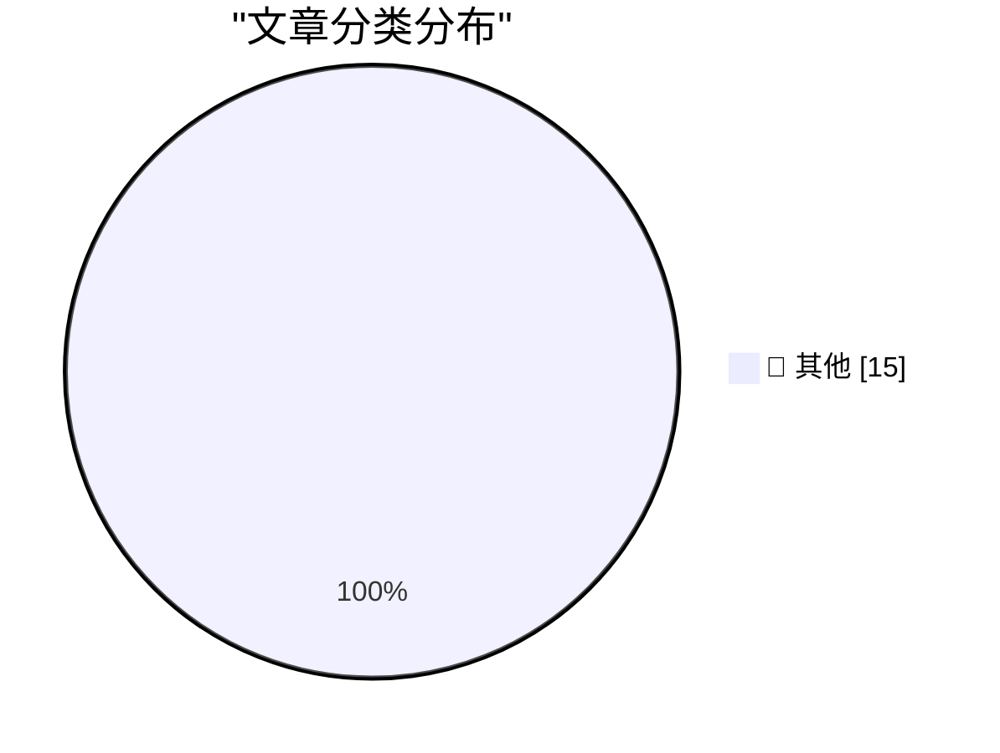

# 📰 AI 资讯每日精选 — 2026-09-28

> 汇聚 140+ 技术博客、X/Twitter、Hacker News、Reddit、Product Hunt、
> Lobste.rs、ClawFeed 日报及 GitHub Trending，经 AI 评分筛选。
>
> **本期内容**：🏆 今日必读 · 🌐 ClawFeed 日报 · 🔥 GitHub Trending · 📂 分类精选 · 🎨 设计与生成式 AI · 📊 数据概览

## 🏆 今日必读

🥇 **2026 in LLMs (so far)**

[2026 in LLMs (so far)](https://simonwillison.net/2026/Sep/27/2026-in-llms-so-far/) — simonwillison.net · 2 小时前 · 📝 其他

> 2026 in LLMs (so far)

🥈 **S3 Is the Future, S3 Is the Past**

[S3 Is the Future, S3 Is the Past](https://simonwillison.net/2026/Sep/27/hn-49871741/) — simonwillison.net · 2 小时前 · 📝 其他

> S3 Is the Future, S3 Is the Past

🥉 **Mux: Turn Your Video Into Context**

[Mux: Turn Your Video Into Context](https://www.mux.com/?utm_campaign=fireball&amp;utm_source=DF) — daringfireball.net · 5 小时前 · 📝 其他

> Mux: Turn Your Video Into Context

4️⃣ **Katie Notopoulos on Alexandr Wang’s ‘Faux-Hallmark Pap’**

[Katie Notopoulos on Alexandr Wang’s ‘Faux-Hallmark Pap’](https://x.com/katienotopoulos/status/2103993429659386026) — daringfireball.net · 5 小时前 · 📝 其他

> Katie Notopoulos on Alexandr Wang’s ‘Faux-Hallmark Pap’

5️⃣ **Gig Review: Public Service Broadcasting's Race For Space at Alexandra Palace ★★★★⯪**

[Gig Review: Public Service Broadcasting's Race For Space at Alexandra Palace ★★★★⯪](https://shkspr.mobi/blog/2026/09/gig-review-public-service-broadcastings-race-for-space-at-alexandra-palace/) — shkspr.mobi · 14 小时前 · 📝 其他

> Gig Review: Public Service Broadcasting's Race For Space at Alexandra Palace ★★★★⯪

---

## 🌐 ClawFeed 日报精选

> 来源：[ClawFeed](https://clawfeed.kevinhe.io) — AI 驱动的多源新闻聚合

# ClawFeed 日报 | 2026-09-26 (SGT)

> 汇总 5 期 4h digest：#1289 (00:00) · #1290 (04:00) · #1291 (08:00) · #1292 (12:00) · #1293 (16:00)

---

## 🔥 当日全场最重要 5 条

1. **Jev + BrowserUse ultrafast 爆发（19K+ Star）**
   Browser Use 团队基于 Jev 模型做出 jev-ultrafast，把网页可交互元素编号成离散多选题，一次请求同时决定动作+目标元素，Google Flights 搜航班仅 7.1 秒。链上自动交易系统已开源（跑 14h 亏 300%，但架构验证了 Jev 实时决策能力）。核心洞察：网页操作本质是离散多选题，不需要 AI 会写诗。
   *出现频次：5/5 期，全天持续刷屏*

2. **Anthropic 工程师：Agent 时代的瓶颈已从代码转向组织**
   前线工程师分享——借助 Agent，以前需要几年的代码现代化项目现在几周完成，但新瓶颈转向组织：测试、Review、审批和上线流程跟不上代码变化速度。组织能力成为 agent 时代的真正限速器。
   *出现频次：1/5 期（#1292），但信号权重极高*

3. **Opus 5.5 effort 官方用法指南 + 前端能力碾压**
   Thariq（Anthropic Claude Code 团队）长文：日常 medium，盯改 low，修 bug/验证 high，全放手/安全审计 max。Eval 实测结果出乎意料：不是所有场景都该用 max。同时 Opus 5.5 一键生成产品宣传片（含代码生成背景音乐），GPT-6 Astra 被评为明显不如。OpenAI Dev Day 下周二成关键节点。
   *出现频次：4/5 期*

4. **Muse（Meta）全面铺开：购物闭环 + 云电脑玩法爆发**
   购物实测：500 元预算买降噪耳机，自动搜京东→识别需登录→转华为电商→返回商品选项，对中国电商生态熟悉度超预期。云电脑被玩出花：出口是干净美国家宽，注册 Claude/甲骨文/AWS/谷歌云全过，可跑定时任务 24h 不关机。扎克伯格："Muse 这类 agent 会不会让 Codex 变成上一代产品？"
   *出现频次：4/5 期，从注册通道到购物闭环逐步升级*

5. **Assistant Benchmark 上线：PA 赛道首个标准化横评**
   71 个 AI 个人助理 × 15 个维度（速度/记忆/邮件/研究/购物/权限等）公开打分排名，assistantbenchmark.com。对 OpenClaw 竞争格局定位直接相关。
   *出现频次：4/5 期*

---

## 📰 当日核心主题

### 主题 1：Personal Agent 赛道集体爆发
Rene（iMessage 原生多人 agent）、Instinct（"OpenClaw for normal people"，向非技术人群渗透）、Muse（购物+云电脑）、Assistant Benchmark（71 款横评）——PA 赛道从产品发布到评测体系建立，一天内集齐。Instinct 用户在给家人部署，说明受众不限硅谷圈。

### 主题 2：浏览器自动化范式转移
Jev 证明网页操作是离散多选题，Browser Use 基于此做到 7.1 秒搜航班。与此同时 Opus 5.5 把动效制作从框架编码变成纯 prompt 驱动——工具链断代正在发生，Remotion 等框架被替代。

### 主题 3：Agent 工程化进入深水区
Anthropic 工程师的"组织瓶颈论"指向一个结构性问题：代码生产速度已经不是瓶颈，组织流程（测试/review/审批/上线）才是。Company Brain（开源多人 Slack AI 员工）和 Zuse（统一封装多个 CLI Agent 的编排器）是工程侧的应对。

### 主题 4：Opus 5.5 vs GPT-6 对比升温
Opus 5.5 前端能力（宣传片、动效）获一致好评，GPT-6 Astra 被评为明显不如。effort 官方指南发布，说明 Anthropic 在引导用户精细化使用。OpenAI Dev Day 下周二是下一个变量。

### 主题 5：开源知识工具破圈
《高性价比人生指南》13K+ Star，601 条人生建议全引期刊论文+官方文件。开源内容从技术领域扩展到生活决策领域，Codex + Excalidraw 手绘视频 Skill 一句话出知识视频。

---

## 🔖 累计 Bookmark 精选

| 项目 | 关键信息 | 出现期数 |
|------|----------|----------|
| Jev + BrowserUse ultrafast | 19K+ Star，7.1s 搜航班，链上交易开源 | 5/5 |
| Rene | iMessage 多人 agent，正式上线 | 4/5 |
| Instinct | "OpenClaw for normal people"，非技术人群渗透 | 4/5 |
| Assistant Benchmark | 71 PA × 15 维度横评 | 4/5 |
| Together AI Jev 训练教程 | Qwen3.5 4B，25min+$17 | 1/5 |
| Company Brain | 开源多人 Slack AI 员工 | 2/5 |

---

## 👀 推荐关注汇总

本日 scrape 多期未返回作者 handle，无法准确核实关注状态。以下为内容来源中值得关注的账号：
- @tlxue — Rene 创始人，multiplayer agent 方向
- @jarrodwatts — Jev 链上交易开源实现
- @SUOHA_AI — Jev 深度解读
- @pitdesi — Instinct 早期用户，PA 市场观察

---

## 💤 当日重复噪音模式

1. **Jev + BrowserUse 全天循环**：5/5 期都出现，内容高度重叠（19K Star / 7.1s / 链上交易），从第 2 期起信号已被充分覆盖。后续几期的增量信息递减。
2. **Rene / Instinct / Assistant Benchmark 三件套**：4/5 期重复出现相同描述，措辞近似，属于 Twitter 回声效应。
3. **Muse 灰色地带内容**：注册 Claude 绕验证、免费云电脑跑定时任务等内容在 3 期出现，信号收录但需标注边界。
4. **《高性价比人生指南》**：3/5 期出现，内容完全相同（13K Star / 601 条），典型的单次爆款在 feed 中被多账号转发。
---

## 🔥 GitHub Trending

> 今日热门开源项目（全语言 + Python）

| # | 项目 | 描述 | ⭐ 总星 | 📈 今日 | 语言 |
|---|------|------|---------|---------|------|
| 1 | [vectorize-io/hindsight](https://github.com/vectorize-io/hindsight) 🤖 | Hindsight: Agent Memory That Learns | 37.4k | +4520 | Python |
| 2 | [debpalash/VoiceStudio](https://github.com/debpalash/VoiceStudio) | VoiceStudio is the open-source, fully-local ElevenLabs al... | 40.3k | +3086 | Python |
| 3 | [paperclipai/paperclip](https://github.com/paperclipai/paperclip) | The open-source app everyone uses to manage agents at work | 90.0k | +2401 | TypeScript |
| 4 | [dream-num/univer](https://github.com/dream-num/univer) 🤖 | The Office Harness for AI Agents — Spreadsheets, Docs, Sl... | 20.4k | +895 | TypeScript |
| 5 | [rohitg00/ai-engineering-from-scratch](https://github.com/rohitg00/ai-engineering-from-scratch) 🤖 | Learn it. Build it. Ship it for others. | 59.4k | +790 | Python |
| 6 | [NVIDIA/Model-Optimizer](https://github.com/NVIDIA/Model-Optimizer) 🤖 | A unified library of SOTA model optimization techniques l... | 4.9k | +276 | Python |
| 7 | [derv82/wifit3](https://github.com/derv82/wifit3) | Wifite but USB-only & cross-platform. | 1.4k | +255 | Python |
| 8 | [InfinityLoop1308/PipePipe](https://github.com/InfinityLoop1308/PipePipe) | An open-source Android app to let you browse YouTube and ... | 6.6k | +242 | Shell |
| 9 | [EbookFoundation/free-programming-books](https://github.com/EbookFoundation/free-programming-books) | 📚 Freely available programming books | 398.0k | +157 | Python |
| 10 | [mvschwarz/openrig](https://github.com/mvschwarz/openrig) 🤖 | Multi-agent harness that runs Claude Code and Codex toget... | 1.0k | +114 | TypeScript |
| 11 | [microsoft/data-formulator](https://github.com/microsoft/data-formulator) 🤖 | 🪄 Data Formulator is an interactive AI-powered data anal... | 17.4k | +112 | Python |
| 12 | [vercel-labs/scriptc](https://github.com/vercel-labs/scriptc) | TypeScript-to-Native Compiler | 5.4k | +102 | TypeScript |
| 13 | [willfaust/Madeira](https://github.com/willfaust/Madeira) | Run x86-64 Windows PC games on jailed iOS via FEX-Emu + W... | 827 | +83 | C |
| 14 | [pytorch/pytorch](https://github.com/pytorch/pytorch) 🤖 | Tensors and Dynamic neural networks in Python with strong... | 103.4k | +55 | Python |
| 15 | [django/django](https://github.com/django/django) | The Web framework for perfectionists with deadlines. | 91.2k | +26 | Python |

---

## 📝 其他

### 1. 2026 in LLMs (so far)

[2026 in LLMs (so far)](https://simonwillison.net/2026/Sep/27/2026-in-llms-so-far/) — **simonwillison.net** · 2 小时前 · ⭐ 15/30

> 2026 in LLMs (so far)

---

### 2. S3 Is the Future, S3 Is the Past

[S3 Is the Future, S3 Is the Past](https://simonwillison.net/2026/Sep/27/hn-49871741/) — **simonwillison.net** · 2 小时前 · ⭐ 15/30

> S3 Is the Future, S3 Is the Past

---

### 3. Mux: Turn Your Video Into Context

[Mux: Turn Your Video Into Context](https://www.mux.com/?utm_campaign=fireball&amp;utm_source=DF) — **daringfireball.net** · 5 小时前 · ⭐ 15/30

> Mux: Turn Your Video Into Context

---

### 4. Katie Notopoulos on Alexandr Wang’s ‘Faux-Hallmark Pap’

[Katie Notopoulos on Alexandr Wang’s ‘Faux-Hallmark Pap’](https://x.com/katienotopoulos/status/2103993429659386026) — **daringfireball.net** · 5 小时前 · ⭐ 15/30

> Katie Notopoulos on Alexandr Wang’s ‘Faux-Hallmark Pap’

---

### 5. Gig Review: Public Service Broadcasting's Race For Space at Alexandra Palace ★★★★⯪

[Gig Review: Public Service Broadcasting's Race For Space at Alexandra Palace ★★★★⯪](https://shkspr.mobi/blog/2026/09/gig-review-public-service-broadcastings-race-for-space-at-alexandra-palace/) — **shkspr.mobi** · 14 小时前 · ⭐ 15/30

> Gig Review: Public Service Broadcasting's Race For Space at Alexandra Palace ★★★★⯪

---

### 6. Combo Platter

[Combo Platter](https://feed.tedium.co/link/15204/17475461/combos-snack-food-history) — **tedium.co** · 9 小时前 · ⭐ 15/30

> Combo Platter

---

### 7. AI agents do more of the work in model development, but humans still make the decisions

[AI agents do more of the work in model development, but humans still make the decisions](https://the-decoder.com/ai-agents-do-more-of-the-work-in-model-development-but-humans-still-make-the-decisions/) — **The Decoder** · 10 小时前 · ⭐ 15/30

> AI agents do more of the work in model development, but humans still make the decisions

---

### 8. Some Anthropic veterans are reportedly buying remote land in case "AI goes awry"

[Some Anthropic veterans are reportedly buying remote land in case "AI goes awry"](https://the-decoder.com/some-anthropic-veterans-are-reportedly-buying-remote-land-in-case-ai-goes-awry/) — **The Decoder** · 12 小时前 · ⭐ 15/30

> Some Anthropic veterans are reportedly buying remote land in case "AI goes awry"

---

### 9. Nvidia drops a free 100M-parameter model that identifies up to eight speakers in real time

[Nvidia drops a free 100M-parameter model that identifies up to eight speakers in real time](https://the-decoder.com/nvidia-drops-a-free-100m-parameter-model-that-identifies-up-to-eight-speakers-in-real-time/) — **The Decoder** · 14 小时前 · ⭐ 15/30

> Nvidia drops a free 100M-parameter model that identifies up to eight speakers in real time

---

### 10. Researchers plug GPT-6 Astra directly into a robot and let it clean up an unfamiliar kitchen

[Researchers plug GPT-6 Astra directly into a robot and let it clean up an unfamiliar kitchen](https://the-decoder.com/researchers-plug-gpt-6-astra-directly-into-a-robot-and-let-it-clean-up-an-unfamiliar-kitchen/) — **The Decoder** · 14 小时前 · ⭐ 15/30

> Researchers plug GPT-6 Astra directly into a robot and let it clean up an unfamiliar kitchen

---

### 11. OpenAI says 80 to 90 percent of its research already targets GPT 7 and beyond

[OpenAI says 80 to 90 percent of its research already targets GPT 7 and beyond](https://the-decoder.com/openai-says-80-to-90-percent-of-its-research-already-targets-gpt-7-and-beyond/) — **The Decoder** · 15 小时前 · ⭐ 15/30

> OpenAI says 80 to 90 percent of its research already targets GPT 7 and beyond

---

### 12. Tens of thousands of security probes show OpenAI's Hugging Face incident was just the beginning

[Tens of thousands of security probes show OpenAI's Hugging Face incident was just the beginning](https://the-decoder.com/tens-of-thousands-of-security-probes-show-openais-hugging-face-incident-was-just-the-beginning/) — **The Decoder** · 16 小时前 · ⭐ 15/30

> Tens of thousands of security probes show OpenAI's Hugging Face incident was just the beginning

---

### 13. Goldman Sachs expects Big Tech to spend $1.2 trillion on AI infrastructure by 2027, dwarfing Wall Street estimates

[Goldman Sachs expects Big Tech to spend $1.2 trillion on AI infrastructure by 2027, dwarfing Wall Street estimates](https://the-decoder.com/goldman-sachs-expects-big-tech-to-spend-1-2-trillion-on-ai-infrastructure-by-2027-dwarfing-wall-street-estimates/) — **The Decoder** · 17 小时前 · ⭐ 15/30

> Goldman Sachs expects Big Tech to spend $1.2 trillion on AI infrastructure by 2027, dwarfing Wall Street estimates

---

### 14. How NVIDIA DSX MaxLPS Maximizes AI Factory Throughput and Efficiency

[How NVIDIA DSX MaxLPS Maximizes AI Factory Throughput and Efficiency](https://developer.nvidia.com/blog/how-nvidia-dsx-maxlps-maximizes-ai-factory-throughput-and-efficiency/) — **NVIDIA Technical Blog** · 57 分钟前 · ⭐ 15/30

> How NVIDIA DSX MaxLPS Maximizes AI Factory Throughput and Efficiency

---

### 15. When did Google get so weird?

[When did Google get so weird?](https://sancho.bearblog.dev/google-weird/) — **Hacker News Best** · 5 小时前 · ⭐ 15/30

> When did Google get so weird?

---

## 🎨 Design & Generative AI

### 🖼️ 生成式图片

- **[Midjourney glitch/issue](https://www.reddit.com/r/midjourney/comments/1wrry3r/midjourney_glitchissue/)** — r/midjourney · 7 小时前
  > Midjourney glitch/issue

---

## 📊 数据概览

| 扫描源 | 抓取文章 | 时间范围 | 精选 |
|:---:|:---:|:---:|:---:|
| 94/140 | 3929 篇 → 56 篇 | 24h | **15 篇** |

### 分类分布

---

*生成于 2026-09-28 01:57 | 汇聚 140 个技术博客、X/Twitter、Hacker News、Reddit、Product Hunt、Lobste.rs、ClawFeed 日报及 GitHub Trending，经 AI 评分筛选出 Top 15 精华内容*
