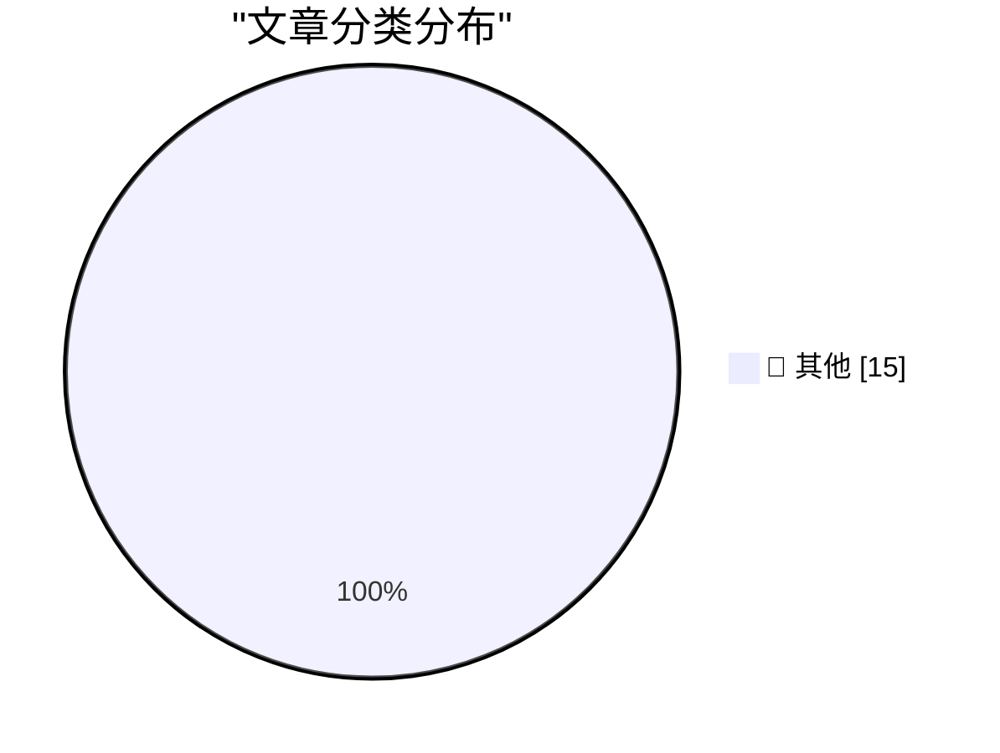

# 📰 AI 资讯每日精选 — 2026-09-29

> 汇聚 140+ 技术博客、X/Twitter、Hacker News、Reddit、Product Hunt、
> Lobste.rs、ClawFeed 日报及 GitHub Trending，经 AI 评分筛选。
>
> **本期内容**：🏆 今日必读 · 🌐 ClawFeed 日报 · 🔥 GitHub Trending · 📂 分类精选 · 🎨 设计与生成式 AI · 📊 数据概览

## 🏆 今日必读

🥇 **Claude Sonnet 5.5**

[Claude Sonnet 5.5](https://simonwillison.net/2026/Sep/28/claude-sonnet-5-5/) — simonwillison.net · 4 小时前 · 📝 其他

> Claude Sonnet 5.5

🥈 **Quoting @joedaroo**

[Quoting @joedaroo](https://simonwillison.net/2026/Sep/28/joedaroo/) — simonwillison.net · 7 小时前 · 📝 其他

> Quoting @joedaroo

🥉 **Quoting Muse AI Agent**

[Quoting Muse AI Agent](https://simonwillison.net/2026/Sep/28/muse-ai-agent/) — simonwillison.net · 22 小时前 · 📝 其他

> Quoting Muse AI Agent

4️⃣ **Dutch Police Arrest ‘Reformed’ Hacker in Shiny Hunters Investigation**

[Dutch Police Arrest ‘Reformed’ Hacker in Shiny Hunters Investigation](https://krebsonsecurity.com/2026/09/dutch-police-arrest-reformed-hacker-in-shiny-hunters-investigation/) — krebsonsecurity.com · 11 小时前 · 📝 其他

> Dutch Police Arrest ‘Reformed’ Hacker in Shiny Hunters Investigation

5️⃣ **Bastardica**

[Bastardica](https://bastardica.mitpit.com/) — daringfireball.net · 27 分钟前 · 📝 其他

> Bastardica

---

## 🌐 ClawFeed 日报精选

> 来源：[ClawFeed](https://clawfeed.kevinhe.io) — AI 驱动的多源新闻聚合

# ClawFeed 日报 | 2026-09-28 (SGT)

> 聚合 1 份 4h digest（id: 1301, 16:00-19:59）
> 今日仅有 1 个时段有数据（素材 feed 5 + bookmarks 5）

---

## 🔥 当日全场最重要 5 条

1. **Meta Muse 全面爆发** — 假期期间 Muse 全面开放注册，原生支持 Tailscale 连接器免客户端一键绑定。核心认知：Meta 实际上为每个注册账号白送一台 2核CPU/8G内存的云端机器，Muse 不是简单的聊天 Agent。
2. **Muse + Hermes 打通** — 用户实现 Muse 通过 TailScale 连接 Hermes 浏览器和主动设备，内网直连；还发现 Muse 可以直接打美国境内商家电话（不支持私人/境外号码）。
3. **Browser Use + JEV 极速方案** — Browser Use 团队基于 Jev 模型做了 jev-ultrafast（19000+ Star），Google Flights 搜航班仅用 7.1 秒。原理：把页面可交互元素编成带编号的表，Jev 一次请求同时决定动作+目标元素。
4. **OpenMuse 开源替代方案出现** — 开源社区快速跟进 Meta Muse，出现了 OpenMuse 替代方案。
5. **Instinct 被评价为 "OpenClaw for normal people"** — 体验如魔法，不限于硅谷人群，作者在帮父亲也设置使用。

## 📰 当日核心主题

- **Meta Muse 生态爆发**：今日几乎所有 feed 都围绕 Muse 展开——开放注册、Tailscale 连接器、套娃注册、Hermes 打通、电话功能、OpenMuse 开源替代、社区更新警告。Muse 的本质是"云端白送算力的个人 Agent 工具"。
- **浏览器自动化提速**：Browser Use + Jev 模型将网页操作从"慢到卡死"变成"7 秒完成"，核心洞察是"网页操作本质是离散多选题"。
- **Agent-as-friend 范式**：Rene（multiplayer-first iMessage agent）和 Instinct 代表了 Agent 从工具向朋友/助手的转变。

## 🔖 累计 Bookmark 精选

- **Browser Use jev-ultrafast**（19000+ Star）— Jev 模型让浏览器操控极速化。开发者 @jarrodwatts 还用 JEV 做了纯 AI 原生链上自动交易系统（开源，跑了 14 小时亏了 300%，但架构惊艳）。
- **Rene** — multiplayer-first iMessage agent，像朋友一样发短信交互。有浏览器、能写代码、购物、建站、做幻灯片。
- **Instinct** — 被描述为"OpenClaw for normal people"，体验如魔法。

## 👀 推荐关注汇总

- 本日 scraper 未能提取推文作者 handle 和 URL，无法做关注推荐。

## 💤 当日重复噪音模式

- **Muse 更新警告重复帖**：多条"不要更新 Muse"类警告帖，内容重复，情绪驱动。
- **Muse 纯情绪帖**：非技术讨论的兴奋/吐槽帖被过滤。

---

*Generated: 2026-09-28 23:59:00 SGT | Sources: digest #1301*
---

## 🔥 GitHub Trending

> 今日热门开源项目（全语言 + Python）

| # | 项目 | 描述 | ⭐ 总星 | 📈 今日 | 语言 |
|---|------|------|---------|---------|------|
| 1 | [vectorize-io/hindsight](https://github.com/vectorize-io/hindsight) 🤖 | Hindsight: Agent Memory That Learns | 41.1k | +4561 | Python |
| 2 | [debpalash/VoiceStudio](https://github.com/debpalash/VoiceStudio) | VoiceStudio is the open-source, fully-local ElevenLabs al... | 44.4k | +3221 | Python |
| 3 | [paperclipai/paperclip](https://github.com/paperclipai/paperclip) | The open-source app everyone uses to manage agents at work | 93.0k | +3197 | TypeScript |
| 4 | [rohitg00/ai-engineering-from-scratch](https://github.com/rohitg00/ai-engineering-from-scratch) 🤖 | Learn it. Build it. Ship it for others. | 60.5k | +1287 | Python |
| 5 | [dream-num/univer](https://github.com/dream-num/univer) 🤖 | The Office Harness for AI Agents — Spreadsheets, Docs, Sl... | 21.3k | +1099 | TypeScript |
| 6 | [mvschwarz/openrig](https://github.com/mvschwarz/openrig) 🤖 | Multi-agent harness that runs Claude Code and Codex toget... | 1.8k | +734 | TypeScript |
| 7 | [byoungd/up](https://github.com/byoungd/up) 🤖 | An advanced guide which might benefit you a lot 🎉 . 韩先凯的... | 64.8k | +327 | JavaScript |
| 8 | [practical-tutorials/project-based-learning](https://github.com/practical-tutorials/project-based-learning) | Curated list of project-based tutorials | 285.1k | +206 | Python |
| 9 | [cs341-illinois/coursebook](https://github.com/cs341-illinois/coursebook) | Open Source Introductory Systems Programming Textbook for... | 2.6k | +195 | TeX |
| 10 | [NawfalMotii79/PLFM_RADAR](https://github.com/NawfalMotii79/PLFM_RADAR) | Open-source, low-cost 10.5 GHz PLFM phased array RADAR sy... | 25.8k | +158 | PLSQL |
| 11 | [alirezarezvani/claude-skills](https://github.com/alirezarezvani/claude-skills) 🤖 | 380 Claude Code skills & agent skills & plugins (30+ Agen... | 26.8k | +145 | Python |
| 12 | [microsoft/SkillOpt](https://github.com/microsoft/SkillOpt) 🤖 | SkillOpt is a text-space optimizer that trains reusable n... | 17.8k | +136 | Python |
| 13 | [ashhart/TensorFold](https://github.com/ashhart/TensorFold) 🤖 | Fast, exact LLM decoding on Apple Silicon (MLX) behind an... | 559 | +120 | Python |
| 14 | [topoteretes/cognee](https://github.com/topoteretes/cognee) 🤖 | Cognee is the open-source AI memory platform for agents. ... | 31.2k | +96 | Python |
| 15 | [samugit83/redamon](https://github.com/samugit83/redamon) 🤖 | An AI-powered agentic red team framework that automates o... | 2.8k | +84 | Python |

---

## 📝 其他

### 1. Claude Sonnet 5.5

[Claude Sonnet 5.5](https://simonwillison.net/2026/Sep/28/claude-sonnet-5-5/) — **simonwillison.net** · 4 小时前 · ⭐ 15/30

> Claude Sonnet 5.5

---

### 2. Quoting @joedaroo

[Quoting @joedaroo](https://simonwillison.net/2026/Sep/28/joedaroo/) — **simonwillison.net** · 7 小时前 · ⭐ 15/30

> Quoting @joedaroo

---

### 3. Quoting Muse AI Agent

[Quoting Muse AI Agent](https://simonwillison.net/2026/Sep/28/muse-ai-agent/) — **simonwillison.net** · 22 小时前 · ⭐ 15/30

> Quoting Muse AI Agent

---

### 4. Dutch Police Arrest ‘Reformed’ Hacker in Shiny Hunters Investigation

[Dutch Police Arrest ‘Reformed’ Hacker in Shiny Hunters Investigation](https://krebsonsecurity.com/2026/09/dutch-police-arrest-reformed-hacker-in-shiny-hunters-investigation/) — **krebsonsecurity.com** · 11 小时前 · ⭐ 15/30

> Dutch Police Arrest ‘Reformed’ Hacker in Shiny Hunters Investigation

---

### 5. Bastardica

[Bastardica](https://bastardica.mitpit.com/) — **daringfireball.net** · 27 分钟前 · ⭐ 15/30

> Bastardica

---

### 6. ‘When Did Google Get So F-Ing Weird?’

[‘When Did Google Get So F-Ing Weird?’](https://sancho.bearblog.dev/google-weird/) — **daringfireball.net** · 51 分钟前 · ⭐ 15/30

> ‘When Did Google Get So F-Ing Weird?’

---

### 7. Joanna Stern Pokes the Pickle

[Joanna Stern Pokes the Pickle](https://www.youtube.com/watch?v=YNqYEMuoQAI) — **daringfireball.net** · 1 小时前 · ⭐ 15/30

> Joanna Stern Pokes the Pickle

---

### 8. ‘Daniel Decodes’ Interview Craig Federighi Regarding the iPhone Duo

[‘Daniel Decodes’ Interview Craig Federighi Regarding the iPhone Duo](https://www.youtube.com/watch?v=y227RF0smAg) — **daringfireball.net** · 1 小时前 · ⭐ 15/30

> ‘Daniel Decodes’ Interview Craig Federighi Regarding the iPhone Duo

---

### 9. Why Stolen Device Protection Makes Passwords Safer

[Why Stolen Device Protection Makes Passwords Safer](https://sixcolors.com/post/2026/09/stolen-device-protection-passwords-glenn/) — **daringfireball.net** · 1 小时前 · ⭐ 15/30

> Why Stolen Device Protection Makes Passwords Safer

---

### 10. Jeremy Stern’s Profile of Mark Zuckerberg for Colossus

[Jeremy Stern’s Profile of Mark Zuckerberg for Colossus](https://colossus.com/article/mark-zuckerberg-profile/) — **daringfireball.net** · 4 小时前 · ⭐ 15/30

> Jeremy Stern’s Profile of Mark Zuckerberg for Colossus

---

### 11. Muse, Instagram, and VLC Lookalike Rip-Offs in the Mac App Store

[Muse, Instagram, and VLC Lookalike Rip-Offs in the Mac App Store](https://lapcatsoftware.com/articles/2026/9/8.html) — **daringfireball.net** · 6 小时前 · ⭐ 15/30

> Muse, Instagram, and VLC Lookalike Rip-Offs in the Mac App Store

---

### 12. ★ Spitballing Predictions for Apple’s October

[★ Spitballing Predictions for Apple’s October](https://daringfireball.net/2026/09/spitballing_predictions_for_apples_october) — **daringfireball.net** · 7 小时前 · ⭐ 15/30

> ★ Spitballing Predictions for Apple’s October

---

### 13. Duo-Man

[Duo-Man](https://x.com/viditb/status/2104103592726765722) — **daringfireball.net** · 10 小时前 · ⭐ 15/30

> Duo-Man

---

### 14. Edge Is Pretending to Be Chrome

[Edge Is Pretending to Be Chrome](https://idiallo.com/blog/edge-imitates-chrome) — **idiallo.com** · 19 小时前 · ⭐ 15/30

> Edge Is Pretending to Be Chrome

---

### 15. Pluralistic: Priceful (28 Sep 2026)

[Pluralistic: Priceful (28 Sep 2026)](https://pluralistic.net/2026/09/28/cost-of-everything/) — **pluralistic.net** · 8 小时前 · ⭐ 15/30

> Pluralistic: Priceful (28 Sep 2026)

---

## 🎨 Design & Generative AI

### 🖼️ 生成式图片

- **[MiniMax H3 REF + Fizgig Nodes: As SOTA (Ref2Img \ Img2Img) True Image Editing Model, Native 4096x1536 in 1 Minute, WF + Prompt for Every Example.](https://www.reddit.com/r/StableDiffusion/comments/1wsb4h3/minimax_h3_ref_fizgig_nodes_as_sota_ref2img/)** — r/StableDiffusion · 16 小时前
  > MiniMax H3 REF + Fizgig Nodes: As SOTA (Ref2Img \ Img2Img) True Image Editing Model, Native 4096x1536 in 1 Minute, WF + Prompt for Every Example.

- **[You don't need character swap LoRA for MiniMax H3](https://www.reddit.com/r/StableDiffusion/comments/1wsknup/you_dont_need_character_swap_lora_for_minimax_h3/)** — r/StableDiffusion · 9 小时前
  > You don't need character swap LoRA for MiniMax H3

- **[Tested h3 character swap lora](https://www.reddit.com/r/StableDiffusion/comments/1wsgcuz/tested_h3_character_swap_lora/)** — r/StableDiffusion · 12 小时前
  > Tested h3 character swap lora

- **[A LoRA I made: AnyAngle LoRA for Qwen Image 2.1. Style-Aligned Arbitrary Camera Angles](https://www.reddit.com/r/StableDiffusion/comments/1ws7phv/a_lora_i_made_anyangle_lora_for_qwen_image_21/)** — r/StableDiffusion · 19 小时前
  > A LoRA I made: AnyAngle LoRA for Qwen Image 2.1. Style-Aligned Arbitrary Camera Angles

- **[Face Swap + Style Transfer in One Pass — Qwen Image 2.1 + New Body Swap LoRA](https://www.reddit.com/r/StableDiffusion/comments/1wsvg3p/face_swap_style_transfer_in_one_pass_qwen_image/)** — r/StableDiffusion · 2 小时前
  > Face Swap + Style Transfer in One Pass — Qwen Image 2.1 + New Body Swap LoRA

- **[Yeufonic - a YuE2-based music creation/management app with local LoRA training](https://www.reddit.com/r/StableDiffusion/comments/1wsbaut/yeufonic_a_yue2based_music_creationmanagement_app/)** — r/StableDiffusion · 15 小时前
  > Yeufonic - a YuE2-based music creation/management app with local LoRA training

---

## 📊 数据概览

| 扫描源 | 抓取文章 | 时间范围 | 精选 |
|:---:|:---:|:---:|:---:|
| 93/140 | 3918 篇 → 95 篇 | 24h | **15 篇** |

### 分类分布

---

*生成于 2026-09-29 02:42 | 汇聚 140 个技术博客、X/Twitter、Hacker News、Reddit、Product Hunt、Lobste.rs、ClawFeed 日报及 GitHub Trending，经 AI 评分筛选出 Top 15 精华内容*
