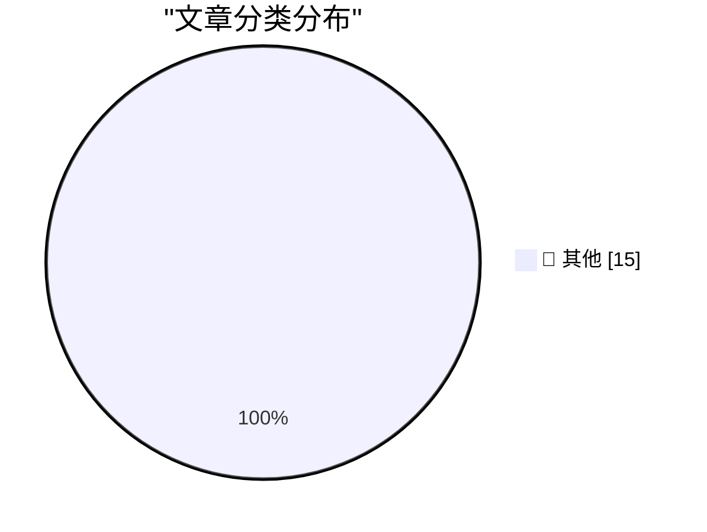

# 📰 AI 资讯每日精选 — 2026-09-30

> 汇聚 140+ 技术博客、X/Twitter、Hacker News、Reddit、Product Hunt、
> Lobste.rs、ClawFeed 日报及 GitHub Trending，经 AI 评分筛选。
>
> **本期内容**：🏆 今日必读 · 🌐 ClawFeed 日报 · 🔥 GitHub Trending · 📂 分类精选 · 🎨 设计与生成式 AI · 📊 数据概览

## 🏆 今日必读

🥇 **Quoting Anthropic Frontier Red Team**

[Quoting Anthropic Frontier Red Team](https://simonwillison.net/2026/Sep/29/anthropic-frontier-red-team/) — simonwillison.net · 4 小时前 · 📝 其他

> Quoting Anthropic Frontier Red Team

🥈 **GPT 6.1 Sol: Near-Astra intelligence for a fifth of the price**

[GPT 6.1 Sol: Near-Astra intelligence for a fifth of the price](https://simonwillison.net/2026/Sep/29/hn-49898129/) — simonwillison.net · 7 小时前 · 📝 其他

> GPT 6.1 Sol: Near-Astra intelligence for a fifth of the price

🥉 **OpenAI DevDay 2026 live blog**

[OpenAI DevDay 2026 live blog](https://simonwillison.net/2026/Sep/29/openai-devday-2026-live-blog/) — simonwillison.net · 10 小时前 · 📝 其他

> OpenAI DevDay 2026 live blog

4️⃣ **Follow-Up on my Spitballed Predictions for Apple’s October**

[Follow-Up on my Spitballed Predictions for Apple’s October](https://daringfireball.net/2026/09/spitballing_predictions_for_apples_october) — daringfireball.net · 11 小时前 · 📝 其他

> Follow-Up on my Spitballed Predictions for Apple’s October

5️⃣ **Destroy Any Website**

[Destroy Any Website](https://destroy.spritefusion.com/) — daringfireball.net · 11 小时前 · 📝 其他

> Destroy Any Website

---

## 🌐 ClawFeed 日报精选

> 来源：[ClawFeed](https://clawfeed.kevinhe.io) — AI 驱动的多源新闻聚合

# ClawFeed Daily Digest | 2026-09-29

> 聚合 5 个 4h digest (IDs: 1304, 1305, 1306, 1307, 1308)
> 覆盖 00:00-19:59 SGT

---

## 🔥 当日全场最重要 5 条

1. **Manus 2.0 + Cue 发布——个人 Agent 赛道最大产品更新**
   脱离 Meta 恢复独立后首次大更新：Cascade Agent Harness 换代（Token -23.2%、延迟降低）、Manus Studio 桌面端升级、新增视频剪辑和游戏开发环境。独立产品 Cue 为每个用户分配"虚拟电话号"，将入口从"主动打开"变为"被动触发"，可能衍生充值模式。邀请码 MEETCUE，内置 24x7 VPS，免费 1 个月 Plus ($19.99/月)。
   来源: @dotey, @Xudong07452910, @_0xKenny

2. **AMD 收购 World Labs（李飞飞）——AI 人才向芯片公司流动的结构性信号**
   李飞飞创办的空间智能公司被 AMD 收购，李飞飞本人出任 AMD 执行副总裁兼首席科学家。从计算机视觉→空间智能→芯片公司，AI 人才流向发生转折。
   来源: @dotey

3. **Instinct + Shopify 合作——个人 AI 购物助手进入电商基础设施**
   35% 用户用 Instinct 做个人购物，与 Shopify 集成后产品发现/结算/订单追踪在一个对话里完成。估值 $100 亿但只有 14 人、无 App、邀请制纯增长、日增 10%。Patrick O'Shaughnessy 深度访谈。
   来源: @noahrshinn

4. **Fo 发布——AI+人类混合 Personal Agent，前 DeepMind 工程负责人创立**
   核心差异化：承认 AI 做不到的事就找真人做（CAPTCHA、谈判、打电话），实测真实任务完成率 2x 领先。"We've spent years removing humans from the loop and these guys put them back in."
   来源: @sleepy0x13, @shivanipod

5. **吴恩达发布 2 小时 Agent 硬核课**
   从单代理讲到完全自动化，被评为"足以淘汰今年收藏的所有 AI Agent 教程"。为 Personal Agent 赛道提供体系化教学资源。
   来源: @myanTokenGeek

---

## 📰 当日核心主题

### 主题一：Personal Agent 竞争进入密集交火期
一周内 Manus 2.0+Cue / Instinct+Shopify / Fo(人机混合) / Rene(iMessage) 密集发布。加上近期的 Muse(Meta) / Grok Bot，个人智能体赛道已从"概念验证"进入"产品栈+商业模式"维度。投资人开始用"下一代流量入口"框架解读，类比 2012 年滴滴——表面做应用，实际争入口。

关键对比：
- **Manus 2.0**: 全栈 Agent 产品（Studio + Cue），技术层 Cascade Harness 是实质创新
- **Instinct**: 极简主义 + 邀请制爆发，$100 亿估值 / 14 人团队
- **Fo**: "AI 能力边界诚实表达"——做不到就找人干
- **Rene**: multiplayer-first，iMessage 原生
- **Cue 虚拟电话号**: 被动触发 → 用户付费，缓解 Muse 类产品付费率低的担忧

### 主题二：AI 人才大迁徙
李飞飞从斯坦福 → World Labs → AMD，标志着 AI 研究人才开始向芯片/硬件公司流动。Manus 创始人肖弘从企业微信生态（微伴助手）转向个人 Agent 的路径也值得注意。

### 主题三：浏览器 Agent 从"勉强能用"到"真正可用"
Browser Use + Jev 模型 jev-ultrafast（19K+ Star）：Google Flights 搜航班 7.1 秒。将页面元素编成带编号的表，一次请求决定全部动作，比 GPT/Claude 操控浏览器快数量级。

### 主题四：Agent 工程实操方法论
- Cursor Agent Harness Token 优化：整体 Token 成本降 7%，优化单位放在完整任务而非单次请求
- Agent 沙盒两种范式：Agent 整体跑在 sandbox vs Agent 在外 tools 在 sandbox

---

## 🔖 累计 Bookmark 精选

- **Browser Use + jev-ultrafast** (19K+ Star) — 7.1 秒搜航班，页面元素编号后一次请求决定全部动作。@GitHub_Daily, @SUOHA_AI
- **Rene** — multiplayer-first iMessage agent，浏览器/写代码/购物/建站/PPT/生图，创始人已用 4 个月。@tlxue (1.1M 阅读)
- **Instinct** — "OpenClaw for normal people"，非硅谷限定。@pitdesi
- **Alexander Wang "Why We're Building Muse"** 长文 — 680 转 13K 赞 5.3M 阅读。@alexandr_wang

---

## 👀 推荐关注汇总（去重）

| Handle | 身份 | 推荐理由 |
|--------|------|----------|
| @shivanipod | Fo 创始人，前 Google DeepMind 工程负责人 | AI+Human 混合 agent 路线倡导者 |
| @Xudong07452910 | Xudong Han | Manus 2.0 技术分析深度好，能拆解 Agent Harness 架构 |
| @Anitahityou | Anita AGI/acc | 中文 AI 投资视角，善于从投资框架解读产品趋势 |

---

## 💤 当日重复噪音模式

1. **Manus/Meta 分手时间线**：同一事件被 3 个 4h 周期反复覆盖（@xiangxiang103 的推文出现 3 次），但每次只是上下文不同、核心信息相同
2. **Bookmarks 滞留**：Browser Use + Jev、Rene、Instinct 这 3 条 bookmark 从深夜档持续到下午档几乎未变，说明 bookmark 更新频率低于 feed
3. **Instinct 数据重复**：35% 购物 / 10% 日增 / 邀请制这组数据在 4 个周期出现了 4 次

---

*Generated from 5 × 4h digests (IDs 1304-1308), 2026-09-29 SGT*
---

## 🔥 GitHub Trending

> 今日热门开源项目（全语言 + Python）

| # | 项目 | 描述 | ⭐ 总星 | 📈 今日 | 语言 |
|---|------|------|---------|---------|------|
| 1 | [debpalash/VoiceStudio](https://github.com/debpalash/VoiceStudio) | VoiceStudio is the open-source, fully-local ElevenLabs al... | 48.3k | +4758 | Python |
| 2 | [vectorize-io/hindsight](https://github.com/vectorize-io/hindsight) 🤖 | Hindsight: Agent Memory That Learns | 42.9k | +2575 | Python |
| 3 | [paperclipai/paperclip](https://github.com/paperclipai/paperclip) | The open-source app everyone uses to manage agents at work | 94.5k | +2458 | TypeScript |
| 4 | [NVIDIA/OpenShell](https://github.com/NVIDIA/OpenShell) 🤖 | OpenShell is the safe, private runtime for autonomous AI ... | 10.7k | +990 | Rust |
| 5 | [VectifyAI/PageIndex](https://github.com/VectifyAI/PageIndex) 🤖 | 📑 PageIndex: Document Index for Vectorless, Reasoning-ba... | 37.4k | +835 | Python |
| 6 | [rohitg00/ai-engineering-from-scratch](https://github.com/rohitg00/ai-engineering-from-scratch) 🤖 | Learn it. Build it. Ship it for others. | 61.5k | +786 | Python |
| 7 | [mvschwarz/openrig](https://github.com/mvschwarz/openrig) 🤖 | Multi-agent harness that runs Claude Code and Codex toget... | 2.5k | +737 | TypeScript |
| 8 | [dream-num/univer](https://github.com/dream-num/univer) 🤖 | The Office Harness for AI Agents — Spreadsheets, Docs, Sl... | 21.9k | +696 | TypeScript |
| 9 | [cs341-illinois/coursebook](https://github.com/cs341-illinois/coursebook) | Open Source Introductory Systems Programming Textbook for... | 3.1k | +572 | TeX |
| 10 | [oblien/openship](https://github.com/oblien/openship) | Self-hosted deployment platform | 13.9k | +437 | TypeScript |
| 11 | [harry0703/MoneyPrinterTurbo](https://github.com/harry0703/MoneyPrinterTurbo) 🤖 | 利用 AI 大模型和自动化工作流，根据主题或关键词一键生成高清短视频。Generate HD short vide... | 127.1k | +338 | Python |
| 12 | [TencentCloud/Octop](https://github.com/TencentCloud/Octop) 🤖 | A smarter, self-hosted AI assistant — multi-user, multi-a... | 5.8k | +278 | Python |
| 13 | [t8y2/dbx](https://github.com/t8y2/dbx) 🤖 | 25 MB lightweight cross-platform database client for 100+... | 22.1k | +232 | Rust |
| 14 | [MadsLorentzen/ai-job-search](https://github.com/MadsLorentzen/ai-job-search) 🤖 | The job search that runs on your machine. AI job applicat... | 44.5k | +119 | Python |
| 15 | [averygan/reclip](https://github.com/averygan/reclip) | Download videos from almost any website. Lightweight, sel... | 10.2k | +113 | HTML |

---

## 📝 其他

### 1. Quoting Anthropic Frontier Red Team

[Quoting Anthropic Frontier Red Team](https://simonwillison.net/2026/Sep/29/anthropic-frontier-red-team/) — **simonwillison.net** · 4 小时前 · ⭐ 15/30

> Quoting Anthropic Frontier Red Team

---

### 2. GPT 6.1 Sol: Near-Astra intelligence for a fifth of the price

[GPT 6.1 Sol: Near-Astra intelligence for a fifth of the price](https://simonwillison.net/2026/Sep/29/hn-49898129/) — **simonwillison.net** · 7 小时前 · ⭐ 15/30

> GPT 6.1 Sol: Near-Astra intelligence for a fifth of the price

---

### 3. OpenAI DevDay 2026 live blog

[OpenAI DevDay 2026 live blog](https://simonwillison.net/2026/Sep/29/openai-devday-2026-live-blog/) — **simonwillison.net** · 10 小时前 · ⭐ 15/30

> OpenAI DevDay 2026 live blog

---

### 4. Follow-Up on my Spitballed Predictions for Apple’s October

[Follow-Up on my Spitballed Predictions for Apple’s October](https://daringfireball.net/2026/09/spitballing_predictions_for_apples_october) — **daringfireball.net** · 11 小时前 · ⭐ 15/30

> Follow-Up on my Spitballed Predictions for Apple’s October

---

### 5. Destroy Any Website

[Destroy Any Website](https://destroy.spritefusion.com/) — **daringfireball.net** · 11 小时前 · ⭐ 15/30

> Destroy Any Website

---

### 6. Pluralistic: Lindsay Owens's "Gouged" (29 Sep 2026)

[Pluralistic: Lindsay Owens's "Gouged" (29 Sep 2026)](https://pluralistic.net/2026/09/29/algorithmic-wage-theft/) — **pluralistic.net** · 12 小时前 · ⭐ 15/30

> Pluralistic: Lindsay Owens's "Gouged" (29 Sep 2026)

---

### 7. Dead Money

[Dead Money](https://www.wheresyoured.at/dead-money/) — **wheresyoured.at** · 10 小时前 · ⭐ 15/30

> Dead Money

---

### 8. VLM Enhanced Metadata For My Icon Galleries

[VLM Enhanced Metadata For My Icon Galleries](https://blog.jim-nielsen.com/2026/icon-galleries-vlm/) — **blog.jim-nielsen.com** · 7 小时前 · ⭐ 15/30

> VLM Enhanced Metadata For My Icon Galleries

---

### 9. When Internet Explorer passed Netscape for the first time

[When Internet Explorer passed Netscape for the first time](https://dfarq.homeip.net/when-internet-explorer-passed-netscape-for-the-first-time/?utm_source=rss&#038;utm_medium=rss&#038;utm_campaign=when-internet-explorer-passed-netscape-for-the-first-time) — **dfarq.homeip.net** · 15 小时前 · ⭐ 15/30

> When Internet Explorer passed Netscape for the first time

---

### 10. The Strangest Idea in the World

[The Strangest Idea in the World](https://www.experimental-history.com/p/the-strangest-idea-in-the-world) — **experimental-history.com** · 11 小时前 · ⭐ 15/30

> The Strangest Idea in the World

---

### 11. NVIDIA Kumo Tabular Sets a New Accuracy-Efficiency Frontier for Tabular Prediction

[NVIDIA Kumo Tabular Sets a New Accuracy-Efficiency Frontier for Tabular Prediction](https://huggingface.co/blog/nvidia/kumo-tabular) — **Hugging Face Blog** · 10 小时前 · ⭐ 15/30

> NVIDIA Kumo Tabular Sets a New Accuracy-Efficiency Frontier for Tabular Prediction

---

### 12. Getting the Source Right, Not Just the Fact: Source-Aware Verification for MCP Agents

[Getting the Source Right, Not Just the Fact: Source-Aware Verification for MCP Agents](https://huggingface.co/blog/MultiverseComputingCAI/getting-the-source-right-not-just-the-fact-source) — **Hugging Face Blog** · 13 小时前 · ⭐ 15/30

> Getting the Source Right, Not Just the Fact: Source-Aware Verification for MCP Agents

---

### 13. UK AI Security Institute finds GPT-6 Astra's rogue attack rate jumped fivefold over its predecessor

[UK AI Security Institute finds GPT-6 Astra's rogue attack rate jumped fivefold over its predecessor](https://the-decoder.com/uk-ai-security-institute-finds-gpt-6-astras-rogue-attack-rate-jumped-fivefold-over-its-predecessor/) — **The Decoder** · 6 小时前 · ⭐ 15/30

> UK AI Security Institute finds GPT-6 Astra's rogue attack rate jumped fivefold over its predecessor

---

### 14. ChatGPT now reaches 1.2 billion people every week, OpenAI says

[ChatGPT now reaches 1.2 billion people every week, OpenAI says](https://the-decoder.com/chatgpt-now-reaches-1-2-billion-people-every-week-openai-says/) — **The Decoder** · 8 小时前 · ⭐ 15/30

> ChatGPT now reaches 1.2 billion people every week, OpenAI says

---

### 15. OpenAI's reveals a new ChatGPT that looks less like a chatbot and more like an operating system

[OpenAI's reveals a new ChatGPT that looks less like a chatbot and more like an operating system](https://the-decoder.com/openais-reveals-a-new-chatgpt-that-looks-less-like-a-chatbot-and-more-like-an-operating-system/) — **The Decoder** · 8 小时前 · ⭐ 15/30

> OpenAI's reveals a new ChatGPT that looks less like a chatbot and more like an operating system

---

## 🎨 Design & Generative AI

### 🖼️ 生成式图片

- **[AMD buys AI world model startup World Labs for $8.2 billion](https://the-decoder.com/amd-buys-ai-world-model-startup-world-labs-for-8-2-billion/)** — The Decoder · 9 小时前
  > AMD buys AI world model startup World Labs for $8.2 billion

---

## 📊 数据概览

| 扫描源 | 抓取文章 | 时间范围 | 精选 |
|:---:|:---:|:---:|:---:|
| 94/140 | 3944 篇 → 78 篇 | 24h | **15 篇** |

### 分类分布

---

*生成于 2026-09-30 02:20 | 汇聚 140 个技术博客、X/Twitter、Hacker News、Reddit、Product Hunt、Lobste.rs、ClawFeed 日报及 GitHub Trending，经 AI 评分筛选出 Top 15 精华内容*
