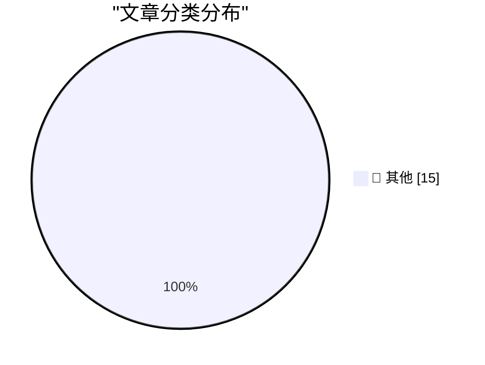

# 📰 AI 资讯每日精选 — 2026-10-02

> 汇聚 140+ 技术博客、X/Twitter、Hacker News、Reddit、Product Hunt、
> Lobste.rs、ClawFeed 日报及 GitHub Trending，经 AI 评分筛选。
>
> **本期内容**：🏆 今日必读 · 🌐 ClawFeed 日报 · 🔥 GitHub Trending · 📂 分类精选 · 🎨 设计与生成式 AI · 📊 数据概览

## 🏆 今日必读

🥇 **Quoting Matthew Green**

[Quoting Matthew Green](https://simonwillison.net/2026/Oct/1/matthew-green/) — simonwillison.net · 20 小时前 · 📝 其他

> Quoting Matthew Green

🥈 **Do not build the LLM torture factory**

[Do not build the LLM torture factory](https://seangoedecke.com/do-not-build-the-llm-torture-factory/) — seangoedecke.com · 2 小时前 · 📝 其他

> Do not build the LLM torture factory

🥉 **Yankees Sweep Boston in Two Games, by Combined Score of 18-2**

[Yankees Sweep Boston in Two Games, by Combined Score of 18-2](https://www.nytimes.com/athletic/7648172/2026/09/30/yankees-beat-red-sox-mlb-wild-card-series/) — daringfireball.net · 2 小时前 · 📝 其他

> Yankees Sweep Boston in Two Games, by Combined Score of 18-2

4️⃣ **Pluralistic: Voting is to politics as shopping is to boycotts (01 Oct 2026)**

[Pluralistic: Voting is to politics as shopping is to boycotts (01 Oct 2026)](https://pluralistic.net/2026/10/01/data-centers/) — pluralistic.net · 9 小时前 · 📝 其他

> Pluralistic: Voting is to politics as shopping is to boycotts (01 Oct 2026)

5️⃣ **Why do OpenAI's GPT-2 weights beat mine?  Part five: data quality**

[Why do OpenAI's GPT-2 weights beat mine?  Part five: data quality](https://www.gilesthomas.com/2026/10/why-do-openai-gpt2-weights-beat-mine-5-data-quality) — gilesthomas.com · 9 小时前 · 📝 其他

> Why do OpenAI's GPT-2 weights beat mine?  Part five: data quality

---

## 🌐 ClawFeed 日报精选

> 来源：[ClawFeed](https://clawfeed.kevinhe.io) — AI 驱动的多源新闻聚合

# ClawFeed 日报 | 2026-10-01 (SGT)

来源：5 期 4h digest (#1320–#1324, 04:00–20:00 SGT)

---

## 🔥 当日全场最重要 5 条

1. **Gemini 4 Argon 发布——谷歌下一代前沿模型创下真实软件工程 SOTA**。与 GPT-6 Astra / Claude Opus 5 形成三方对峙，Agent 基础设施层再添重量级选手。"毁天灭地"级社区反应。

2. **Opus 5.5 "程序化视频"现象级刷屏**——不是视频模型，是写程序画每一帧（Canvas/WebGL/Three.js/Remotion → MP4）。宝玉(@dotey)万字长文解构，74K 浏览量，对 Anthropic 编程能力的最强背书之一。

3. **玉伯(@lifesinger)定调"Agent 新物种"**——Claude Tag / Grok Bot / Muse / Cue / Dots 一连串发布标志着 general agent 物种确立，computer 和 phone 正在变成 agent 基础设施。10K 浏览量，高度凝练的产业视角。

4. **SGLang 多模态决策模型击败 Pokemon 精英四天王**——Qwen3.8-27B 训练成 sub-100ms 决策模型，原生 /v1/decisions API。决策模型范式从文本扩展到多模态+具身。

5. **MiniMax 开源 OpenAgentCore + Higgsfield 把 Computer Use 做进视频创作**——Agent 基础设施开源化加速（self-host agent core: sandbox+模型+harness）；Computer Use 从浏览器扩展到专业软件自动化（GPT-6.1 Sol 驱动视频全流程）。

---

## 📰 当日核心主题

### 1. Personal Agent 五路赛马
dots（24h 离线推进）/ Muse（生活助理普惠）/ Cue（Agent 配邮箱电话钱包）/ Instinct（短信电话入口）/ Grok Bot（geek/VPS 玩法）。dots 首日体验不佳（云电脑"基本不可用"），dot.com 域名被 Elon Musk 拿给 Grok Bot。话题连续 24h 覆盖，新增信息量边际递减。Instinct 创始人 Noah Shinn (23 岁) Invest Like the Best 播客首次长篇输出。

### 2. Opus 5.5 程序化视频
全天持续发酵：从"一句话做视频"到技术路线拆解，核心洞察是"视频=30fps 静态图，模型只需回答第 N 帧长什么样"。对"什么算视频模型"的定义构成挑战。

### 3. Agent 基础设施层深化
- Agent Infra 知识体系化（Stateful vs Stateless、分布式状态管理是必修课）
- InstaCloud $8M seed 做 agent-native serverless cloud，要"杀死 AWS/GCP/Azure"
- MiniMax OpenAgentCore 开源（self-host agent core）
- "一切 infra 值得为 agent 重新做一遍"

### 4. Skill 生态：从工具封装到专家经验沉淀
Matt Pocock Top 3 Skill Makers (@poteto/@dexhorthy/@emilkowalski) 引发范式讨论：多年实践者把工作方法写成 Agent 可执行 Skills。Claude Code Skill Makers 正成为新的创作者身份。AIHOT 全开源也指向"人人可搭建私人信源站"。

### 5. Claude Code 深度方法论
Latent Space × Thariq 92 分钟播客：prompting 仍是 agentic coding 最高杠杆技能；Claude.md 未来可能演化为更动态形态；Mods/Mutable Software/Multiplayer Agents 是下一步方向。

---

## 🔖 累计 bookmark 精选

全天 bookmarks 无变化，连续 5 期相同：
- @sama — Dots 官方发布
- @ManusAI — Manus 2.0 发布
- @alexandr_wang — "Here's to the wanting" + Muse 小企业版
- @dotey / @indigox — DevDay 一图看懂

⚠️ 建议 Kevin 处理后清除，当前 bookmarks 已无增量信息价值。

---

## 👀 推荐关注汇总

| 账号 | 理由 |
|------|------|
| @Khazix0918 (卡兹克) | AIHOT 创始人，月活百万 AI 热点站全开源，格局型 builder |
| @yifanxu_ephai | Agent Infra 知识体系化布道者，分布式基础 × Agent 工程桥梁 |
| @trq212 (Thariq Shihipar) | Claude Code 负责人，prompting/mods/multiplayer agents 一手信息源 |
| @saladday (SaladDay) | MiniMax 团队，OpenAgentCore 开源者，agent infra 一手源 |
| Higgsfield AI (@higgsfield) | Computer Use + 视频创作自动化，GPT-6.1 Sol 集成先行者 |
| InstaCloud 团队 | agent-native cloud infra，$8M seed，值得跟踪产品演进 |

此前已推荐仍值得关注：@benhawkes / @sam_alba

---

## 💤 当日重复噪音模式

1. **Bookmarks 跨期堆积**：sama/ManusAI/alexandr_wang/dotey/indigox 连续 5 期未清除，占满 bookmarks 位但无增量信息。
2. **PA 五大玩家横评信息衰减**：dots/Muse/Cue/Grok Bot/Instinct 对比话题连续 24h 覆盖，后 3 期新增视角显著减少。
3. **Crypto/非 AI 内容零星混入**：Rabby→Ambire 钱包迁移、交易喊单等与 AI/agent 主线无关。
4. **@guruchahal 连续 2 期无实质内容**（仅转发 Elon Musk+自拍），建议取关观察。
5. **mark 标记待清理**：WeChat 文章 + YouTube 视频因验证墙无法自动抓取，已连续多期挂起。
---

## 🔥 GitHub Trending

> 今日热门开源项目（全语言 + Python）

| # | 项目 | 描述 | ⭐ 总星 | 📈 今日 | 语言 |
|---|------|------|---------|---------|------|
| 1 | [NVIDIA/OpenShell](https://github.com/NVIDIA/OpenShell) 🤖 | OpenShell is the safe, private runtime for autonomous AI ... | 14.1k | +2456 | Rust |
| 2 | [ifixai-ai/iFixAi](https://github.com/ifixai-ai/iFixAi) 🤖 | Independent Auditing of AI Agents. Run by human or the ag... | 18.5k | +1492 | Python |
| 3 | [debpalash/VoiceStudio](https://github.com/debpalash/VoiceStudio) | VoiceStudio is the open-source, fully-local ElevenLabs al... | 51.4k | +1284 | Python |
| 4 | [DietrichGebert/ponytail](https://github.com/DietrichGebert/ponytail) 🤖 | Makes your AI agent think like the laziest senior dev in ... | 150.6k | +1194 | JavaScript |
| 5 | [mattpocock/skills](https://github.com/mattpocock/skills) | Skills for Real Engineers. Straight from my .agents direc... | 274.0k | +883 | Shell |
| 6 | [mvschwarz/openrig](https://github.com/mvschwarz/openrig) 🤖 | Build your own network of agents from Claude Code, Codex ... | 3.8k | +642 | TypeScript |
| 7 | [heygen-com/hyperframes](https://github.com/heygen-com/hyperframes) | Write HTML. Render video. Built for agents. | 55.4k | +627 | TypeScript |
| 8 | [harry0703/MoneyPrinterTurbo](https://github.com/harry0703/MoneyPrinterTurbo) 🤖 | 利用 AI 大模型和自动化工作流，根据主题或关键词一键生成高清短视频。Generate HD short vide... | 128.0k | +576 | Python |
| 9 | [pbakaus/impeccable](https://github.com/pbakaus/impeccable) 🤖 | The design language that makes your AI harness better at ... | 73.7k | +495 | JavaScript |
| 10 | [VectifyAI/PageIndex](https://github.com/VectifyAI/PageIndex) 🤖 | 📑 PageIndex: Document Index for Vectorless, Reasoning-ba... | 38.4k | +477 | Python |
| 11 | [obra/superpowers](https://github.com/obra/superpowers) | An agentic skills framework & software development method... | 294.0k | +455 | Shell |
| 12 | [HunxByts/GhostTrack](https://github.com/HunxByts/GhostTrack) | Useful tool to track location or mobile number | 16.4k | +368 | Python |
| 13 | [mksglu/context-mode](https://github.com/mksglu/context-mode) 🤖 | Context window optimization for AI coding agents. Sandbox... | 24.8k | +362 | TypeScript |
| 14 | [pablostanley/yoinks](https://github.com/pablostanley/yoinks) | yoink any video from your terminal. no shady ads. | 3.0k | +361 | TypeScript |
| 15 | [ComposioHQ/awesome-claude-skills](https://github.com/ComposioHQ/awesome-claude-skills) 🤖 | A curated list of awesome Claude Skills, resources, and t... | 76.3k | +319 | Python |

---

## 📝 其他

### 1. Quoting Matthew Green

[Quoting Matthew Green](https://simonwillison.net/2026/Oct/1/matthew-green/) — **simonwillison.net** · 20 小时前 · ⭐ 15/30

> Quoting Matthew Green

---

### 2. Do not build the LLM torture factory

[Do not build the LLM torture factory](https://seangoedecke.com/do-not-build-the-llm-torture-factory/) — **seangoedecke.com** · 2 小时前 · ⭐ 15/30

> Do not build the LLM torture factory

---

### 3. Yankees Sweep Boston in Two Games, by Combined Score of 18-2

[Yankees Sweep Boston in Two Games, by Combined Score of 18-2](https://www.nytimes.com/athletic/7648172/2026/09/30/yankees-beat-red-sox-mlb-wild-card-series/) — **daringfireball.net** · 2 小时前 · ⭐ 15/30

> Yankees Sweep Boston in Two Games, by Combined Score of 18-2

---

### 4. Pluralistic: Voting is to politics as shopping is to boycotts (01 Oct 2026)

[Pluralistic: Voting is to politics as shopping is to boycotts (01 Oct 2026)](https://pluralistic.net/2026/10/01/data-centers/) — **pluralistic.net** · 9 小时前 · ⭐ 15/30

> Pluralistic: Voting is to politics as shopping is to boycotts (01 Oct 2026)

---

### 5. Why do OpenAI's GPT-2 weights beat mine?  Part five: data quality

[Why do OpenAI's GPT-2 weights beat mine?  Part five: data quality](https://www.gilesthomas.com/2026/10/why-do-openai-gpt2-weights-beat-mine-5-data-quality) — **gilesthomas.com** · 9 小时前 · ⭐ 15/30

> Why do OpenAI's GPT-2 weights beat mine?  Part five: data quality

---

### 6. Why Americans Stopped Throwing Dinner Parties

[Why Americans Stopped Throwing Dinner Parties](https://www.theatlantic.com/ideas/2026/10/americans-socialization-dinner-decline-hosting/688846/?utm_source=feed) — **derekthompson.org** · 15 小时前 · ⭐ 15/30

> Why Americans Stopped Throwing Dinner Parties

---

### 7. Software Heritage Identifiers

[Software Heritage Identifiers](https://nesbitt.io/2026/10/01/software-heritage-identifiers.html) — **nesbitt.io** · 15 小时前 · ⭐ 15/30

> Software Heritage Identifiers

---

### 8. Understanding the AI That Drives Robots

[Understanding the AI That Drives Robots](https://www.construction-physics.com/p/understanding-the-ai-that-drives) — **construction-physics.com** · 14 小时前 · ⭐ 15/30

> Understanding the AI That Drives Robots

---

### 9. Si Sheppard – How did a few hundred Spanish soldiers topple two empires?

[Si Sheppard – How did a few hundred Spanish soldiers topple two empires?](https://www.dwarkesh.com/p/si-sheppard) — **dwarkesh.com** · 11 小时前 · ⭐ 15/30

> Si Sheppard – How did a few hundred Spanish soldiers topple two empires?

---

### 10. The day GIF became free to use, forever

[The day GIF became free to use, forever](https://dfarq.homeip.net/the-day-gif-became-free-to-use-forever/?utm_source=rss&#038;utm_medium=rss&#038;utm_campaign=the-day-gif-became-free-to-use-forever) — **dfarq.homeip.net** · 15 小时前 · ⭐ 15/30

> The day GIF became free to use, forever

---

### 11. Introducing Olmo-core 3: Open, scalable training infrastructure for large MoEs

[Introducing Olmo-core 3: Open, scalable training infrastructure for large MoEs](https://huggingface.co/blog/allenai/olmocore3) — **Hugging Face Blog** · 11 小时前 · ⭐ 15/30

> Introducing Olmo-core 3: Open, scalable training infrastructure for large MoEs

---

### 12. Nearly half of test subjects mistook Tavus' AI video avatar for a real person on a one-minute call

[Nearly half of test subjects mistook Tavus' AI video avatar for a real person on a one-minute call](https://the-decoder.com/nearly-half-of-test-subjects-mistook-tavus-ai-video-avatar-for-a-real-person-on-a-one-minute-call/) — **The Decoder** · 8 小时前 · ⭐ 15/30

> Nearly half of test subjects mistook Tavus' AI video avatar for a real person on a one-minute call

---

### 13. Ideogram says its new model can edit part of an image without messing up the rest

[Ideogram says its new model can edit part of an image without messing up the rest](https://the-decoder.com/ideogram-says-its-new-model-can-edit-part-of-an-image-without-messing-up-the-rest/) — **The Decoder** · 9 小时前 · ⭐ 15/30

> Ideogram says its new model can edit part of an image without messing up the rest

---

### 14. Anthropic brings Claude to civilian agencies as its fight with the Pentagon drags on

[Anthropic brings Claude to civilian agencies as its fight with the Pentagon drags on](https://the-decoder.com/anthropic-brings-claude-to-civilian-agencies-as-its-fight-with-the-pentagon-drags-on/) — **The Decoder** · 12 小时前 · ⭐ 15/30

> Anthropic brings Claude to civilian agencies as its fight with the Pentagon drags on

---

### 15. Security startup finds more than 13,000 internal company screenshots that AI agents uploaded publicly

[Security startup finds more than 13,000 internal company screenshots that AI agents uploaded publicly](https://the-decoder.com/security-startup-finds-more-than-13000-internal-company-screenshots-that-ai-agents-uploaded-publicly/) — **The Decoder** · 13 小时前 · ⭐ 15/30

> Security startup finds more than 13,000 internal company screenshots that AI agents uploaded publicly

---

## 🎨 Design & Generative AI

### 🖼️ 生成式图片

- **[Ideogram says its new model can edit part of an image without messing up the rest](https://the-decoder.com/ideogram-says-its-new-model-can-edit-part-of-an-image-without-messing-up-the-rest/)** — The Decoder · 9 小时前
  > Ideogram says its new model can edit part of an image without messing up the rest

---

## 📊 数据概览

| 扫描源 | 抓取文章 | 时间范围 | 精选 |
|:---:|:---:|:---:|:---:|
| 92/140 | 3703 篇 → 75 篇 | 24h | **15 篇** |

### 分类分布

---

*生成于 2026-10-02 02:33 | 汇聚 140 个技术博客、X/Twitter、Hacker News、Reddit、Product Hunt、Lobste.rs、ClawFeed 日报及 GitHub Trending，经 AI 评分筛选出 Top 15 精华内容*
