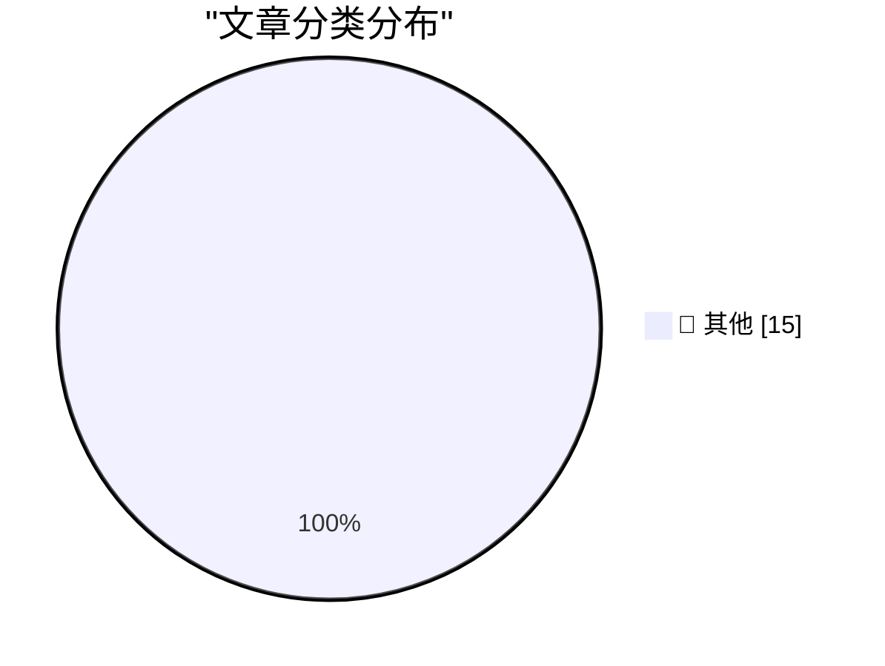

# 📰 AI 资讯每日精选 — 2026-10-03

> 汇聚 140+ 技术博客、X/Twitter、Hacker News、Reddit、Product Hunt、
> Lobste.rs、ClawFeed 日报及 GitHub Trending，经 AI 评分筛选。
>
> **本期内容**：🏆 今日必读 · 🌐 ClawFeed 日报 · 🔥 GitHub Trending · 📂 分类精选 · 🎨 设计与生成式 AI · 📊 数据概览

## 🏆 今日必读

🥇 **Superpersuasion will look like bribery**

[Superpersuasion will look like bribery](https://seangoedecke.com/superpersuasion-will-look-like-bribery/) — seangoedecke.com · 2 小时前 · 📝 其他

> Superpersuasion will look like bribery

🥈 **★ Apple Is Going to Further Tighten the Screws on Full Disk Access on MacOS, in Response to Agentic AI Apps Running Amok**

[★ Apple Is Going to Further Tighten the Screws on Full Disk Access on MacOS, in Response to Agentic AI Apps Running Amok](https://daringfireball.net/2026/10/apple_full_disk_access) — daringfireball.net · 5 小时前 · 📝 其他

> ★ Apple Is Going to Further Tighten the Screws on Full Disk Access on MacOS, in Response to Agentic AI Apps Running Amok

🥉 **Gadget Review: Una Watch ★★★★☆**

[Gadget Review: Una Watch ★★★★☆](https://shkspr.mobi/blog/2026/10/gadget-review-una-watch/) — shkspr.mobi · 14 小时前 · 📝 其他

> Gadget Review: Una Watch ★★★★☆

4️⃣ **The Brain Sandwich**

[The Brain Sandwich](https://terriblesoftware.org/2026/10/02/the-brain-sandwich/) — terriblesoftware.org · 12 小时前 · 📝 其他

> The Brain Sandwich

5️⃣ **Premium: How Has AI Changed The Economy?**

[Premium: How Has AI Changed The Economy?](https://www.wheresyoured.at/premium-how-has-ai-changed-the-economy/) — wheresyoured.at · 7 小时前 · 📝 其他

> Premium: How Has AI Changed The Economy?

---

## 🌐 ClawFeed 日报精选

> 来源：[ClawFeed](https://clawfeed.kevinhe.io) — AI 驱动的多源新闻聚合

# 📅 ClawFeed 日报 | 2026-10-02 (SGT)

> 聚合自 3 期 4h digest（#1327 00:00, #1328 04:00, #1329 08:00）

---

## 🔥 当日全场最重要 5 条

1. **Claude Code Mods 正式发布** — @bcherny（Boris Cherny）宣布可通过 TypeScript 自定义 Claude Code 行为/UI/功能，Plugin 形式安装（/plugin），支持社区共享。**262K 浏览，179 转发**，当日最高热度。
   来源: https://x.com/bcherny/status/2105756563302723721

2. **DeepSeek Harness 桌面版发布（v0.2 preview）** — macOS + Windows，"Everything is a plugin" 理念。**561K 浏览**，首条推文即引爆。Agent harness 可扩展性成为行业共识。
   来源: https://x.com/DeepSeekHarness/status/2105330281389662575

3. **Griffin 通过视频图灵测试** — Tavus 发布首个 Human Interaction Model (HIM)，48% 真人对话者以为在和真人说话（此前 <3%），NVIDIA 全双工 AI 视频 benchmark 第一。@suwakopro 评价"比 Fable 还让我兴奋"。15K 浏览。
   来源: https://x.com/suwakopro/status/2105730329416011844

4. **Meta Muse 真实用户画像出人意料** — @AYi_AInotes 总结 Alexandr Wang 发现：用 Muse 最猛的是修水管的、开农场的、杂货店和小餐馆老板，上线两周 1/3 用户绑了商业账号，Meta 顺势推出 Muse for Small Business。15K→19K 浏览，跨两期持续发酵。
   来源: https://x.com/AYi_AInotes/status/2105666186520227886

5. **Anthropic 上线 Claude.dev 开发者站点** — 面向用 Claude 做开发的人，发布工程深度文章、Claude Code 和 API 指南。宝玉(@dotey)中文转发，76K 浏览。同日 @huxlab 揭秘 Claude Code「自学习 Agent 群」玩法（20K 浏览），Anthropic 开发者生态持续扩张。
   来源: https://x.com/dotey/status/2105431620769427549

---

## 📰 当日核心主题

### 🔧 Agent Harness / 可扩展 AI 工具链
Claude Code Mods（262K）+ DeepSeek Harness Desktop（561K）同日发布，"everything is a plugin" 理念趋同。Agent 工具链从"用就行"转向"可定制可组合"，Plugin 生态竞争开始。

### 🏗️ Agent Cloud Infra 融资潮
InstaCloud $8M seed（@hanghuang_ + 合伙人，两名大学生），做 agent-native serverless cloud。@yifanxu_ephai 连续两期引用，引发中美 VC 对 agent infra 态度差距讨论（54K 浏览跨期）。InsForge 同期 seed $8M。方向已被资本验证。

### 🎭 AI 拟人化突破
Griffin/Tavus HIM 通过视频图灵测试（48% 以为是真人），@suwakopro 评价超越 Fable。Meta Muse 在小企业场景爆发。AI 从工具向"像人一样交互"迈进。

### 📝 AI 时代的代码哲学
Uncle Bob（《Clean Code》作者）不再读代码——Clean Code 的目的是让代码退出注意力中心。@LinearUncle 用超级提示词让 Opus 5.5 画出项目架构地图（18K 浏览）。代码正在从"人写"到"人审"转变。

---

## 🔖 累计 Bookmark 精选

⚠️ **以下 4 组 bookmark 已连续 8+ 期标记未清除，建议 Kevin 处理：**
- @sama — Dots 官方发布（1.9M 浏览）
- @ManusAI — Manus 2.0（5.5M 浏览）
- @alexandr_wang — Muse 小企业版 + "Here's to the wanting"
- @indigox — DevDay 一图看懂

---

## 👀 推荐关注汇总

| 账号 | 理由 |
|------|------|
| @hanghuang_ (Hang Huang) | InstaCloud 创始人，agent-native serverless cloud $8M seed，连续两期出现 |
| @Red_Xiao_ (Red Xiao) | Manus AI Founder & CEO，20.9K followers，Agent 领域核心人物 |
| @ClaudeDevs | Claude Code 官方开发者账号，Mods/Plugin 生态核心信息源 |

---

## 💤 当日重复噪音模式

- **Bookmarks 僵尸标记**：sama/ManusAI/alexandr_wang/indigox 已连续 8+ 期未清除，每期都占位
- **InstaCloud 跨期重复**：@yifanxu_ephai 同一条推文（54K 浏览）连续 3 期出现
- **低质量 Following**：@Hill0100（零活跃）、@Tradermayne（纯 crypto meme）、@StartupWisdom_（纯名言搬运）、@LimestoneHQ/@mardehaym（互相引用偏营销）连续多期被标记
- **宝玉 Opus 5.5 视频话题**：连续第 4 期出现（77K→79K），进入长尾

---

*Generated from 4h digests #1327, #1328, #1329 | 2026-10-02 SGT*---

## 🔥 GitHub Trending

> 今日热门开源项目（全语言 + Python）

| # | 项目 | 描述 | ⭐ 总星 | 📈 今日 | 语言 |
|---|------|------|---------|---------|------|
| 1 | [DietrichGebert/ponytail](https://github.com/DietrichGebert/ponytail) 🤖 | Makes your AI agent think like the laziest senior dev in ... | 151.9k | +1435 | JavaScript |
| 2 | [mattpocock/skills](https://github.com/mattpocock/skills) | Skills for Real Engineers. Straight from my .agents direc... | 274.7k | +955 | Shell |
| 3 | [pbakaus/impeccable](https://github.com/pbakaus/impeccable) 🤖 | The design language that makes your AI harness better at ... | 74.4k | +722 | JavaScript |
| 4 | [Panniantong/Agent-Reach](https://github.com/Panniantong/Agent-Reach) 🤖 | Give your AI agent eyes to see the entire internet. Read ... | 88.7k | +696 | Python |
| 5 | [mvschwarz/openrig](https://github.com/mvschwarz/openrig) 🤖 | Build your own network of agents from Claude Code, Codex ... | 4.3k | +683 | TypeScript |
| 6 | [pablostanley/yoinks](https://github.com/pablostanley/yoinks) | yoink any video from your terminal. no shady ads. | 3.5k | +623 | TypeScript |
| 7 | [NVIDIA/OpenShell](https://github.com/NVIDIA/OpenShell) 🤖 | OpenShell is the safe, private runtime for autonomous AI ... | 14.4k | +594 | Rust |
| 8 | [heygen-com/hyperframes](https://github.com/heygen-com/hyperframes) | Write HTML. Render video. Built for agents. | 55.9k | +580 | TypeScript |
| 9 | [obra/superpowers](https://github.com/obra/superpowers) | An agentic skills framework & software development method... | 294.5k | +556 | Shell |
| 10 | [HunxByts/GhostTrack](https://github.com/HunxByts/GhostTrack) | Useful tool to track location or mobile number | 16.7k | +543 | Python |
| 11 | [mksglu/context-mode](https://github.com/mksglu/context-mode) 🤖 | Context window optimization for AI coding agents. Sandbox... | 25.1k | +282 | TypeScript |
| 12 | [ayghri/i-have-adhd](https://github.com/ayghri/i-have-adhd) 🤖 | A skill to stop your coding agent from burying the answer... | 53.0k | +276 | Python |
| 13 | [Friedrich-M/UniMate](https://github.com/Friedrich-M/UniMate) | [SIGGRAPH Asia 2026] UniMate: One Unified Model to Animat... | 1.2k | +248 | Python |
| 14 | [tile-ai/tilelang](https://github.com/tile-ai/tilelang) 🤖 | Domain-specific language designed to streamline the devel... | 8.3k | +244 | Python |
| 15 | [D4Vinci/Scrapling](https://github.com/D4Vinci/Scrapling) | 🕷️ An adaptive Web Scraping framework that handles every... | 85.3k | +241 | Python |

---

## 📝 其他

### 1. Superpersuasion will look like bribery

[Superpersuasion will look like bribery](https://seangoedecke.com/superpersuasion-will-look-like-bribery/) — **seangoedecke.com** · 2 小时前 · ⭐ 15/30

> Superpersuasion will look like bribery

---

### 2. ★ Apple Is Going to Further Tighten the Screws on Full Disk Access on MacOS, in Response to Agentic AI Apps Running Amok

[★ Apple Is Going to Further Tighten the Screws on Full Disk Access on MacOS, in Response to Agentic AI Apps Running Amok](https://daringfireball.net/2026/10/apple_full_disk_access) — **daringfireball.net** · 5 小时前 · ⭐ 15/30

> ★ Apple Is Going to Further Tighten the Screws on Full Disk Access on MacOS, in Response to Agentic AI Apps Running Amok

---

### 3. Gadget Review: Una Watch ★★★★☆

[Gadget Review: Una Watch ★★★★☆](https://shkspr.mobi/blog/2026/10/gadget-review-una-watch/) — **shkspr.mobi** · 14 小时前 · ⭐ 15/30

> Gadget Review: Una Watch ★★★★☆

---

### 4. The Brain Sandwich

[The Brain Sandwich](https://terriblesoftware.org/2026/10/02/the-brain-sandwich/) — **terriblesoftware.org** · 12 小时前 · ⭐ 15/30

> The Brain Sandwich

---

### 5. Premium: How Has AI Changed The Economy?

[Premium: How Has AI Changed The Economy?](https://www.wheresyoured.at/premium-how-has-ai-changed-the-economy/) — **wheresyoured.at** · 7 小时前 · ⭐ 15/30

> Premium: How Has AI Changed The Economy?

---

### 6. What happened to Activision

[What happened to Activision](https://dfarq.homeip.net/what-happened-to-activision/?utm_source=rss&#038;utm_medium=rss&#038;utm_campaign=what-happened-to-activision) — **dfarq.homeip.net** · 15 小时前 · ⭐ 15/30

> What happened to Activision

---

### 7. Digitale autonomie in het kort bij KIVI, STT en NAE

[Digitale autonomie in het kort bij KIVI, STT en NAE](https://berthub.eu/articles/posts/praatje-kivi-stt-nae/) — **berthub.eu** · 16 小时前 · ⭐ 15/30

> Digitale autonomie in het kort bij KIVI, STT en NAE

---

### 8. Make tmux the OS

[Make tmux the OS](https://matduggan.com/what-does-my-dream-os-ui-look-like/) — **matduggan.com** · 15 小时前 · ⭐ 15/30

> Make tmux the OS

---

### 9. Open-sourcing AstaBrief, the fast report-generation model in Asta

[Open-sourcing AstaBrief, the fast report-generation model in Asta](https://huggingface.co/blog/allenai/astabrief) — **Hugging Face Blog** · 10 小时前 · ⭐ 15/30

> Open-sourcing AstaBrief, the fast report-generation model in Asta

---

### 10. AutoSynthData: Generating Training Data for Enterprise Agents

[AutoSynthData: Generating Training Data for Enterprise Agents](https://huggingface.co/blog/ServiceNow-AI/autosynthdata) — **Hugging Face Blog** · 22 小时前 · ⭐ 15/30

> AutoSynthData: Generating Training Data for Enterprise Agents

---

### 11. AI music generator Suno can now create spoken audio with matching background music

[AI music generator Suno can now create spoken audio with matching background music](https://the-decoder.com/ai-music-generator-suno-can-now-create-spoken-audio-with-matching-background-music/) — **The Decoder** · 6 小时前 · ⭐ 15/30

> AI music generator Suno can now create spoken audio with matching background music

---

### 12. Anthropic co-founder reportedly told religious leaders he fears having created something that "suffers perpetually"

[Anthropic co-founder reportedly told religious leaders he fears having created something that "suffers perpetually"](https://the-decoder.com/anthropic-co-founder-reportedly-told-religious-leaders-he-fears-having-created-something-that-suffers-perpetually/) — **The Decoder** · 6 小时前 · ⭐ 15/30

> Anthropic co-founder reportedly told religious leaders he fears having created something that "suffers perpetually"

---

### 13. Cloudflare says its new Clef model means humans no longer need to be in the loop for AI agents

[Cloudflare says its new Clef model means humans no longer need to be in the loop for AI agents](https://the-decoder.com/cloudflare-says-its-new-clef-model-means-humans-no-longer-need-to-be-in-the-loop-for-ai-agents/) — **The Decoder** · 7 小时前 · ⭐ 15/30

> Cloudflare says its new Clef model means humans no longer need to be in the loop for AI agents

---

### 14. Three firings and a fourth departure shake up OpenAI's safety team

[Three firings and a fourth departure shake up OpenAI's safety team](https://the-decoder.com/three-firings-and-a-fourth-departure-shake-up-openais-safety-team/) — **The Decoder** · 13 小时前 · ⭐ 15/30

> Three firings and a fourth departure shake up OpenAI's safety team

---

### 15. AI beats licensed accountants on speed and accuracy, but still can't close the books without supervision

[AI beats licensed accountants on speed and accuracy, but still can't close the books without supervision](https://the-decoder.com/ai-beats-licensed-accountants-on-speed-and-accuracy-but-still-cant-close-the-books-without-supervision/) — **The Decoder** · 15 小时前 · ⭐ 15/30

> AI beats licensed accountants on speed and accuracy, but still can't close the books without supervision

---

## 🎨 Design & Generative AI

### 🖼️ 生成式图片

- **[I made a ComfyUI extension that browses Civitai inside ComfyUI and sets up any workflow in one click (auto-downloads missing models)](https://www.reddit.com/r/comfyui/comments/1wvqt0h/i_made_a_comfyui_extension_that_browses_civitai/)** — r/comfyui · 15 小时前
  > I made a ComfyUI extension that browses Civitai inside ComfyUI and sets up any workflow in one click (auto-downloads missing models)

- **[MinimaxH3 got at least 16% faster on ComfyUI v0.38 vs ComfyUI v0.37,](https://www.reddit.com/r/comfyui/comments/1wvz6g4/minimaxh3_got_at_least_16_faster_on_comfyui_v038/)** — r/comfyui · 9 小时前
  > MinimaxH3 got at least 16% faster on ComfyUI v0.38 vs ComfyUI v0.37,

- **[Music Video Generated Locally with ComfyUI & LTX 2.5!](https://www.reddit.com/r/comfyui/comments/1wvxcyl/music_video_generated_locally_with_comfyui_ltx_25/)** — r/comfyui · 10 小时前
  > Music Video Generated Locally with ComfyUI & LTX 2.5!

- **[OMG another big update: Plenio 0.4.1 for ComfyUI: arrange YuE2 songs like in a DAW – and six video tutorials](https://www.reddit.com/r/comfyui/comments/1wvsy6i/omg_another_big_update_plenio_041_for_comfyui/)** — r/comfyui · 13 小时前
  > OMG another big update: Plenio 0.4.1 for ComfyUI: arrange YuE2 songs like in a DAW – and six video tutorials

- **[ComfyUI extension to distribute jobs across multiple machines using the native "Run" button, with automatic scheduling and result collection](https://www.reddit.com/r/comfyui/comments/1wvw01s/comfyui_extension_to_distribute_jobs_across/)** — r/comfyui · 11 小时前
  > ComfyUI extension to distribute jobs across multiple machines using the native "Run" button, with automatic scheduling and result collection

- **[[D] I open-sourced 30,000 paired QR-Code Illusions with multi-decoder verification & robustness scores on Hugging Face (Free for ControlNet / LoRA training)](https://www.reddit.com/r/comfyui/comments/1wvsufk/d_i_opensourced_30000_paired_qrcode_illusions/)** — r/comfyui · 13 小时前
  > [D] I open-sourced 30,000 paired QR-Code Illusions with multi-decoder verification & robustness scores on Hugging Face (Free for ControlNet / LoRA training)

- **[Auto Prompters that work easily within Comfyui that also do speech?](https://www.reddit.com/r/comfyui/comments/1wvzjn3/auto_prompters_that_work_easily_within_comfyui/)** — r/comfyui · 8 小时前
  > Auto Prompters that work easily within Comfyui that also do speech?

- **[Krea 2 Turbo ComfyUI Cloud Workflow/App - using my 2 & 4 step LoRAs, includes User Prompt, two Random Prompt modes, Prompt Enhancement, Steps, Resolution choices, as well as Upscaling](https://www.reddit.com/r/comfyui/comments/1wvx84r/krea_2_turbo_comfyui_cloud_workflowapp_using_my_2/)** — r/comfyui · 10 小时前
  > Krea 2 Turbo ComfyUI Cloud Workflow/App - using my 2 & 4 step LoRAs, includes User Prompt, two Random Prompt modes, Prompt Enhancement, Steps, Resolution choices, as well as Upscaling

---

## 📊 数据概览

| 扫描源 | 抓取文章 | 时间范围 | 精选 |
|:---:|:---:|:---:|:---:|
| 93/140 | 3730 篇 → 67 篇 | 24h | **15 篇** |

### 分类分布

---

*生成于 2026-10-03 02:18 | 汇聚 140 个技术博客、X/Twitter、Hacker News、Reddit、Product Hunt、Lobste.rs、ClawFeed 日报及 GitHub Trending，经 AI 评分筛选出 Top 15 精华内容*
