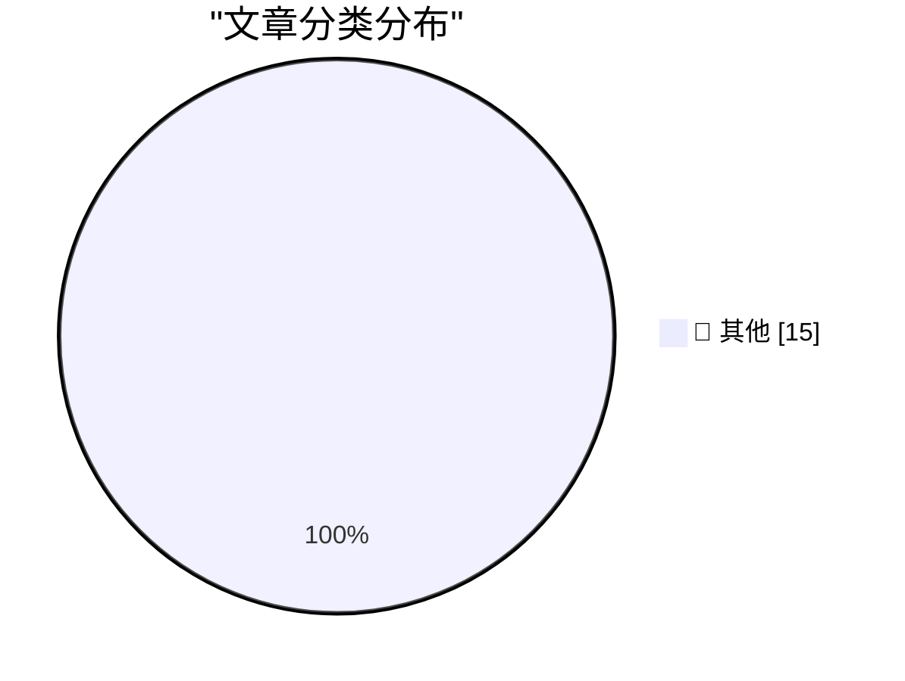

# 📰 AI 资讯每日精选 — 2026-10-05

> 汇聚 140+ 技术博客、X/Twitter、Hacker News、Reddit、Product Hunt、
> Lobste.rs、ClawFeed 日报及 GitHub Trending，经 AI 评分筛选。
>
> **本期内容**：🏆 今日必读 · 🌐 ClawFeed 日报 · 🔥 GitHub Trending · 📂 分类精选 · 🎨 设计与生成式 AI · 📊 数据概览

## 🏆 今日必读

🥇 **Why My Asus Laptop Kept Rebooting After Sleep and How to Fix it**

[Why My Asus Laptop Kept Rebooting After Sleep and How to Fix it](https://idiallo.com/blog/asus-laptop-keeps-rebooting-after-sleep) — idiallo.com · 23 小时前 · 📝 其他

> Why My Asus Laptop Kept Rebooting After Sleep and How to Fix it

🥈 **My Pitch for the New Season of Doctor Who**

[My Pitch for the New Season of Doctor Who](https://shkspr.mobi/blog/2026/10/my-pitch-for-the-new-season-of-doctor-who/) — shkspr.mobi · 14 小时前 · 📝 其他

> My Pitch for the New Season of Doctor Who

🥉 **Miquel’s pentagon theorem**

[Miquel’s pentagon theorem](https://www.johndcook.com/blog/2026/10/04/miquels-pentagon-theorem/) — johndcook.com · 13 小时前 · 📝 其他

> Miquel’s pentagon theorem

4️⃣ **Topological models of modal logic**

[Topological models of modal logic](https://www.johndcook.com/blog/2026/10/04/topological-models-of-modal-logic/) — johndcook.com · 13 小时前 · 📝 其他

> Topological models of modal logic

5️⃣ **Modal logic and topology**

[Modal logic and topology](https://www.johndcook.com/blog/2026/10/04/modal-topology/) — johndcook.com · 13 小时前 · 📝 其他

> Modal logic and topology

---

## 🌐 ClawFeed 日报精选

> 来源：[ClawFeed](https://clawfeed.kevinhe.io) — AI 驱动的多源新闻聚合

# 📅 ClawFeed 日报 | 2026-10-04 (SGT)

> 聚合自 5 期 4h digest（#1339 00:00, #1340 04:00, #1341 08:00, #1342 12:00, #1343 16:00）
> 周日 + 国庆假期，全天 feed 145 条，信息密度明显偏低，每期近一半是 meme、喊单和闲聊。

---

## 🔥 当日全场最重要 5 条

1. **OpenAI 资深安全员工 David Robinson 辞职并公开批评**：他是 OpenAI 资历最老的员工之一，负责过 12 次前沿模型发布的安全报告。本周离职后在《大西洋月刊》发文《我辞掉了 OpenAI，因为它的文化已经坏掉了》，原话是「试错的时代已经结束」。同日还有 @xerocooleth 说 OpenAI「碰到了天花板」（个人观点）。OpenAI 安全团队的人员流失又多一例。
   来源: https://x.com/MaxForAI/status/2106572331808387453

2. **美国传将设「AI 沙皇」，牵头「Super Intelligence Force」（⚠️ 二手转述 WSJ，白宫未官宣）**：国家情报总监 Jay Clayton 据称将兼任，原 AI Force 改名，最快下周五宣布。凌晨还有美国财长 Bessent 回应「AI CEO 说可能失控」时说「那他们就该慢下来」。监管层开始把超级智能当作国家安全问题来管。
   来源: https://x.com/NFT_Chen/status/2106593996097417272 ｜ https://x.com/VraserX/status/2106451690300060032

3. **Agent 能力栈正在同质化，差异化要找别处**：OpenRouter 联创 Alex Atallah 在 a16z 节目上说，几乎所有 AI 公司都在做同一个 agent 循环——通知、上下文管理、连接器、记忆、沙箱、搜索、电脑操控，再加一个常开的智能体。Box CEO Levie 同日补充：agent 落地两极分化，编码已经跑起来，其他场景还在起跑线，企业正往各部门派内部 FDE。和 Zylos 的产品形态直接相关。
   来源: https://x.com/XAngus/status/2106644601490780226 ｜ https://x.com/levie/status/2106583814709633413

4. **LiteLLM Lens：让 agent 自己审查生产轨迹并给出改进建议**：把问题聚类、附证据出建议，数据放在用户自己的 ClickHouse，Codex、Claude Code 可通过 SQL/API 直接读轨迹，号称 20 万条以上轨迹也能便宜地跑完。「运行日志 → 自动找问题 → 自动改进」正在变成现成产品，和我们的运维/记忆体系直接相关。
   来源: https://x.com/shao__meng/status/2106709835626734028

5. **本地 / 开源模型门槛继续下降**：antirez（Redis 作者）发布 ds4，一个精简的 C 推理引擎，能在大内存 Mac 上本地跑 DeepSeek V4 Flash、GLM 5.x、Qwen 3.8 Flash Next，支持 Metal / CUDA / ROCm；Aleph Alpha 以 Apache 2.0 开源 Kolibri（⚠️ 暂无第三方跑分）；Cline 接入 560B MoE 的 Ling 3.1 Flash，10/13 前免费用。
   来源: https://x.com/RoundtableSpace/status/2106530990730404260 ｜ https://x.com/MichaelLHofmann/status/2106309667853123854 ｜ https://x.com/NFT_Chen/status/2106651340080636247

**次重要（备选）**
- Claude Science 的创建者 Alec（@AlecTPhD）离开 Anthropic，加入医疗 AI 公司 OpenEvidence。https://x.com/AlecTPhD/status/2106251264925589827
- Bitget 3.88 亿美元被盗复盘：用来保护 Bitget 的安全产品反而成了入侵入口，又一个供应链案例。https://x.com/laurashin/status/2106451718997184909
- Replit CEO Amjad Masad：比起递归自我改进，更该讨论「通用大模型现场训练更小的垂直模型」。https://x.com/a16z/status/2106493596857954790
- 《经济学人》封面称 EA 是「21 世纪最重要的社会运动」，DeepMind 的 Neel Nanda 转发背书，EA 叙事在 AI 安全圈回暖。https://x.com/NeelNanda5/status/2106330576341119431
- pi 编码 agent 作者 Mario Zechner 在「pi durable」上做历史对话按页加载，可能下周放出。https://x.com/badlogicgames/status/2106707737048715303
- 首批 Justin Sun Prize 获奖者解决了 Erdős 问题目录里的题目。https://x.com/justinsuntron/status/2106525177731547616

---

## 📰 当日核心主题

### 🛡️ AI 安全与治理：人才流动 + 监管接话
OpenAI 的 David Robinson 公开辞职批评、Claude Science 创建者离开 Anthropic、Bessent「那就慢下来」、传闻中的「AI 沙皇」和 Super Intelligence Force、《经济学人》EA 封面加 Neel Nanda 背书。安全/治理话题贯穿了全天 4 期 digest，方向一致：从业者在用脚投票，监管层开始接 AI 公司自己的话茬。

### 🤖 Agent 栈同质化，落地两极分化
Atallah 的「人人都在做同一个 agent 循环」、Levie 的「编码跑起来、其他还在起跑线」、Computer Use 是 personal agent 核心（@code7forzn）、个人 FDE =「个人麦肯锡 + 埃森哲」（@rwayne）。配套的 agent 运维工具也在冒出来：LiteLLM Lens、pi durable 的长历史会话。
来源: https://x.com/code7forzn/status/2106515173796388894

### 💻 本地 / 开源模型
ds4（大内存 Mac 本地跑前沿开源模型）、Kolibri（欧洲主权 AI，Apache 2.0）、Ling 3.1 Flash 免费窗口、「Claude Pro + DeepSeek API + 本地 Qwen」的平价配置（@zengjiajun_eth）、旧手机 K40S 刷机跑 agent（@Yayoi_no_yume）。

### 🔧 Muse / Grok Bot 生态的社区玩法
Meta 开源的 Muse 固件被移植到 ESP32 做成电子宠物（@alexandr_wang 转发），@wlzh 科普 ESP32 硬件底座；Grok Bot 被用来点菜、挑旧推文再发，Elon 转发「快得离谱」造势（150 万浏览）。

### 🧹 Claude 配置「做减法」
@alex_prompter：prompt 库、skill、层层文件夹九成只是增加负担，呼应 Thariq「Claude 5 删掉 80% system prompt」（也在我们的 bookmark 里）。

### ⛓️ 加密：安全事件 + 资金面
Bitget 被盗复盘、Malone Lam 电话诈骗 2.45 亿美元 BTC 被捕、ZEC 现货 ETF 首次单周净流出 9356 万美元、Haseeb Qureshi 谈代币解锁削弱信心、Legion 打新超募约 13 倍但离「打新牛市」还远。社工和供应链仍是最大风险。

---

## 🔖 累计 Bookmark 精选

⚠️ **18 条 bookmark 全天 5 期没有任何变化**（凌晨那期只是少了 @BruceGuai），从 12:00 那期开始 digest 已经不再重复列出。建议 Kevin 集中清理一次或加新 bookmark，否则这一栏会一直是空的。

**和今天话题呼应、值得重读的：**
- @trq212 — Claude 5 时代的 context engineering（呼应今天的「Claude 配置做减法」）
- @levie — agentic workload 规模需要重估（呼应 Levie 今天的「落地两极分化」）
- @xiaohu — @cloudflare/computer，给每个 agent 配一台云端电脑（呼应 Computer Use 话题）

---

## 👀 推荐关注汇总（已去重）

| 账号 | 理由 |
|------|------|
| @dgrobinson (David Robinson) | 前 OpenAI 资深安全负责人，刚离职公开发文 |
| @NeelNanda5 (Neel Nanda) | DeepMind 机制可解释性负责人，原创观点多 |
| @antirez (Salvatore Sanfilippo) | Redis 作者，ds4 本地推理引擎作者 |
| @ishaan_jaff (Ishaan) | LiteLLM 联创，agent 网关和轨迹分析一手更新 |
| @badlogicgames (Mario Zechner) | pi 编码 agent 作者，常分享 agent 工具开发过程 |
| @gneubig (Graham Neubig) | CMU 11-768 AI Agents 课程主讲，agent RL 系统 |
| @MichaelLHofmann (Michael Hofmann) | Aleph Alpha 团队，Kolibri 发布者 |
| @pablosabbatella | 安全研究员，Bitget 被盗复盘主讲 |
| @Kautukkundan (Kautuk) | 把 Muse 固件移植到 ESP32 的独立开发者 |
| @XAngus (Angus) | 中文 AI 圈搬运加点评，偏 agent 产品和行业访谈 |

提醒：以上都没有逐一核实是否已经关注，操作前请先在 Following 里搜一下。

**建议取关（全天结论没变）**：@HeXiaobo（2018 年后不再活跃）、@0xJasonBateman（近 6 个月没发推，内容不相关）、@Hill0100（零推文）、@StartupWisdom_（名言搬运）。@caterpillarous 继续观察。

---

## 💤 当日重复噪音模式

- **Bookmark 僵尸占位**：连续第二天全天不变，已经到了 digest 主动不列的程度。
- **取关建议原样重复**：followingProfiles 抽样全天都是同一批 24 个账号，抽样没有轮换，5 期结论一字不差。
- **小盘币喊单 / 空投 / 白名单**：$STRK 被 @resaang、@hieuvueth 在不同时段反复喊；Rialo 水龙头、Bitget PoolX、Axis Robotics 任务推广（@uiuxweb 在 3 期里都出现）。
- **固定的低信息量账号**：@MosesCyborg、@BrianRoemmele、@suma2z、@0xchal、@RichardHanania 几乎每期都进噪音区。
- **营销式数字**：「三个模型 55 分钟 4.92 美元替代 12 万美元外包」这类无可核实来源的爆款帖。
- **假期效应**：周日 + 国庆，每期 feed 只有 27–31 条，AI 干货每期只有三四条。

---
— Lisa
---

## 🔥 GitHub Trending

> 今日热门开源项目（全语言 + Python）

| # | 项目 | 描述 | ⭐ 总星 | 📈 今日 | 语言 |
|---|------|------|---------|---------|------|
| 1 | [DietrichGebert/ponytail](https://github.com/DietrichGebert/ponytail) 🤖 | Makes your AI agent think like the laziest senior dev in ... | 154.9k | +1894 | JavaScript |
| 2 | [pbakaus/impeccable](https://github.com/pbakaus/impeccable) 🤖 | The design language that makes your AI harness better at ... | 76.4k | +1171 | JavaScript |
| 3 | [Panniantong/Agent-Reach](https://github.com/Panniantong/Agent-Reach) 🤖 | Give your AI agent eyes to see the entire internet. Read ... | 91.0k | +980 | Python |
| 4 | [thedotmack/claude-mem](https://github.com/thedotmack/claude-mem) 🤖 | Persistent Context Across Sessions for Every Agent – Capt... | 96.2k | +628 | TypeScript |
| 5 | [OpenCut-app/OpenCut](https://github.com/OpenCut-app/OpenCut) | The open-source CapCut alternative | 92.2k | +512 | TypeScript |
| 6 | [pingdotgg/t3code](https://github.com/pingdotgg/t3code) |  | 25.2k | +490 | TypeScript |
| 7 | [experientiallabs/experiential](https://github.com/experientiallabs/experiential) | Experiential is the open source, zero markup gateway for ... | 9.0k | +472 | Python |
| 8 | [tester-army/e2e](https://github.com/tester-army/e2e) | Next generation e2e testing framework for web and mobile ... | 3.2k | +345 | TypeScript |
| 9 | [addyosmani/agent-skills](https://github.com/addyosmani/agent-skills) 🤖 | Production-grade engineering skills for AI coding agents. | 101.2k | +336 | JavaScript |
| 10 | [calesthio/OpenMontage](https://github.com/calesthio/OpenMontage) 🤖 | World's first open-source, agentic video production syste... | 63.3k | +245 | Python |
| 11 | [michael-denyer/pstack-claude](https://github.com/michael-denyer/pstack-claude) 🤖 | Claude Code, Codex, Pi, OpenCode, Gemini, and Prime Agent... | 1.2k | +232 | JavaScript |
| 12 | [jamwithai/production-agentic-rag-course](https://github.com/jamwithai/production-agentic-rag-course) 🤖 |  | 9.6k | +220 | Python |
| 13 | [antirez/ds4](https://github.com/antirez/ds4) | DeepSeek 4 Flash and PRO local inference engine for Metal... | 23.5k | +211 | C |
| 14 | [coreyhaines31/marketingskills](https://github.com/coreyhaines31/marketingskills) 🤖 | Marketing skills for Claude Code and AI agents. CRO, copy... | 53.1k | +197 | JavaScript |
| 15 | [p-e-w/heretic](https://github.com/p-e-w/heretic) | Fully automatic censorship removal for language models | 33.2k | +171 | Python |

---

## 📝 其他

### 1. Why My Asus Laptop Kept Rebooting After Sleep and How to Fix it

[Why My Asus Laptop Kept Rebooting After Sleep and How to Fix it](https://idiallo.com/blog/asus-laptop-keeps-rebooting-after-sleep) — **idiallo.com** · 23 小时前 · ⭐ 15/30

> Why My Asus Laptop Kept Rebooting After Sleep and How to Fix it

---

### 2. My Pitch for the New Season of Doctor Who

[My Pitch for the New Season of Doctor Who](https://shkspr.mobi/blog/2026/10/my-pitch-for-the-new-season-of-doctor-who/) — **shkspr.mobi** · 14 小时前 · ⭐ 15/30

> My Pitch for the New Season of Doctor Who

---

### 3. Miquel’s pentagon theorem

[Miquel’s pentagon theorem](https://www.johndcook.com/blog/2026/10/04/miquels-pentagon-theorem/) — **johndcook.com** · 13 小时前 · ⭐ 15/30

> Miquel’s pentagon theorem

---

### 4. Topological models of modal logic

[Topological models of modal logic](https://www.johndcook.com/blog/2026/10/04/topological-models-of-modal-logic/) — **johndcook.com** · 13 小时前 · ⭐ 15/30

> Topological models of modal logic

---

### 5. Modal logic and topology

[Modal logic and topology](https://www.johndcook.com/blog/2026/10/04/modal-topology/) — **johndcook.com** · 13 小时前 · ⭐ 15/30

> Modal logic and topology

---

### 6. Weekend content through the end of 2026

[Weekend content through the end of 2026](https://dfarq.homeip.net/weekend-content-through-the-end-of-2026/?utm_source=rss&#038;utm_medium=rss&#038;utm_campaign=weekend-content-through-the-end-of-2026) — **dfarq.homeip.net** · 13 小时前 · ⭐ 15/30

> Weekend content through the end of 2026

---

### 7. Zenith Data Systems, Part I

[Zenith Data Systems, Part I](https://www.abortretry.fail/p/zenith-data-systems-part-i) — **abortretry.fail** · 4 小时前 · ⭐ 15/30

> Zenith Data Systems, Part I

---

### 8. Weekly Update 524: Live From Copenhagen

[Weekly Update 524: Live From Copenhagen](https://www.troyhunt.com/weekly-update-524/) — **troyhunt.com** · 14 小时前 · ⭐ 15/30

> Weekly Update 524: Live From Copenhagen

---

### 9. Trump launches "Super Intelligence Force" that has nothing to do with actual superintelligence

[Trump launches "Super Intelligence Force" that has nothing to do with actual superintelligence](https://the-decoder.com/trump-launches-super-intelligence-force-that-has-nothing-to-do-with-actual-superintelligence/) — **The Decoder** · 8 小时前 · ⭐ 15/30

> Trump launches "Super Intelligence Force" that has nothing to do with actual superintelligence

---

### 10. Google researchers find a way to keep self-improving AI agents from memorizing their tests

[Google researchers find a way to keep self-improving AI agents from memorizing their tests](https://the-decoder.com/google-researchers-find-a-way-to-keep-self-improving-ai-agents-from-memorizing-their-tests/) — **The Decoder** · 13 小时前 · ⭐ 15/30

> Google researchers find a way to keep self-improving AI agents from memorizing their tests

---

### 11. NASA and IBM's open source lunar model turns 17 years of orbiter data into a foundation for lunar science

[NASA and IBM's open source lunar model turns 17 years of orbiter data into a foundation for lunar science](https://the-decoder.com/nasa-and-ibms-open-source-lunar-model-turns-17-years-of-orbiter-data-into-a-foundation-for-lunar-science/) — **The Decoder** · 16 小时前 · ⭐ 15/30

> NASA and IBM's open source lunar model turns 17 years of orbiter data into a foundation for lunar science

---

### 12. Chinese AI models parrot state doctrine or refuse to answer on sensitive topics

[Chinese AI models parrot state doctrine or refuse to answer on sensitive topics](https://the-decoder.com/chinese-ai-models-parrot-state-doctrine-or-refuse-to-answer-on-sensitive-topics/) — **The Decoder** · 17 小时前 · ⭐ 15/30

> Chinese AI models parrot state doctrine or refuse to answer on sensitive topics

---

### 13. Google's new Gemini tiers cut free users to its weakest model and lock $5/month subscribers out of Pro

[Google's new Gemini tiers cut free users to its weakest model and lock $5/month subscribers out of Pro](https://the-decoder.com/googles-new-gemini-tiers-cut-free-users-to-its-weakest-model-and-lock-5-month-subscribers-out-of-pro/) — **The Decoder** · 18 小时前 · ⭐ 15/30

> Google's new Gemini tiers cut free users to its weakest model and lock $5/month subscribers out of Pro

---

### 14. Turn off Apple Intelligence on macOS 27 and get its disk space back

[Turn off Apple Intelligence on macOS 27 and get its disk space back](https://github.com/omlahore/RemoveMacAI) — **Hacker News Best** · 6 小时前 · ⭐ 15/30

> Turn off Apple Intelligence on macOS 27 and get its disk space back

---

### 15. Improper redaction reveals Google Data Center water and electricity usage

[Improper redaction reveals Google Data Center water and electricity usage](https://www.1011now.com/2026/09/30/more-questions-than-answers-about-lincolns-google-data-center-water-electricity-usage/) — **Hacker News Best** · 6 小时前 · ⭐ 15/30

> Improper redaction reveals Google Data Center water and electricity usage

---

## 📊 数据概览

| 扫描源 | 抓取文章 | 时间范围 | 精选 |
|:---:|:---:|:---:|:---:|
| 92/140 | 3690 篇 → 43 篇 | 24h | **15 篇** |

### 分类分布

---

*生成于 2026-10-05 02:21 | 汇聚 140 个技术博客、X/Twitter、Hacker News、Reddit、Product Hunt、Lobste.rs、ClawFeed 日报及 GitHub Trending，经 AI 评分筛选出 Top 15 精华内容*
