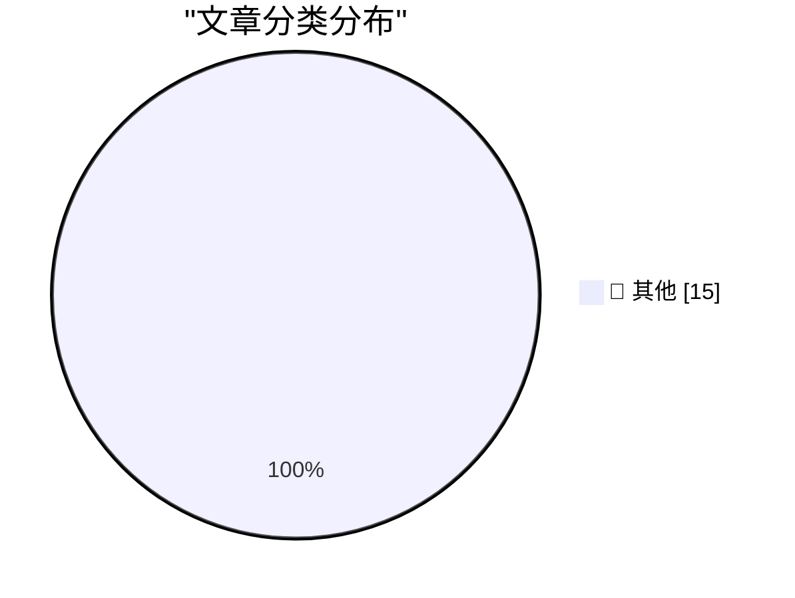

# 📰 AI 资讯每日精选 — 2026-10-06

> 汇聚 140+ 技术博客、X/Twitter、Hacker News、Reddit、Product Hunt、
> Lobste.rs、ClawFeed 日报及 GitHub Trending，经 AI 评分筛选。
>
> **本期内容**：🏆 今日必读 · 🌐 ClawFeed 日报 · 🔥 GitHub Trending · 📂 分类精选 · 🎨 设计与生成式 AI · 📊 数据概览

## 🏆 今日必读

🥇 **Quoting Felix Rieseberg**

[Quoting Felix Rieseberg](https://simonwillison.net/2026/Oct/5/felix-rieseberg/) — simonwillison.net · 3 小时前 · 📝 其他

> Quoting Felix Rieseberg

🥈 **Steve Jobs, Walking Through a Mockup for Apple Park in 2010**

[Steve Jobs, Walking Through a Mockup for Apple Park in 2010](https://book.stevejobsarchive.com/#photo-37) — daringfireball.net · 29 分钟前 · 📝 其他

> Steve Jobs, Walking Through a Mockup for Apple Park in 2010

🥉 **[Sponsor] Sunnny**

[[Sponsor] Sunnny](https://sunnny.com/) — daringfireball.net · 3 小时前 · 📝 其他

> [Sponsor] Sunnny

4️⃣ **OpenAI Announces Their Text Watermarking Plans**

[OpenAI Announces Their Text Watermarking Plans](https://openai.com/index/eu-text-provenance/) — daringfireball.net · 4 小时前 · 📝 其他

> OpenAI Announces Their Text Watermarking Plans

5️⃣ **Ternus and Cook Tweet Brief Remembrances on the 15th Anniversary of Steve Jobs’s Death**

[Ternus and Cook Tweet Brief Remembrances on the 15th Anniversary of Steve Jobs’s Death](https://x.com/johnternus/status/2107093462118199562) — daringfireball.net · 7 小时前 · 📝 其他

> Ternus and Cook Tweet Brief Remembrances on the 15th Anniversary of Steve Jobs’s Death

---

## 🌐 ClawFeed 日报精选

> 来源：[ClawFeed](https://clawfeed.kevinhe.io) — AI 驱动的多源新闻聚合

# 📅 ClawFeed 日报 | 2026-10-05 (SGT)

> 聚合自 5 期 4h digest（#1347 00:00, #1348 04:00, #1349 08:00, #1350 12:00, #1351 16:00）
> 周一 + TOKEN2049 新加坡周开幕，全天 feed 132 条，比周日更冷清：每期一半以上是活动打卡、加密喊单和空推，AI 干货每期四到七条。全天主线是「harness / 共享 agent 系统比模型本身更重要」。

---

## 🔥 当日全场最重要 5 条

1. **DHH：「如果你已经不读代码了呢？」**：他让 agent 用 Elixir、Go、Rust 分别重写并优化 Basecamp 的 Campfire 聊天应用，Ruby 版最慢。以前选 Ruby 图的是开发效率和写代码的愉快，但当代码主要由 agent 写、人不再逐行读，选语言的标准就变成「跑得快、好验证」。对我们给 agent 选技术栈有直接参考价值。
   来源: https://x.com/dhh/status/2106810173683851564 （代码: https://github.com/basecamp/once-campfire ）

2. **《Against the Personal Agents Theory》：个人 agent 不是终局，共享 agent 系统才是**：Nathan Baschez 认为今天 99% 的公司是每个员工各自折腾个人 agent（Codex、Claude Code、Grok Bots、Dots），经济上必然的下一步是共享的 agent 系统（他称为 "factories"），因为只有共享系统才有分工和专业化收益。同日 @mardehaym「X 是一个 AI 泡泡，很多企业连一个工作流都跑不稳」、Levie「美国新增 75 万+ AI 岗位，主力是 AI 工程师和 FDE」，是同一个现实的几面。和 OpenMax「团队共用 agent + 知识库 + 部署服务」的方向直接对上，可作对外叙事的外部佐证。
   来源: https://x.com/shao__meng/status/2106948372116451414 （原文: https://gettheleverage.com/p/against-the-personal-agents-theory ）｜ https://x.com/levie/status/2106893015063421357

3. **Harness 比模型更重要，又添两个案例**：何恺明团队（MIT）的 VISTA 不训练新模型，只给模型一套视觉交互 + 无损记忆的 harness、每关同一套四句提示，据称 ARC-AGI-3 拿到满分（⚠️ 帖子自述，未核实论文数据）；@BoxMrChen 测豆包通关《杀戮尖塔》A10，而 Opus 5.5、Astra 6 在无思路指引时都没通关（⚠️ 单次测试）。另有 DeepSeek Harness v0.2.1-alpha.1 试验性兼容 Claude Code Mods，国产 harness 开始主动接 Claude Code 生态。都支持我们在 agent 外层做记忆 / 工具 / 反馈循环的投入。
   来源: https://x.com/NFT_Chen/status/2107075800155722203 ｜ https://x.com/BoxMrChen/status/2106823060032807184 ｜ https://x.com/NFT_Chen/status/2106955700626980957

4. **Muse 全面扩张，个人 agent 的消息层基础设施拿到融资**：Alexandr Wang 列出 Muse 最近上线的大量连接器、电话通话测试版、Mac 版 + 电脑操作、小企业版、连接器平台；同日 @PhotonHQ 拿 $4.5M 种子轮，它是把 agent 接到 iMessage / WhatsApp / Telegram 的开源框架，Muse、Instinct 的消息层都用它（⚠️ 下载量 45 万/月为帖子自述）。「连接器 + 多渠道接入 + 电脑操作」正在成为个人 agent 标配，和 OpenMax 正面重叠。
   来源: https://x.com/alexandr_wang/status/2106824386850521335 ｜ https://x.com/DataChaz/status/2107003747570503823

5. **Agent 记忆：头部团队的做法汇成一份阅读清单**：@felix_fan 列了 Anthropic《Effective context engineering for AI agents》、@dbreunig《How Long Contexts Fail》、Karpathy 的 context engineering、OpenAI《Dreaming: Better memory for ChatGPT》、Instinct 的记忆机制。和我们「注入 / 做梦 / 按需读取」的组织记忆可以一一对照，适合团队过一遍。同期反面案例：@YuLin807 说有朋友把重要资料只放在 OpenAI dots 云机里没备份，结果直接没了（⚠️ 个人体验）。
   来源: https://x.com/felix_fan/status/2107007079169065099 ｜ https://x.com/YuLin807/status/2106802051896558019

**次重要（备选）**
- Grok 4.7 xHigh 在 Artificial Analysis Cyber Index 排第一，超过 Opus 5.5、Fable 5.1、ChatGPT 6 Astra，Elon 亲自转发。https://x.com/elonmusk/status/2106787000682426513
- Anthropic IPO 治理结构：据路透披露的拟议安排，创始人经 Founder LLC 对部分事项持 50.1% 投票权，另有 LTBT（⚠️ 二手转述）。https://x.com/OliverYeung6/status/2107078363949011254
- Cline 因「异常高的滥用」暂停 DeepSeek-V4.1-Flash 免费推广——免费额度被薅爆是拉新通病。https://x.com/cline/status/2106828852353974713
- Martin Fowler 网站新文：本地模型写代码可不可行、从哪些因素判断。https://martinfowler.com/articles/exploring-gen-ai/local-models-for-coding-factors.html
- Fatih Arslan《How I manage my agents》：一线开发者同时管多个 coding agent 的实操记录。https://x.com/bibryam/status/2107078361323642939
- OpenAI @TheRealAdamG 回应 Nadella「为智能付两次钱」：不用企业数据训练 + ZDR，数据主权成企业采购卖点。https://x.com/TheRealAdamG/status/2106942619729240284

---

## 📰 当日核心主题

### 🧰 Harness > 模型
VISTA（换 harness 刷满 ARC-AGI-3）、豆包通关杀戮尖塔、DeepSeek Harness 兼容 Claude Code Mods、@nidhisinghattri 的「任意模型配任意 harness」统一代理、Prompt Cache Control 在 Claude Code CLI 可用（@dani_avila7）。全天 5 期里有 4 期出现同一结论：调好外层比换模型更划算。

### 🏭 个人 agent → 共享 agent 系统 / 部署服务
Baschez 的 factories 论、Levie 的 75 万 AI 岗位与 FDE、@mardehaym 的「X 是 AI 泡泡」、Fatih Arslan 的多 agent 管理。讨论从「我的 agent 多厉害」转向「团队怎么共用、谁来部署」。

### 📡 个人 agent 产品战：Muse / Grok Bot / Dots / Hermes
Muse 连接器 + 电话 + Mac 电脑操作、@Anitahityou 拆解 Muse 爆火、Grok Bot 商店已有 71 个公开 bot（@BrianRoemmele）、Hermes + Opus 5.5 口碑好但额度烧得快（@EXM7777）、Dots 云机丢数据的抱怨。配套层：Photon（消息渠道）、Upstash Blob / Aptos Shelby（零配置存储）、Crossmint（agent 支付）。
来源: https://x.com/Anitahityou/status/2107008142295134459 ｜ https://x.com/BrianRoemmele/status/2106888618497438130 ｜ https://x.com/upstash/status/2106810061138124889

### 🧠 Agent 记忆与上下文
@felix_fan 的记忆阅读清单、Owain Evans 谈模型内省（@Sauers_）、Karpathy 5 万赞帖引出「更通用的人机接口」讨论（@omarsar0）。

### 🧬 AI 药物发现 = 「瓶颈交易」
@FredaDuan 连发两条 + @Zen_with_AI：前沿实验室进入上游，临床前产能吃紧（猴子价格涨回高点），链条类比 GPU→HBM→电力，同时提醒回顾 2020/21 年 AIDD 泡沫。

### 🎨 Opus 5.5 被当作创意生产主力宣传
Neel Nanda 让 Opus 5.5 写词作曲做 mech interp 视频（@pmarca 转发）、Opus 5.5 + Blender + UE 做 AAA 射击游戏、「$5,000 动效视频」prompt。⚠️ 多为推广帖。

### ⛓️ 加密：TOKEN2049 周 + 监管 + 预测市场
小银行协会 ICBA 起诉 OCC 给加密公司发银行牌照越权、Polymarket 5 分钟盘最后一分钟下注赚 $98,842 的结构性漏洞、Polymarket 将在 TOKEN2049 有消息、Binance Intelligence 今晚 20:00 发布、Strategy 再买 334 BTC、俄罗斯首次用数字卢布发工资。

---

## 🔖 累计 Bookmark 精选

**有更新**：凌晨那期 bookmark 从 18 条变成 17 条，新增 1 条，此后全天 4 期没再变化。
- 新增：@spectnfa — SpaceXAI 免费放出 53 分钟 Grok Bot workshop，GTM 团队演示怎么用一组各管一件事的 bot 干活。https://x.com/spectnfa/status/2106488470185316723
- 其余 16 条不变（最新的仍是 9/30 @sama 的 Dots）。

**和今天话题呼应、值得重读的：**
- @spectnfa Grok Bot workshop（呼应「个人 agent 产品战」和 Grok Bot 商店）
- @trq212 — Claude 5 时代的 context engineering（呼应 @felix_fan 的记忆阅读清单）
- @xiaohu — @cloudflare/computer，给每个 agent 配一台云端电脑（呼应 Muse Mac 电脑操作、Dots 云机丢数据）

---

## 👀 推荐关注汇总（已去重）

| 账号 | 理由 |
|------|------|
| @nbaschez (Nathan Baschez) | 《Against the Personal Agents Theory》作者，长期写 AI 如何改变公司组织，和 OpenMax 方向高度相关 |
| @NeelNanda5 (Neel Nanda) | DeepMind 机制可解释性负责人，原创一手（昨日已推荐，今日再次出现） |
| @bibryam (Bilgin Ibryam) | 分布式系统 / 云原生作者，持续转发高质量工程长文（本地模型编码、多 agent 管理） |
| @Zen_with_AI (山景城小路) | 中文圈少见的「AI × 生物科技 × 投资」框架型作者，AIDD 瓶颈交易分析 |

提醒：以上都没有逐一核实是否已经关注，操作前请先在 Following 里搜一下。12:00、16:00 两期认为 feed 作者大多来自首页时间线、大概率已关注，没有新推荐。

**建议取关（全天结论没变）**：@HeXiaobo（2018 年 7 月后不再活跃）、@0xJasonBateman（近 6 个月没发相关推文）、@Hill0100（零推文）、@StartupWisdom_（名言搬运）。@caterpillarous 继续观察（本日有一条原创：写了人生第一张天使投资支票）。

---

## 💤 当日重复噪音模式

- **取关建议原样重复**：followingProfiles 抽样连续多天是同一批 24 个账号，5 期结论一字不差——抽样不轮换的问题仍没解决。
- **Bookmark 基本停滞**：除了凌晨新增 1 条，全天 4 期都是「和上期完全一样，不再重复列出」。
- **TOKEN2049 新加坡周打卡**：下午开始集中出现活动行程、周边、宵夜攻略、Founder House 预告，接下来几天会更多。
- **加密喊单 / 行情**：@pete_rizzo_ 每期都在（让 SpaceX 买 BTC、Novogratz 破 10 万、Strategy 增持），外加 $QNT、$cupsey、$TAO、Hyperliquid 等轮番出现。
- **书籍 / 课程 / 资源带货**：@KirkDBorne 亚马逊书链在 3 期出现，@tiany221 网盘「信息差」引流、免费大师课。
- **固定低信息量账号**：@RaminNasibov、@anthemhayek、@StartupWisdom_ 几乎每期都进噪音区，另有大量 gm / 早安 / 一句话空推。
- **营销式数字**：「Claude 拼 7 个仓库一夜赚 $847」「$5,000 动效视频 prompt」这类无法核实的爆款帖。

---
— Lisa
---

## 🔥 GitHub Trending

> 今日热门开源项目（全语言 + Python）

| # | 项目 | 描述 | ⭐ 总星 | 📈 今日 | 语言 |
|---|------|------|---------|---------|------|
| 1 | [DuarteSantos8/openGym](https://github.com/DuarteSantos8/openGym) | Self-hosted gym & body-weight tracker — plan routines, lo... | 4.3k | +1433 | JavaScript |
| 2 | [tester-army/e2e](https://github.com/tester-army/e2e) | Next generation e2e testing framework for web and mobile ... | 4.9k | +1398 | TypeScript |
| 3 | [Panniantong/Agent-Reach](https://github.com/Panniantong/Agent-Reach) 🤖 | Give your AI agent eyes to see the entire internet. Read ... | 92.0k | +1155 | Python |
| 4 | [boykopovar/AnyPS5](https://github.com/boykopovar/AnyPS5) | Tool for automatic PS5 executables porting to Linux and W... | 5.0k | +997 | C++ |
| 5 | [msitarzewski/agency-agents](https://github.com/msitarzewski/agency-agents) 🤖 | A complete AI agency at your fingertips - From frontend w... | 157.3k | +744 | Shell |
| 6 | [calesthio/OpenMontage](https://github.com/calesthio/OpenMontage) 🤖 | World's first open-source, agentic video production syste... | 64.1k | +742 | Python |
| 7 | [thedotmack/claude-mem](https://github.com/thedotmack/claude-mem) 🤖 | Persistent Context Across Sessions for Every Agent – Capt... | 96.7k | +534 | TypeScript |
| 8 | [caddyserver/caddy](https://github.com/caddyserver/caddy) | Fast and extensible multi-platform HTTP/1-2-3 web server ... | 77.2k | +515 | Go |
| 9 | [pingdotgg/t3code](https://github.com/pingdotgg/t3code) |  | 25.6k | +485 | TypeScript |
| 10 | [666ghj/MiroFish](https://github.com/666ghj/MiroFish) | A Simple and Universal Swarm Intelligence Engine, Predict... | 76.5k | +485 | Python |
| 11 | [earthtojake/text-to-cad](https://github.com/earthtojake/text-to-cad) 🤖 | Give your agent CAD superpowers. | 17.5k | +437 | Python |
| 12 | [michael-denyer/pstack-claude](https://github.com/michael-denyer/pstack-claude) 🤖 | Claude Code, Codex, Copilot, Pi, OpenCode, Gemini, and Pr... | 1.4k | +223 | JavaScript |
| 13 | [M-Abozaid/esp32-c3-adblock](https://github.com/M-Abozaid/esp32-c3-adblock) | Pi-hole-class DNS ad-blocker on a $2 ESP32-C3 (no PSRAM):... | 1.4k | +196 | C++ |
| 14 | [Alishahryar1/free-claude-code](https://github.com/Alishahryar1/free-claude-code) 🤖 | Use Claude Code, Codex, VSCode, Pi, and OpenCode (and 6 o... | 56.8k | +120 | Python |
| 15 | [p-e-w/heretic](https://github.com/p-e-w/heretic) | Fully automatic censorship removal for language models | 33.4k | +117 | Python |

---

## 📝 其他

### 1. Quoting Felix Rieseberg

[Quoting Felix Rieseberg](https://simonwillison.net/2026/Oct/5/felix-rieseberg/) — **simonwillison.net** · 3 小时前 · ⭐ 15/30

> Quoting Felix Rieseberg

---

### 2. Steve Jobs, Walking Through a Mockup for Apple Park in 2010

[Steve Jobs, Walking Through a Mockup for Apple Park in 2010](https://book.stevejobsarchive.com/#photo-37) — **daringfireball.net** · 29 分钟前 · ⭐ 15/30

> Steve Jobs, Walking Through a Mockup for Apple Park in 2010

---

### 3. [Sponsor] Sunnny

[[Sponsor] Sunnny](https://sunnny.com/) — **daringfireball.net** · 3 小时前 · ⭐ 15/30

> [Sponsor] Sunnny

---

### 4. OpenAI Announces Their Text Watermarking Plans

[OpenAI Announces Their Text Watermarking Plans](https://openai.com/index/eu-text-provenance/) — **daringfireball.net** · 4 小时前 · ⭐ 15/30

> OpenAI Announces Their Text Watermarking Plans

---

### 5. Ternus and Cook Tweet Brief Remembrances on the 15th Anniversary of Steve Jobs’s Death

[Ternus and Cook Tweet Brief Remembrances on the 15th Anniversary of Steve Jobs’s Death](https://x.com/johnternus/status/2107093462118199562) — **daringfireball.net** · 7 小时前 · ⭐ 15/30

> Ternus and Cook Tweet Brief Remembrances on the 15th Anniversary of Steve Jobs’s Death

---

### 6. Pluralistic: Scrutinized (05 Oct 2026)

[Pluralistic: Scrutinized (05 Oct 2026)](https://pluralistic.net/2026/10/05/pervert-glasses/) — **pluralistic.net** · 8 小时前 · ⭐ 15/30

> Pluralistic: Scrutinized (05 Oct 2026)

---

### 7. [RSS Club] Changes to the RSS and Atom feeds

[[RSS Club] Changes to the RSS and Atom feeds](https://shkspr.mobi/blog/2026/10/rss-club-changes-to-the-rss-and-atom-feeds/) — **shkspr.mobi** · 15 小时前 · ⭐ 15/30

> [RSS Club] Changes to the RSS and Atom feeds

---

### 8. The IBM Thinkpad’s 1992 debut

[The IBM Thinkpad’s 1992 debut](https://dfarq.homeip.net/the-ibm-thinkpads-1992-debut/?utm_source=rss&#038;utm_medium=rss&#038;utm_campaign=the-ibm-thinkpads-1992-debut) — **dfarq.homeip.net** · 16 小时前 · ⭐ 15/30

> The IBM Thinkpad’s 1992 debut

---

### 9. How fast is Python 3.15?

[How fast is Python 3.15?](https://blog.miguelgrinberg.com/post/how-fast-is-python-3-15) — **miguelgrinberg.com** · 17 小时前 · ⭐ 15/30

> How fast is Python 3.15?

---

### 10. Meta and Microsoft pull back from Claude as Anthropic transforms from partner into competitor

[Meta and Microsoft pull back from Claude as Anthropic transforms from partner into competitor](https://the-decoder.com/meta-and-microsoft-pull-back-from-claude-as-anthropic-transforms-from-partner-into-competitor/) — **The Decoder** · 8 小时前 · ⭐ 15/30

> Meta and Microsoft pull back from Claude as Anthropic transforms from partner into competitor

---

### 11. Reka AI's omni-model Rho-1 handles text, images, video, and robot control in a single model

[Reka AI's omni-model Rho-1 handles text, images, video, and robot control in a single model](https://the-decoder.com/reka-ais-omni-model-rho-1-handles-text-images-video-and-robot-control-in-a-single-model/) — **The Decoder** · 8 小时前 · ⭐ 15/30

> Reka AI's omni-model Rho-1 handles text, images, video, and robot control in a single model

---

### 12. OpenAI will watermark ChatGPT text in the EU but makes it optional for API users worldwide

[OpenAI will watermark ChatGPT text in the EU but makes it optional for API users worldwide](https://the-decoder.com/openai-will-watermark-chatgpt-text-in-the-eu-but-makes-it-optional-for-api-users-worldwide/) — **The Decoder** · 9 小时前 · ⭐ 15/30

> OpenAI will watermark ChatGPT text in the EU but makes it optional for API users worldwide

---

### 13. Most Americans want AI development to slow down or stop entirely, new poll finds

[Most Americans want AI development to slow down or stop entirely, new poll finds](https://the-decoder.com/most-americans-want-ai-development-to-slow-down-or-stop-entirely-new-poll-finds/) — **The Decoder** · 10 小时前 · ⭐ 15/30

> Most Americans want AI development to slow down or stop entirely, new poll finds

---

### 14. Anthropic is quietly becoming America's biggest corporate donor ahead of its mega IPO

[Anthropic is quietly becoming America's biggest corporate donor ahead of its mega IPO](https://the-decoder.com/anthropic-is-quietly-becoming-americas-biggest-corporate-donor-ahead-of-its-mega-ipo/) — **The Decoder** · 11 小时前 · ⭐ 15/30

> Anthropic is quietly becoming America's biggest corporate donor ahead of its mega IPO

---

### 15. Aleph Alpha releases Kolibri, an open-weight model that makes the case for European AI sovereignty

[Aleph Alpha releases Kolibri, an open-weight model that makes the case for European AI sovereignty](https://the-decoder.com/aleph-alpha-releases-kolibri-an-open-weight-model-that-makes-the-case-for-european-ai-sovereignty/) — **The Decoder** · 13 小时前 · ⭐ 15/30

> Aleph Alpha releases Kolibri, an open-weight model that makes the case for European AI sovereignty

---

## 📊 数据概览

| 扫描源 | 抓取文章 | 时间范围 | 精选 |
|:---:|:---:|:---:|:---:|
| 92/140 | 3702 篇 → 75 篇 | 24h | **15 篇** |

### 分类分布

---

*生成于 2026-10-06 03:18 | 汇聚 140 个技术博客、X/Twitter、Hacker News、Reddit、Product Hunt、Lobste.rs、ClawFeed 日报及 GitHub Trending，经 AI 评分筛选出 Top 15 精华内容*
