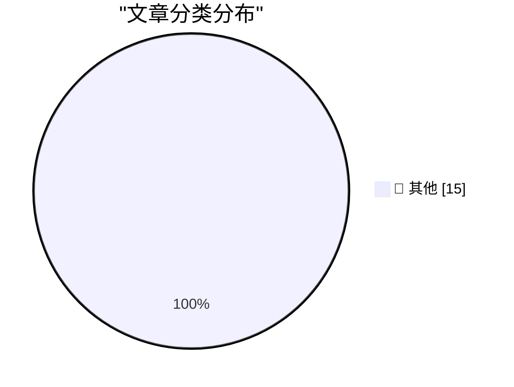

# 📰 AI 资讯每日精选 — 2026-10-07

> 汇聚 140+ 技术博客、X/Twitter、Hacker News、Reddit、Product Hunt、
> Lobste.rs、ClawFeed 日报及 GitHub Trending，经 AI 评分筛选。
>
> **本期内容**：🏆 今日必读 · 🌐 ClawFeed 日报 · 🔥 GitHub Trending · 📂 分类精选 · 🎨 设计与生成式 AI · 📊 数据概览

## 🏆 今日必读

🥇 **OpenAI “rogue” agent activities found on Wikimedia projects**

[OpenAI “rogue” agent activities found on Wikimedia projects](https://simonwillison.net/2026/Oct/7/openai-rogue-agents-wikimedia/) — simonwillison.net · 2 小时前 · 📝 其他

> OpenAI “rogue” agent activities found on Wikimedia projects

🥈 **Quoting Victoria Kim**

[Quoting Victoria Kim](https://simonwillison.net/2026/Oct/6/victoria-kim/) — simonwillison.net · 2 小时前 · 📝 其他

> Quoting Victoria Kim

🥉 **llm-openai-decisions 0.1a0**

[llm-openai-decisions 0.1a0](https://simonwillison.net/2026/Oct/6/llm-openai-decisions/) — simonwillison.net · 3 小时前 · 📝 其他

> llm-openai-decisions 0.1a0

4️⃣ **llm-mistral 0.16**

[llm-mistral 0.16](https://simonwillison.net/2026/Oct/6/llm-mistral/) — simonwillison.net · 5 小时前 · 📝 其他

> llm-mistral 0.16

5️⃣ **EmbeddingGemma 2**

[EmbeddingGemma 2](https://simonwillison.net/2026/Oct/6/hn-49983751/) — simonwillison.net · 6 小时前 · 📝 其他

> EmbeddingGemma 2

---

## 🌐 ClawFeed 日报精选

> 来源：[ClawFeed](https://clawfeed.kevinhe.io) — AI 驱动的多源新闻聚合

# 📅 ClawFeed 日报 | 2026-10-06 (SGT)

> 聚合自 5 期 4h digest（#1354 00:00, #1355 04:00, #1356 08:00, #1357 12:00, #1358 16:00）
> 周二 + Token 2049 新加坡周进入高峰（OKX NOW、Solana Summit、BNB Chain、Monad 等），全天 feed 155 条，一半以上是峰会打卡、NFT 白名单和喊单，AI 干货每期三到六条。全天两条主线：「agent 开始碰钱」（Coinbase for Agents、Grok Bot 接 30 个金融账户、稳定币收款），以及「个人 agent 走向大众、企业 agent 卡在测试和统一流程」。

---

## 🔥 当日全场最重要 5 条

1. **Agent 开始直接动钱：交易所、理财、支付三条线同一天出现**：@CoinbaseDev 发布「AiFi is here」，用 Coinbase for Agents 可以直接对 agent 说「Rebalance my portfolio」让它代为交易；@Teslaconomics 把 Chase、Schwab、Fidelity、Robinhood、Apple Card、𝕏 Money 等 30 个账户全部接进 Grok Bot，帖内写着「If Grok Bot messes up, we will make you whole」；下午 Coinbase 又通过支付平台 Yuno 让商户不改集成就能开稳定币收款。个人理财 agent 从只读走到能操作，平台开始拿「出错兜底」当卖点。⚠️ Coinbase 那条只有一句宣传语，权限、限额、风控要看官方文档；「兜底」是谁的承诺、条款是什么都没说清，需找 xAI 官方说法核实。
   来源: https://x.com/CoinbaseDev/status/2107246383501865436 ｜ https://x.com/Teslaconomics/status/2107168380965060790 ｜ https://x.com/ShanAggarwal/status/2107286164420133129

2. **Meta 个人 agent Muse 免费开放，据称冲上 App Store 第一**：@businessbarista 说「有 Facebook 账号就有自己的 agent」，agent 从要懂技术、要付费的小众工具变成大众产品，围绕 Muse 做教程和内容是空档期机会；@thisiskp_ 已做社区用例目录，@yuntianming10 因邀请码两天就失效、改用开源 OpenMuse 自部署。同日 Sierra 的 Instinct 支持拉进群聊为整个群干活（@noahrshinn），@turingou 评个人 AI 电脑 Core：95% 的人只需要一个能在各房间对话的语音音箱 + 远程 personal agent。个人 agent 赛道继续和 OpenMax 正面重叠。⚠️「App Store 第一」未核实。
   来源: https://x.com/businessbarista/status/2107288945948070091 ｜ https://x.com/yuntianming10/status/2107315231739531535 ｜ https://x.com/turingou/status/2107362016742809855

3. **OpenAI 信号：编排层会被模型吸收**：Lenny 访谈 OpenAI ChatGPT / Codex 负责人 Tibo（@thsottiaux）：模型选择器很可能消失，「loops 和 graphs」式 agent 编排只是过渡阶段，互联网上大多数操作很快由 agent 完成。几小时后 @OpenAIDevs 演示 Codex CLI：语音发起任务、跨项目管多个 agent、在单独 worktree 里试另一个方向——多 agent 并行和 worktree 隔离直接做进官方 CLI。下午还有「OpenAI 要把 Chat、Work、Codex 合并」的传闻（⚠️ 来自非官方账号 @CodexResets1）。对我们自建编排层是个提醒：要押在模型吸收不掉的部分（组织记忆、验收、部署）。
   来源: https://x.com/lennysan/status/2107189821819302058 ｜ https://x.com/OpenAIDevs/status/2107242397361139938

4. **企业 agent 落地卡在「测试环境」和「统一流程」**：@levie 转 Era 免费上线——生成一整家模拟企业，在 Salesforce、Slack、Jira、Zendesk、Gong、Deel 里都像真公司，专门用来测企业 agent，因为没法拿真公司数据安全地测；Levie 的判断是不测就不知道 agent 表现如何。傍晚 @mardehaym（PE 运营合伙人）说：钱可以给整个投资组合买 AI 工具，但每个工程团队还是各自摸索。这两条正对应我们的 agent 验收 / 回归测试，以及「AI 研发流程统一到一套做法」。⚠️ Era 那条来自 followingProfiles 抽样，没拿到单条链接；@mardehaym 原推后半段被折叠。
   来源: https://x.com/levie ｜ https://x.com/mardehaym/status/2107431499704258639

5. **Reflection 发布开源 agentic 模型 Beam（501B 总参 / 23B 激活）**：MoE、从头训练，主打推理效率和编码 / agent 任务，号称美国开源模型最强，完整权重本月放出。23B 激活意味着推理成本低，适合做 agent 底座，值得等权重放出后实测。⚠️ 目前只有官方宣称，没有第三方评测。
   来源: https://x.com/TheAhmadOsman/status/2107198451578720607

**次重要（备选）**
- Claude Code 团队 @trq212 在做让 Claude Code 写出更好 HTML 方案的技能（直白语言、代码片段、待决问题单列、界面草图、lint 挡常见失败），发布前征求反馈；中文圈 @NFT_Chen 已转成「html-plan」。和我们把方案做成可视化页面同方向。https://x.com/trq212/status/2107192901537329354
- OKX 的 Star 在 OKX NOW 峰会说 OKX 每月 AI 开支已到千万美元级别（⚠️ 听讲者转述）。https://x.com/0xLige/status/2107311467162956004
- 长端利率继续上行：10 年期美债接近 5.35%（Wintermute），30 年期触及 5.7%，2002 年以来首次。https://x.com/Barchart/status/2107157542455451836
- 以太坊 Sepolia 今晚 21:53 SGT 分叉到 Gloas，Prysm v7.2.1 默认 gas limit 2 亿，跑节点的需提前升级。https://x.com/prylabs/status/2107240328663085288
- Hugging Face Hub 开始托管 RL 环境，想做跨框架的统一分发层。https://x.com/abidlabs/status/2107186020404125778
- @shan3v 发布 agent-handoff：把正在跑的 Claude Code / Codex 会话连同分支和未提交改动 ssh 搬到另一台常开机器接着跑，和我们多台 agent 机器的用法很接近。https://x.com/shan3v/status/2107178342541881622
- 深度伪造进入商务通话：TBV 团队有人和「熟人」视频通话，对方是 AI 冒充。值得提醒团队。https://x.com/BitcoinNews/status/2107184048200179968

---

## 📰 当日核心主题

### 💸 Agent × 金融（AiFi）
Coinbase for Agents 代为调仓、Grok Bot 接 30 个金融账户并「兜底」、Coinbase × Yuno 稳定币收款、Anchorage Digital 做 Puffer UniFi 机构托管（@taozi0929 点评「AI agent 自己付款结算时底层设施跟不跟得上」）、@DualMintRWA 设备融资上链 USDC 分红。全天 4 期都有这条线，从「agent 帮你查」到「agent 帮你下单 / 收款」。
来源: https://x.com/taozi0929/status/2107290243871207743 ｜ https://x.com/SebyCore/status/2107202075415470430

### 📡 个人 agent 大众化：Muse / Instinct / Grok Bot / Dot
Muse 免费开放 + OpenMuse 自部署替代、Instinct 进群聊、@turingou 对个人 AI 硬件的冷判断、@rwayne 用「数字人」账号跑自媒体（三天两万曝光）、用 Dot 整理脏活直传 GitHub。连续两天（10/5 Muse 连接器扩张、10/6 免费开放）Muse 都是个人 agent 话题中心。

### 🧭 编排层归属：模型厂 vs. 外层 harness
Tibo「编排是过渡阶段」+ Codex CLI 多 agent / worktree、OpenAI 产品合并传闻、@trq212 的 HTML 方案技能、@shan3v agent-handoff。昨天的主线是「harness > 模型」，今天模型厂的回应是「把 harness 做进自家产品」。

### 🏢 企业 agent 落地
Era 模拟企业测试环境（@levie）、@mardehaym 的 PE 投资组合统一用法问题、OKX 每月千万美元 AI 开支、AI 改变融资路演与尽调（@TobiasTBV 在 3 期出现）。

### 🧪 开源模型与基础设施
Reflection Beam（501B/23B MoE）、HF Hub 托管 RL 环境、Open Axis Benchmark（@7777chu：看泛化而不是背题库）、hashsma.sh 用 AI 加速哈希函数安全性研究（@zooko）。

### ⛓️ 加密：Token 2049 周 + 宏观 + 链上升级
宏观：10 年期 5.35%、30 年期 5.7%、BTC 与美股相关性回升、BTC 与黄金相关性 6 年最高、恐慌贪婪指数 80。链上：Sepolia Gloas 分叉、Optimism Upgrade 20 打下 Superchain 原生互通基础（@l2beat）、Derive V3 迁移以太坊（SGT 10/7 02:00）、Solana Q3 应用收入 3.65 亿美元。机构：Grayscale Hyperliquid 质押 ETF 的 8-K、Metaplanet 留 10-15% 非 BTC 仓位、Lubin 不否认 MetaMask IPO、Raydium 代币化资产收入首超 memecoin。
来源: https://x.com/l2beat/status/2107438998578659597 ｜ https://x.com/wublockchain12/status/2107182816069087453

---

## 🔖 累计 Bookmark 精选

**无更新**：全天 5 期都是 17 条，条数和最新一条（@spectnfa 的 SpaceXAI Grok Bot workshop）都和 10/5 一样，没有新增。

**和今天话题呼应、值得重读的：**
- @spectnfa Grok Bot workshop（呼应 Grok Bot 接 30 个金融账户）
- @sama 的 Dots（呼应 @rwayne 用 Dot 整理脏活）
- @xiaohu — @cloudflare/computer，给每个 agent 配一台云端电脑（呼应 @shan3v agent-handoff、个人 AI 电脑 Core）

---

## 👀 推荐关注汇总（已去重）

| 账号 | 理由 |
|------|------|
| @AlecTPhD | 前 Anthropic、Claude Science 作者，10/3 加入 OpenEvidence；抽样页显示尚未关注（10/1、10/4 已推荐，今日再次提醒） |
| @mschoening | Notion；抽样页显示尚未关注（此前已推荐） |
| @typesafeai | Jev 模型背后的实验室，16.4 万粉；抽样页显示尚未关注（此前已推荐） |

今日 feed 里没有新的高质量候选（大部分是峰会现场帖）。已关注账号中值得多看的：@shan3v（agent-handoff）、@levie（Era）、@noahrshinn（Instinct 群聊）、@mardehaym（企业 AI 落地一手经验）、@rwayne（数字人实测）。

**建议取关**：@0xJasonBateman（近 6 个月没有相关推文）、@Hill0100（抓不到任何推文）、@StartupWisdom_（名人语录搬运）、@Mr57814170 良轩Mr蒋（12:00 列观察、16:00 再出现，全是 BTC 开单喊单，建议取关）。
**继续观察**：@caterpillarous（发了第一张天使投资支票）、@Tradermayne（自营交易平台拉客为主，偶有 Polymarket 等有用信息）。

---

## 💤 当日重复噪音模式

- **Token 2049 峰会打卡**：OKX NOW、Solana Summit、BNB Chain、Monad OPEN、Ondo、Base 中文社区、HOOD Summit 的现场照、嘉宾名单、直播预告，上午那期占了一半以上。
- **NFT 白名单 / 积分**：@FungoLabs（Zama FHE 加密 NFT）在 00:00 和 12:00 两期被多人集中喊，另有 Axis Robotics 积分、Cambria 白名单、TMF Pass、paperdao 抽奖。
- **喊单与亏钱情绪**：OKB、$LIT、$PUMP、$PLTR、「Lambo」「bullish」一句话帖，以及「越努力越亏」「群里跑路」类情绪帖。
- **固定低信息量账号**：@RaminNasibov（每期都有生活帖）、@StartupWisdom_ 语录（MrBeast、Drew Houston、Peter Thiel 轮换）、@DataChaz「需要更多数据中心」连续两期。
- **取关 / Bookmark 结论原样重复**：followingProfiles 抽样仍是同一批 24 个账号为主，同三个取关对象 5 期一字不差；bookmark 全天无变化。
- **营销式标题**：「这个 Opus 5.5 prompt 能让对手倒闭」「4.5 万次实测 LLM 预测股价、泄露全部代码」「GPT Image 2.5 海报提示词」。
- **未核实的大新闻**：光遗传学获诺贝尔奖、Meta infra 安全漏洞、X 回复曝光不计入分成，都是单一来源，需要原始报道核实。

---
— Lisa
---

## 🔥 GitHub Trending

> 今日热门开源项目（全语言 + Python）

| # | 项目 | 描述 | ⭐ 总星 | 📈 今日 | 语言 |
|---|------|------|---------|---------|------|
| 1 | [morluto/rea](https://github.com/morluto/rea) | Reverse engineer anything with agents, from app behavior ... | 9.8k | +2956 | TypeScript |
| 2 | [tester-army/e2e](https://github.com/tester-army/e2e) | Next generation e2e testing framework for web and mobile ... | 6.4k | +1725 | TypeScript |
| 3 | [DuarteSantos8/openGym](https://github.com/DuarteSantos8/openGym) | Self-hosted gym & body-weight tracker — plan routines, lo... | 5.8k | +1419 | JavaScript |
| 4 | [boykopovar/AnyPS5](https://github.com/boykopovar/AnyPS5) | Tool for automatic PS5 executables porting to Linux and W... | 6.7k | +949 | C++ |
| 5 | [mattpocock/skills](https://github.com/mattpocock/skills) | Skills for Real Engineers. Straight from my .agents direc... | 278.2k | +889 | Shell |
| 6 | [Panniantong/Agent-Reach](https://github.com/Panniantong/Agent-Reach) 🤖 | Give your AI agent eyes to see the entire internet. Read ... | 92.7k | +857 | Python |
| 7 | [calesthio/OpenMontage](https://github.com/calesthio/OpenMontage) 🤖 | World's first open-source, agentic video production syste... | 64.7k | +857 | Python |
| 8 | [rohitg00/ai-engineering-from-scratch](https://github.com/rohitg00/ai-engineering-from-scratch) 🤖 | Learn it. Build it. Ship it for others. | 65.3k | +636 | Python |
| 9 | [msitarzewski/agency-agents](https://github.com/msitarzewski/agency-agents) 🤖 | A complete AI agency at your fingertips - From frontend w... | 157.9k | +623 | Shell |
| 10 | [earthtojake/text-to-cad](https://github.com/earthtojake/text-to-cad) 🤖 | Give your agent CAD superpowers. | 18.0k | +619 | Python |
| 11 | [pbakaus/impeccable](https://github.com/pbakaus/impeccable) 🤖 | The design language that makes your AI harness better at ... | 77.7k | +616 | JavaScript |
| 12 | [thedotmack/claude-mem](https://github.com/thedotmack/claude-mem) 🤖 | Persistent Context Across Sessions for Every Agent – Capt... | 97.2k | +534 | TypeScript |
| 13 | [p-e-w/heretic](https://github.com/p-e-w/heretic) | Fully automatic censorship removal for language models | 33.7k | +342 | Python |
| 14 | [ayghri/i-have-adhd](https://github.com/ayghri/i-have-adhd) 🤖 | A skill to stop your coding agent from burying the answer... | 54.5k | +326 | Python |
| 15 | [cathrynlavery/diagram-design](https://github.com/cathrynlavery/diagram-design) 🤖 | Editorial diagram design for Claude Code, Codex, GitHub C... | 44.1k | +228 | HTML |

---

## 📝 其他

### 1. OpenAI “rogue” agent activities found on Wikimedia projects

[OpenAI “rogue” agent activities found on Wikimedia projects](https://simonwillison.net/2026/Oct/7/openai-rogue-agents-wikimedia/) — **simonwillison.net** · 2 小时前 · ⭐ 15/30

> OpenAI “rogue” agent activities found on Wikimedia projects

---

### 2. Quoting Victoria Kim

[Quoting Victoria Kim](https://simonwillison.net/2026/Oct/6/victoria-kim/) — **simonwillison.net** · 2 小时前 · ⭐ 15/30

> Quoting Victoria Kim

---

### 3. llm-openai-decisions 0.1a0

[llm-openai-decisions 0.1a0](https://simonwillison.net/2026/Oct/6/llm-openai-decisions/) — **simonwillison.net** · 3 小时前 · ⭐ 15/30

> llm-openai-decisions 0.1a0

---

### 4. llm-mistral 0.16

[llm-mistral 0.16](https://simonwillison.net/2026/Oct/6/llm-mistral/) — **simonwillison.net** · 5 小时前 · ⭐ 15/30

> llm-mistral 0.16

---

### 5. EmbeddingGemma 2

[EmbeddingGemma 2](https://simonwillison.net/2026/Oct/6/hn-49983751/) — **simonwillison.net** · 6 小时前 · ⭐ 15/30

> EmbeddingGemma 2

---

### 6. Introducing Mistral Large 4: Le chonk

[Introducing Mistral Large 4: Le chonk](https://simonwillison.net/2026/Oct/6/le-chonk/) — **simonwillison.net** · 6 小时前 · ⭐ 15/30

> Introducing Mistral Large 4: Le chonk

---

### 7. Using Parseable with Datasette for OpenTelemetry traces

[Using Parseable with Datasette for OpenTelemetry traces](https://simonwillison.net/2026/Oct/6/datasette-parseable-opentelemetry/) — **simonwillison.net** · 7 小时前 · ⭐ 15/30

> Using Parseable with Datasette for OpenTelemetry traces

---

### 8. Mistral Large 4

[Mistral Large 4](https://simonwillison.net/2026/Oct/6/hn-49982139/) — **simonwillison.net** · 8 小时前 · ⭐ 15/30

> Mistral Large 4

---

### 9. datasette-atom 0.11a0

[datasette-atom 0.11a0](https://simonwillison.net/2026/Oct/6/datasette-atom/) — **simonwillison.net** · 9 小时前 · ⭐ 15/30

> datasette-atom 0.11a0

---

### 10. Scrimshaw Jukebox

[Scrimshaw Jukebox](https://simonwillison.net/2026/Oct/6/scrimshaw-jukebox/) — **simonwillison.net** · 11 小时前 · ⭐ 15/30

> Scrimshaw Jukebox

---

### 11. How to read code

[How to read code](https://seangoedecke.com/how-to-read-code/) — **seangoedecke.com** · 2 小时前 · ⭐ 15/30

> How to read code

---

### 12. Unofficial Command-Line Tool Removes Apple Intelligence From MacOS 27

[Unofficial Command-Line Tool Removes Apple Intelligence From MacOS 27](https://arstechnica.com/apple/2026/10/command-line-tool-quickly-removes-apple-intelligence-from-macos-27/) — **daringfireball.net** · 8 小时前 · ⭐ 15/30

> Unofficial Command-Line Tool Removes Apple Intelligence From MacOS 27

---

### 13. Steve Jobs, Walking Through a Mockup for Apple Park in 2010

[Steve Jobs, Walking Through a Mockup for Apple Park in 2010](https://book.stevejobsarchive.com/#photo-37) — **daringfireball.net** · 23 小时前 · ⭐ 15/30

> Steve Jobs, Walking Through a Mockup for Apple Park in 2010

---

### 14. Pluralistic: Swapping money for expertise (06 Oct 2026)

[Pluralistic: Swapping money for expertise (06 Oct 2026)](https://pluralistic.net/2026/10/06/nonfungible/) — **pluralistic.net** · 13 小时前 · ⭐ 15/30

> Pluralistic: Swapping money for expertise (06 Oct 2026)

---

### 15. Una Watch - SDK and Writing Your First App

[Una Watch - SDK and Writing Your First App](https://shkspr.mobi/blog/2026/10/una-watch-sdk-and-writing-your-first-app/) — **shkspr.mobi** · 15 小时前 · ⭐ 15/30

> Una Watch - SDK and Writing Your First App

---

## 🎨 Design & Generative AI

### 🖼️ 生成式图片

- **[Researchers stretch LeCun's JEPA AI into a universal world model that works from physics to biology](https://the-decoder.com/researchers-stretch-lecuns-jepa-ai-into-a-universal-world-model-that-works-from-physics-to-biology/)** — The Decoder · 14 小时前
  > Researchers stretch LeCun's JEPA AI into a universal world model that works from physics to biology

- **[We Built a Working Local AI Filmmaking Pipeline in ComfyUI — RTX 4070 12GB](https://www.reddit.com/r/comfyui/comments/1wz9qy1/we_built_a_working_local_ai_filmmaking_pipeline/)** — r/comfyui · 8 小时前
  > We Built a Working Local AI Filmmaking Pipeline in ComfyUI — RTX 4070 12GB

- **[Omni .char(same face, cloths & body) now with consistent voice, just by dropping a few seconds sample audio: Minimax H3(ComfyUI Workflow)](https://www.reddit.com/r/comfyui/comments/1wz405c/omni_charsame_face_cloths_body_now_with/)** — r/comfyui · 12 小时前
  > Omni .char(same face, cloths & body) now with consistent voice, just by dropping a few seconds sample audio: Minimax H3(ComfyUI Workflow)

- **[ComfyUI benchmark across 13 GPUs (Flux 1 dev FP8)](https://www.reddit.com/r/comfyui/comments/1wyyrr5/comfyui_benchmark_across_13_gpus_flux_1_dev_fp8/)** — r/comfyui · 16 小时前
  > ComfyUI benchmark across 13 GPUs (Flux 1 dev FP8)

- **[ComfyUI-Extended-Lora-Loader](https://www.reddit.com/r/comfyui/comments/1wzc6z0/comfyuiextendedloraloader/)** — r/comfyui · 6 小时前
  > ComfyUI-Extended-Lora-Loader

- **[HunyuanImage 3.0 (80B) running natively in ComfyUI on a single 12–24 GB GPU: text-to-image, editing and style transfer, ~30 s per image](https://www.reddit.com/r/comfyui/comments/1wzdoh3/hunyuanimage_30_80b_running_natively_in_comfyui/)** — r/comfyui · 5 小时前
  > HunyuanImage 3.0 (80B) running natively in ComfyUI on a single 12–24 GB GPU: text-to-image, editing and style transfer, ~30 s per image

- **[Free AI Model for Design & Text in ComfyUI | Ming Image 0.1 (Ep37)](https://www.reddit.com/r/comfyui/comments/1wz4yc9/free_ai_model_for_design_text_in_comfyui_ming/)** — r/comfyui · 11 小时前
  > Free AI Model for Design & Text in ComfyUI | Ming Image 0.1 (Ep37)

- **[AND HOW DOES THAT MAKE YOU FEEL? | An AI Short Comedy Film Made by Claude in Minimax H3 and my Video builder in ComfyUI.](https://www.reddit.com/r/comfyui/comments/1wzbws9/and_how_does_that_make_you_feel_an_ai_short/)** — r/comfyui · 7 小时前
  > AND HOW DOES THAT MAKE YOU FEEL? | An AI Short Comedy Film Made by Claude in Minimax H3 and my Video builder in ComfyUI.

- **[How to save workflow in subdirectories in ComfyUI/user/default/workflows](https://www.reddit.com/r/comfyui/comments/1wzd7m4/how_to_save_workflow_in_subdirectories_in/)** — r/comfyui · 6 小时前
  > How to save workflow in subdirectories in ComfyUI/user/default/workflows

- **[How can I get the exact same identity as my trained LoRA?](https://www.reddit.com/r/comfyui/comments/1wyylrl/how_can_i_get_the_exact_same_identity_as_my/)** — r/comfyui · 16 小时前
  > How can I get the exact same identity as my trained LoRA?

- **[built an app to use ComfyUI on mobile](https://www.reddit.com/r/comfyui/comments/1wyydou/built_an_app_to_use_comfyui_on_mobile/)** — r/comfyui · 16 小时前
  > built an app to use ComfyUI on mobile

- **[use ComfyUI on mobile](https://www.reddit.com/r/comfyui/comments/1wzbznu/use_comfyui_on_mobile/)** — r/comfyui · 7 小时前
  > use ComfyUI on mobile

---

## 📊 数据概览

| 扫描源 | 抓取文章 | 时间范围 | 精选 |
|:---:|:---:|:---:|:---:|
| 93/140 | 3734 篇 → 93 篇 | 24h | **15 篇** |

### 分类分布

---

*生成于 2026-10-07 02:40 | 汇聚 140 个技术博客、X/Twitter、Hacker News、Reddit、Product Hunt、Lobste.rs、ClawFeed 日报及 GitHub Trending，经 AI 评分筛选出 Top 15 精华内容*
