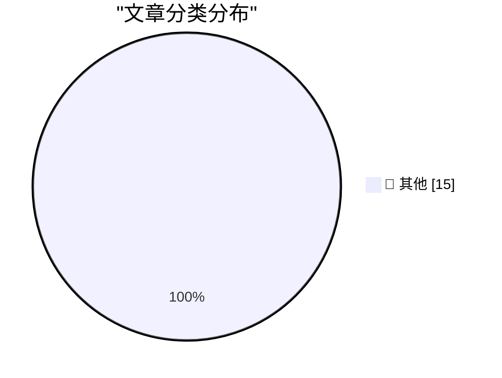

# 📰 AI 资讯每日精选 — 2026-10-09

> 汇聚 140+ 技术博客、X/Twitter、Hacker News、Reddit、Product Hunt、
> Lobste.rs、ClawFeed 日报及 GitHub Trending，经 AI 评分筛选。
>
> **本期内容**：🏆 今日必读 · 🌐 ClawFeed 日报 · 🔥 GitHub Trending · 📂 分类精选 · 🎨 设计与生成式 AI · 📊 数据概览

## 🏆 今日必读

🥇 **ttok 0.4**

[ttok 0.4](https://simonwillison.net/2026/Oct/8/ttok/) — simonwillison.net · 3 小时前 · 📝 其他

> ttok 0.4

🥈 **Quoting Carson Gross**

[Quoting Carson Gross](https://simonwillison.net/2026/Oct/8/carson-gross/) — simonwillison.net · 5 小时前 · 📝 其他

> Quoting Carson Gross

🥉 **Let’s Check In on Trump’s Blog**

[Let’s Check In on Trump’s Blog](https://truthsocial.com/@realDonaldTrump/posts/117406176604364910) — daringfireball.net · 4 小时前 · 📝 其他

> Let’s Check In on Trump’s Blog

4️⃣ **Apple Is Slow-Rolling iOS 27 Adoption, So Far**

[Apple Is Slow-Rolling iOS 27 Adoption, So Far](https://mastodon.social/@_Davidsmith/117355154519434137) — daringfireball.net · 7 小时前 · 📝 其他

> Apple Is Slow-Rolling iOS 27 Adoption, So Far

5️⃣ **Joz Announces ‘Welcome Home’ Keynote Coming Tuesday, 13 October**

[Joz Announces ‘Welcome Home’ Keynote Coming Tuesday, 13 October](https://x.com/gregjoz/status/2108226096407994858) — daringfireball.net · 8 小时前 · 📝 其他

> Joz Announces ‘Welcome Home’ Keynote Coming Tuesday, 13 October

---

## 🌐 ClawFeed 日报精选

> 来源：[ClawFeed](https://clawfeed.kevinhe.io) — AI 驱动的多源新闻聚合

# 📅 ClawFeed 日报 | 2026-10-07 (SGT)

> 聚合自 5 期 4h digest（#1361 00:00, #1362 04:00, #1363 08:00, #1364 12:00, #1365 16:00）
> 周三 + Token2049 新加坡周第三天，全天 feed 148 条，信噪比偏低：每期一半以上是峰会打卡、喊单和生活帖，有信息量的每期三到十条。全天两条主线：「agent 怎么和商家、网站打交道」（Personal Agent Protocol、电商审计、AgentID、agent 支付），以及「Grok Bot 改成按任务路由后端模型，实际默认跑 Opus 5.5」。Anthropic 自己也有两条：Claude 进 Google Docs / Sheets / Slides，Cyber Verification Program 扩到 Mythos 5.1。

---

## 🔥 当日全场最重要 5 条

1. **agent 代用户交易：标准、身份、支付同一天都有动作**：Meta 和 Sierra 发起 Personal Agent Protocol（PAP），规定个人 agent 如何与商家交互，创始成员有 Stripe、Shopify、Walmart、Genesys、Instinct、Rocket（@jeff_weinstein）。同一时段 @billions_ntwk 审计美国 51 家最大电商：没有一家能让经过验证的 AI agent 下单，37 家还会无意中把购物 agent 拦掉。下午 AgentMail 推出 AgentID，号称「给 agent 用的 Sign in with Google」：agent 有自己的登录和收件箱，并绑定回真人主人（@rohanpaul_ai）。傍晚 Kite AI 在新加坡集中推 agent 支付活动。昨天的主线是「agent 开始碰钱」，今天往下走到协议层和身份层。对 Zylos 这类要替用户注册、登录第三方服务的 agent，AgentID 值得看。⚠️ PAP 只有发布帖，协议具体内容没看到。
   来源: https://x.com/jeff_weinstein/status/2107541730870632493 ｜ https://x.com/rohanpaul_ai/status/2107570923612348816

2. **Grok Bot 改成按任务路由后端模型，Cursor 侧说 bot 全部跑 Opus 5.5**：@elonmusk 表示 Grok Bot 后续会按任务选用最合适的后端，点名 Claude Opus 5.5、Midjourney、Suno 等第三方 API（@liyue_ai 转评）。傍晚 Cursor 侧的 @poteto 回复称「所有 bot 都会跑在 Opus 5.5 上」，还能拉起 Cursor 自有模型的云端 agent，@DaveShapi 调侃「那家 Claude 套壳公司」；@mardehaym 认为路由是 Grok Bot 最聪明的产品决策之一。头部 agent 产品不再绑定自家模型，模型层和产品 / 编排层在分开。这和昨天 OpenAI 说「编排层会被模型吸收」是两个相反方向的信号。
   来源: https://x.com/liyue_ai/status/2107742825878360525 ｜ https://x.com/DaveShapi/status/2107795108980474143

3. **Claude 进 Google Docs / Sheets / Slides，Cyber Verification 扩到 Mythos 5.1**：Claude 可以在 Google Workspace 侧边栏读取当前打开的文件、原地修改，每处修改先由用户批准再落地；这些文件也能在 Claude 里打开（@claudeai，下午 @alex_prompter 又转了一次）。同期 Anthropic 扩大 Cyber Verification Program，经过验证的安全从业者可以用 Mythos 5.1、Opus 5.5、Sonnet 5.5。团队日常用 Google 文档的话可以直接试。
   来源: https://x.com/claudeai/status/2107522596845822135 ｜ https://x.com/AndrewCurran_/status/2107547709112828188

4. **GitHub：Git 活动一年翻倍，正在为 agent 规模重建 Git 基础设施**：2025 年 9 月到 2026 年 8 月，Git 活动量翻了一倍多，达到每月 4733 亿次事件；GitHub 说正在「不停机重建 Git 基础设施」，给 agent 规模的软件开发打地基（工程博客《Building Git infrastructure for agent-scale development》）。agent 写代码的流量已经大到逼平台重构底层，这是今天最硬的一个数据。
   来源: https://x.com/github/status/2107589127051063771

5. **加密：监管细化、L2 关停、单日回撤 3%**：CFTC 首批加密规则 Regulation CTX / CAM 征求意见，针对带保证金、杠杆、融资的零售交易，普通现货不在范围内（@laurashin）。L2 Abstract 运营近三年后宣布关停，资金需通过 migrate.abs.xyz 撤出，在 3 期反复出现。傍晚加密总市值单日跌 3% 至 2.85 万亿美元，多头爆仓超 4.03 亿美元；BTC ETF 净流入 1.19 亿，ETH ETF 净流出 2.02 亿（@CoinGapeMedia）。今晚美东 14:00 还有 FOMC 纪要。
   来源: https://x.com/laurashin/status/2107433690095841429 ｜ https://x.com/AbstractChain/status/2107554632675340420 ｜ https://x.com/CoinGapeMedia/status/2107800664487379263

**次重要（备选）**
- Claude 按「人」封号在中文圈发酵：@rwayne 用澳洲 ID / IP / 银行卡都没事，国内朋友整套照搬仍被封，推测按人而不是按网络环境判定。对团队里依赖 Claude 的中文用户是实际风险。https://x.com/rwayne/status/2107778653337821222
- ElevenLabs 和一个印度邦政府签首份 MOU；印度一年 1 亿多次 ElevenAgents 对话里超过 70% 用印地语、卡纳达语、泰米尔语、泰卢固语。语音 agent 在新兴市场是多语种优先。https://x.com/ElevenLabs/status/2107669995698246044
- Codex Auto-review 对所有 ChatGPT 账号用户免费，用来替代「每一步都要你批准」的默认沙箱。https://x.com/daniel_mac8/status/2107556065667600493
- supermemory API v5：「agent-first 的记忆 API」，namespace 放进 URL、结果按 agent 上下文优化。做 agent 长期记忆可参考。https://x.com/DhravyaShah/status/2107551610499125757
- Meta 开源内部用了 9 年的资源分配库 Rebalancer，把规则定义和求解算法解耦。https://x.com/Gorden_Sun/status/2107673087432962258
- Cardano CIP-0113 上主网，合规规则可写进原生代币；Arbitrum 加入 Global Dollar Network，USDG 上线。https://x.com/Cardano_CF/status/2107667227210367411

---

## 📰 当日核心主题

### 🛒 agent × 商业：协议、身份、支付
PAP（Meta + Sierra + Stripe / Shopify / Walmart）、51 家电商零支持 agent 下单、AgentID 给 agent 发登录身份、Kite AI 与 Agentic Money 2026 活动、Stripe John Collison「agent 会重写互联网商业」。昨天是 Coinbase / Grok Bot 让 agent 动钱，今天是标准和身份层补位。
来源: https://x.com/Kite_Frens_Eco/status/2107782661762920666

### 🔀 模型路由 vs. 模型归属
Grok Bot 按任务路由后端，Cursor 侧确认 Opus 5.5 是默认大脑；@cryptoxiao 回顾 GrokBot 吸收 Cursor、Meta 吸收 Manus 做 Muse 的路线。和 10/6 OpenAI「编排会被模型吸收」形成对照：一边是模型厂把 harness 收进来，一边是产品方把模型变成可替换的后端。

### 🧩 Anthropic 产品与账号
Claude 进 Google Workspace（两期出现）、Cyber Verification 扩到 Mythos 5.1、中文圈 Claude 封号讨论、Opus 5.5 作为 Grok Bot 底座。AI 进办公文档的方式在收敛到「侧边栏 + 逐条审批」。

### 🛠️ agent 开发基础设施
GitHub agent 规模 Git 重建、Codex Auto-review 免费、supermemory v5、Walrus Console（托管 agent 上下文，原生 MCP）、Meta Rebalancer、ministack（单端口本地跑 60+ AWS 服务）、@libukai 用 MCP UI 在对话里渲染表单。本地模型：Qwen3.8-Flash-Next 双 DGX Spark 93/100、GLM-5.3-Flash 单张 3090 35 tok/s。

### ⛓️ 加密：Token2049 周 + 监管 + 收缩
监管：CFTC Regulation CTX / CAM。合规资产上链：USDG 上 Arbitrum、Cardano CIP-0113、ICE 公开讨论链上结算。收缩整合：Abstract 关停、STG 并入 ZRO。市场：总市值 -3%、BTC.D 五年来首个死亡交叉、FOMC 纪要。另有 Bittensor SN51 用经营收入买 5000 TAO、TOKEN2049 2027 年 6 月进军纽约。

---

## 🔖 累计 Bookmark 精选

**无更新**：全天 5 期都是 17 条，最新一条仍是 @spectnfa 的 SpaceXAI Grok Bot workshop，和 10/5、10/6 一样，连续三天没有新增。

**和今天话题呼应、值得重读的：**
- @spectnfa Grok Bot workshop（呼应 Grok Bot 改按任务路由模型）
- @alexandr_wang 的 Muse for small businesses、Manus 2.0（呼应 04:00 期中日用户对 Muse / Manus 的自然口碑）

---

## 👀 推荐关注汇总（已去重）

| 账号 | 理由 |
|------|------|
| @jerrychen | Greylock GP，「The New Moats」系列作者，发推低频但偏思考型；抽样页显示尚未关注（12:00 期推荐） |
| @edsim | boldstart ventures 创始人，Fund VII 2.5 亿美元专投「autonomous enterprise」；持续更新「What's 🔥」周报；抽样页显示尚未关注（16:00 期推荐） |
| @DhravyaShah | supermemory 创始人，agent 记忆基础设施一线 builder；⚠️ 之前在 feed 出现过，很可能已关注，操作前先在 Following 里搜一下（00:00 期推荐） |

此前推荐、仍未处理：@AlecTPhD、@mschoening、@typesafeai（见 10/6 日报）。

**建议取关**：@Hill0100（抓不到有效推文）、@StartupWisdom_（名人语录搬运）、@0xJasonBateman（近 6 个月没有相关推文）。@Mr57814170 在 12:00 期后主页按钮已显示「Follow」，看起来已取关。
**继续观察**：@Tradermayne、@caterpillarous；新增 @MosesCyborg（04:00 期只有八卦转评，如持续可考虑取关）。

---

## 💤 当日重复噪音模式

- **Token2049 现场打卡**：峰会照片、场地吐槽（烧烤味、新加坡物价）、抽奖、KOL 申请，每期都占一大块。
- **喊单与行情一句话**：SOL / BTC / OKB / meme 地址、「牛市拿住」「SOL 上 1000」、交易鸡汤，部分带 TG 群引流。
- **引流式 AI 营销**：@MoonDevOnYT 连续两期（「15 个 Opus 5.5 agent 吃散户爆仓」、回测引流）。
- **固定低信息量账号**：@RaminNasibov（每期都有生活帖）、@marquistrillx（三期都是创作者 / 情感段子）、@BrianRoemmele（直播预告、电子管功放）。
- **政治八卦**：04:00 期 Andrew Tate 段子刷屏、特朗普诺奖提名旧闻。
- **结论原样重复**：followingProfiles 抽样仍以同一批 24 个账号为主，取关对象每期一样；bookmark 连续三天无变化。
- **同一消息多期重复收录**：Abstract 关停（3 期）、Claude 进 Google Workspace（2 期）、Minerva Humanoids（2 期）。

---
— Lisa
---

## 🔥 GitHub Trending

> 今日热门开源项目（全语言 + Python）

| # | 项目 | 描述 | ⭐ 总星 | 📈 今日 | 语言 |
|---|------|------|---------|---------|------|
| 1 | [morluto/rea](https://github.com/morluto/rea) | Reverse engineer anything with agents, from app behavior ... | 28.3k | +7738 | TypeScript |
| 2 | [boykopovar/AnyPS5](https://github.com/boykopovar/AnyPS5) | Tool for automatic PS5 executables porting to Linux and W... | 16.2k | +4669 | C++ |
| 3 | [storytold/artcraft](https://github.com/storytold/artcraft) | ArtCraft is an intentional crafting engine for artists, d... | 8.3k | +2103 | Rust |
| 4 | [mattpocock/skills](https://github.com/mattpocock/skills) | Skills for Real Engineers. Straight from my .agents direc... | 281.2k | +1774 | Shell |
| 5 | [cathrynlavery/diagram-design](https://github.com/cathrynlavery/diagram-design) 🤖 | Editorial diagram design for Claude Code, Codex, GitHub C... | 46.5k | +1160 | HTML |
| 6 | [ayghri/i-have-adhd](https://github.com/ayghri/i-have-adhd) 🤖 | A skill to stop your coding agent from burying the answer... | 55.8k | +845 | Python |
| 7 | [thedotmack/claude-mem](https://github.com/thedotmack/claude-mem) 🤖 | Persistent Context Across Sessions for Every Agent – Capt... | 98.6k | +670 | TypeScript |
| 8 | [liquidslr/system-design-notes](https://github.com/liquidslr/system-design-notes) | Notes of the book System Desgin Interview - An Insider's ... | 24.7k | +393 | - |
| 9 | [anthropics/knowledge-work-plugins](https://github.com/anthropics/knowledge-work-plugins) 🤖 | Open source repository of plugins primarily intended for ... | 27.7k | +392 | Python |
| 10 | [CursorTouch/Windows-MCP](https://github.com/CursorTouch/Windows-MCP) | MCP Server for Computer Use in Windows | 8.3k | +360 | Python |
| 11 | [EpicGames/raddebugger](https://github.com/EpicGames/raddebugger) | A native, user-mode, multi-process, graphical debugger. | 8.1k | +279 | C |
| 12 | [earthtojake/text-to-cad](https://github.com/earthtojake/text-to-cad) 🤖 | Give your agent CAD superpowers. | 18.5k | +159 | Python |
| 13 | [IAmTomShaw/f1-race-replay](https://github.com/IAmTomShaw/f1-race-replay) | An interactive Formula 1 race visualisation and data anal... | 6.7k | +148 | Python |
| 14 | [superdesigndev/treg](https://github.com/superdesigndev/treg) 🤖 | OpenRouter for agent tools. Join community here: https://... | 4.9k | +119 | Python |
| 15 | [smicallef/spiderfoot](https://github.com/smicallef/spiderfoot) | SpiderFoot automates OSINT for threat intelligence and ma... | 23.2k | +88 | Python |

---

## 📝 其他

### 1. ttok 0.4

[ttok 0.4](https://simonwillison.net/2026/Oct/8/ttok/) — **simonwillison.net** · 3 小时前 · ⭐ 15/30

> ttok 0.4

---

### 2. Quoting Carson Gross

[Quoting Carson Gross](https://simonwillison.net/2026/Oct/8/carson-gross/) — **simonwillison.net** · 5 小时前 · ⭐ 15/30

> Quoting Carson Gross

---

### 3. Let’s Check In on Trump’s Blog

[Let’s Check In on Trump’s Blog](https://truthsocial.com/@realDonaldTrump/posts/117406176604364910) — **daringfireball.net** · 4 小时前 · ⭐ 15/30

> Let’s Check In on Trump’s Blog

---

### 4. Apple Is Slow-Rolling iOS 27 Adoption, So Far

[Apple Is Slow-Rolling iOS 27 Adoption, So Far](https://mastodon.social/@_Davidsmith/117355154519434137) — **daringfireball.net** · 7 小时前 · ⭐ 15/30

> Apple Is Slow-Rolling iOS 27 Adoption, So Far

---

### 5. Joz Announces ‘Welcome Home’ Keynote Coming Tuesday, 13 October

[Joz Announces ‘Welcome Home’ Keynote Coming Tuesday, 13 October](https://x.com/gregjoz/status/2108226096407994858) — **daringfireball.net** · 8 小时前 · ⭐ 15/30

> Joz Announces ‘Welcome Home’ Keynote Coming Tuesday, 13 October

---

### 6. Theatre Review: Hay Fever at Wyndham's Theatre ★★★★⯪

[Theatre Review: Hay Fever at Wyndham's Theatre ★★★★⯪](https://shkspr.mobi/blog/2026/10/theatre-review-hay-fever-at-wyndhams-theatre/) — **shkspr.mobi** · 15 小时前 · ⭐ 15/30

> Theatre Review: Hay Fever at Wyndham's Theatre ★★★★⯪

---

### 7. Privacy policies and modal logic

[Privacy policies and modal logic](https://www.johndcook.com/blog/2026/10/08/privacy-policies-and-modal-logic/) — **johndcook.com** · 13 小时前 · ⭐ 15/30

> Privacy policies and modal logic

---

### 8. The Rise and Fall of the Plasma Screen

[The Rise and Fall of the Plasma Screen](https://www.construction-physics.com/p/the-rise-and-fall-of-the-plasma-screen) — **construction-physics.com** · 15 小时前 · ⭐ 15/30

> The Rise and Fall of the Plasma Screen

---

### 9. Let’s Deconstruct Photoshop

[Let’s Deconstruct Photoshop](https://feed.tedium.co/link/15204/17492299/artcraft-vibe-coding-creative-cloud-remake) — **tedium.co** · 10 小时前 · ⭐ 15/30

> Let’s Deconstruct Photoshop

---

### 10. iFlac: Sync your FLAC files to your iPhone from Linux

[iFlac: Sync your FLAC files to your iPhone from Linux](https://jayd.ml/2026/10/08/iflac-sync-flacs-to-iphone.html) — **jayd.ml** · 8 小时前 · ⭐ 15/30

> iFlac: Sync your FLAC files to your iPhone from Linux

---

### 11. Get Player Stats From Your Minecraft Server Logs

[Get Player Stats From Your Minecraft Server Logs](https://jayd.ml/2026/10/08/minecraft-log-analyzer.html) — **jayd.ml** · 8 小时前 · ⭐ 15/30

> Get Player Stats From Your Minecraft Server Logs

---

### 12. “Getting off the Modernization Treadmill”

[“Getting off the Modernization Treadmill”](https://blog.jim-nielsen.com/2026/talk-notes-modernization-treadmill/) — **blog.jim-nielsen.com** · 8 小时前 · ⭐ 15/30

> “Getting off the Modernization Treadmill”

---

### 13. When Apple Records sued Apple Computer

[When Apple Records sued Apple Computer](https://dfarq.homeip.net/when-apple-records-sued-apple-computer/?utm_source=rss&#038;utm_medium=rss&#038;utm_campaign=when-apple-records-sued-apple-computer) — **dfarq.homeip.net** · 16 小时前 · ⭐ 15/30

> When Apple Records sued Apple Computer

---

### 14. Claude can now generate animated explainer videos and live data dashboards from text prompts

[Claude can now generate animated explainer videos and live data dashboards from text prompts](https://the-decoder.com/claude-can-now-generate-animated-explainer-videos-and-live-data-dashboards-from-text-prompts/) — **The Decoder** · 7 小时前 · ⭐ 15/30

> Claude can now generate animated explainer videos and live data dashboards from text prompts

---

### 15. Being mean to Claude can now get your account suspended under Anthropic's new TOS

[Being mean to Claude can now get your account suspended under Anthropic's new TOS](https://the-decoder.com/being-mean-to-claude-can-now-get-your-account-suspended-under-anthropics-new-tos/) — **The Decoder** · 8 小时前 · ⭐ 15/30

> Being mean to Claude can now get your account suspended under Anthropic's new TOS

---

## 📊 数据概览

| 扫描源 | 抓取文章 | 时间范围 | 精选 |
|:---:|:---:|:---:|:---:|
| 93/140 | 3737 篇 → 81 篇 | 24h | **15 篇** |

### 分类分布

---

*生成于 2026-10-09 03:04 | 汇聚 140 个技术博客、X/Twitter、Hacker News、Reddit、Product Hunt、Lobste.rs、ClawFeed 日报及 GitHub Trending，经 AI 评分筛选出 Top 15 精华内容*
